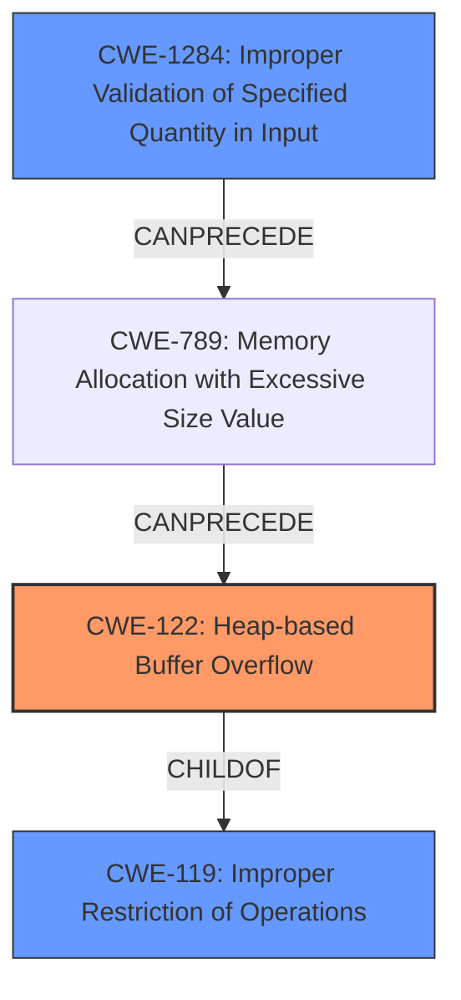

# Analysis Report for CVE-2024-53901

# Vulnerability Analysis Report: CVE-2024-53901

## Description

The Imager package before 1.025 for Perl has a **heap-based buffer overflow** leading to denial of service, or possibly unspecified other impact, when the trim() method is called on a crafted input image.

## Vulnerability Description Key Phrases

- **Weakness:** heap-based buffer overflow
- **Impact:** ['denial of service', 'unspecified other impact']
- **Vector:** crafted input image
- **Product:** Imager package
- **Version:** before 1.025
- **Component:** trim() method

## Analysis (with Relationship Data)

# Summary
| CWE ID  | CWE Name                                                                              | Confidence | CWE Abstraction Level | CWE Vulnerability Mapping Label | CWE-Vulnerability Mapping Notes |
| :-------- | :------------------------------------------------------------------------------------ | :--------- | :---------------------- | :------------------------------ | :------------------------------ |
| CWE-122   | Heap-based Buffer Overflow                                                            | 0.9        | Variant               | Primary                         | Allowed                       |
| CWE-119   | Improper Restriction of Operations within the Bounds of a Memory Buffer              | 0.7        | Class                   | Secondary                       | Discouraged                     |
| CWE-1284  | Improper Validation of Specified Quantity in Input                                  | 0.6        | Base                    | Secondary                       | Allowed                       |

## Evidence and Confidence

*   **Confidence Score:** 0.8
*   **Evidence Strength:** HIGH

## Relationship Analysis
The primary relationship influencing the CWE selection is the child-parent relationship between CWE-122 (Heap-based Buffer Overflow) and CWE-119 (Improper Restriction of Operations within the Bounds of a Memory Buffer). CWE-122 is a variant of CWE-119, providing a more specific classification. The vulnerability description explicitly mentions a heap-based buffer overflow, making CWE-122 the preferred choice. CWE-1284 (Improper Validation of Specified Quantity in Input) can precede CWE-789 (Memory Allocation with Excessive Size Value) which in turn can lead to a buffer overflow.



## Vulnerability Chain
The vulnerability chain starts with the **improper handling or validation of the input image** (potentially related to size or dimensions), leading to an **incorrect calculation of the buffer size** on the heap. This culminates in a **heap-based buffer overflow** when data is written to the undersized buffer, causing a denial of service or other unspecified impacts.

The chain of root cause and weaknesses is:
1.  Improper Validation of Specified Quantity in Input (CWE-1284) - The product receives input that is expected to specify a quantity (such as size or length), but it does not validate or incorrectly validates that the quantity has the required properties.
2.  Memory Allocation with Excessive Size Value (CWE-789) - The product allocates memory based on an untrusted, large size value, but it does not ensure that the size is within expected limits, allowing arbitrary amounts of memory to be allocated.
3.  Heap-based Buffer Overflow (CWE-122) - A heap overflow condition is a buffer overflow, where the buffer that can be overwritten is allocated in the heap portion of memory, generally meaning that the buffer was allocated using a routine such as malloc().

## Summary of Analysis
The analysis is primarily based on the provided vulnerability description and the CVE reference link content summary. The description clearly states a "**heap-based buffer overflow**" in the `trim()` method of the Imager package. The CVE reference content confirms this root cause, detailing that the overflow occurs due to an incorrect size calculation when processing a crafted input image.

The graph relationships influenced the selection by highlighting the hierarchical connection between CWE-122 and CWE-119. While CWE-119 is a broader category, CWE-122 provides a more precise classification of the vulnerability. CWE-1284 highlights the lack of validation of the input that could contribute to the vulnerability.

The selected CWEs are at the optimal level of specificity because CWE-122 directly reflects the stated vulnerability (heap-based buffer overflow), while CWE-119 serves as a more general category to which CWE-122 belongs. CWE-1284 reflects the improper validation of the input image.

Relevant CWE Information:

# Enhanced Context (25 CWEs)
The following CWEs were identified as potentially relevant to this vulnerability:

## CWE-129: Improper Validation of Array Index
**Abstraction Level**: Variant
**Similarity Score**: 0.72
**Source**: dense

**Description**:
The product uses untrusted input when calculating or using an array index, but the product does not validate or incorrectly validates the index to ensure the index references a valid position within the array.

**Mapping Guidance**:
- Usage: Allowed
- Rationale: This CWE entry is at the Variant level of abstraction, which is a preferred level of abstraction for mapping to the root causes of vulnerabilities.

*Not Selected:* While input validation is relevant, the core issue is a heap-based buffer overflow, not an array index issue.

## CWE-789: Memory Allocation with Excessive Size Value
**Abstraction Level**: Variant
**Similarity Score**: 0.70
**Source**: dense

**Description**:
The product allocates memory based on an untrusted, large size value, but it does not ensure that the size is within expected limits, allowing arbitrary amounts of memory to be allocated.

**Mapping Guidance**:
- Usage: Allowed
- Rationale: This CWE entry is at the Variant level of abstraction, which is a preferred level of abstraction for mapping to the root causes of vulnerabilities.

*Not Selected:* While this may be related, the description states that the **buffer size calculation** is incorrect rather than excessive.

## CWE-131: Incorrect Calculation of Buffer Size
**Abstraction Level**: Base
**Similarity Score**: 0.69
**Source**: dense

**Description**:
The product does not correctly calculate the size to be used when allocating a buffer, which could lead to a buffer overflow.

**Mapping Guidance**:
- Usage: Allowed
- Rationale: This CWE entry is at the Base level of abstraction, which is a preferred level of abstraction for mapping to the root causes of vulnerabilities.

*Not Selected:* While the CVE summary mentions an incorrect size calculation, CWE-122 is the best fit based on the specific vulnerability.

## CWE-193: Off-by-one Error
**Abstraction Level**: Base
**Similarity Score**: 0.69
**Source**: dense

**Description**:
A product calculates or uses an incorrect maximum or minimum value that is 1 more, or 1 less, than the correct value.

**Mapping Guidance**:
- Usage: Allowed
- Rationale: This CWE entry is at the Base level of abstraction, which is a preferred level of abstraction for mapping to the root causes of vulnerabilities.

*Not Selected:* An off-by-one error is a possible cause of a buffer overflow, but the description does not specify this.

## CWE-212: Improper Removal of Sensitive Information Before Storage or Transfer
**Abstraction Level**: Base
**Similarity Score**: 0.68
**Source**: dense

**Description**:
The product stores, transfers, or shares a resource that contains sensitive information, but it does not properly remove that information before the product makes the resource available to unauthorized actors.

**Mapping Guidance**:
- Usage: Allowed
- Rationale: This CWE entry is at the Base level of abstraction, which is a preferred level of abstraction for mapping to the root causes of vulnerabilities.

*Not Selected:* This CWE is irrelevant to the vulnerability.

## CWE-125: Out-of-bounds Read
**Abstraction Level**: Base
**Similarity Score**: 0.68
**Source**: dense

**Description**:
The product reads data past the end, or before the beginning, of the intended buffer.

**Mapping Guidance**:
- Usage: Allowed
- Rationale: This CWE entry is at the Base level of abstraction, which is a preferred level of abstraction for mapping to the root causes of vulnerabilities.

*Not Selected:* The description indicates a buffer overflow (write), not a read.

## CWE-252: Unchecked Return Value
**Abstraction Level**: Base
**Similarity Score**: 0.67
**Source**: dense

**Description**:
The product does not check the return value from a method or function, which can prevent it from detecting unexpected states and conditions.

**Mapping Guidance**:
- Usage: Allowed
- Rationale: This CWE entry is at the Base level of abstraction, which is a preferred level of abstraction for mapping to the root causes of vulnerabilities.

*Not Selected:* This CWE is not relevant to the vulnerability.

## CWE-824: Access of Uninitialized Pointer
**Abstraction Level**: Base
**Similarity Score**: 0.67
**Source**: dense

**Description**:
The product accesses or uses a pointer that has not been initialized.

**Mapping Guidance


## CWE Relationship Analysis

Current CWEs represent these abstraction levels: .


### Vulnerability Chain Analysis

**Chain starting from CWE-1284:**
- 1284 (Improper Validation of Specified Quantity in Input) - ROOT


**Chain starting from CWE-125:**
- 125 (Out-of-bounds Read) - ROOT


### CWE Relationship Diagram

```mermaid
graph TD
    classDef primary fill:#f96,stroke:#333,stroke-width:2px
    classDef secondary fill:#69f,stroke:#333
    classDef tertiary fill:#9e9,stroke:#333
```


*Report generated on 2025-07-13 22:20:22*
