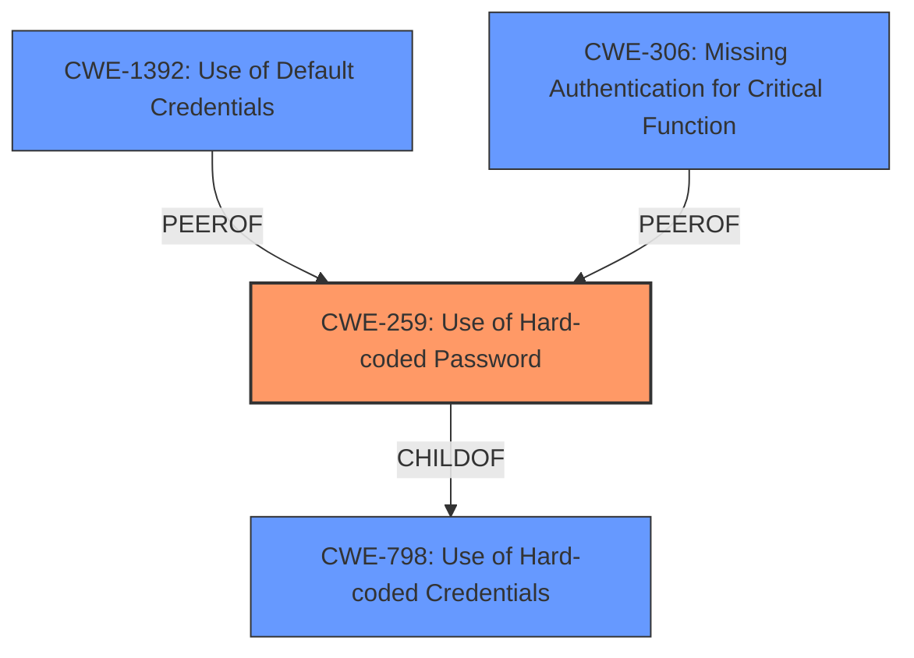

# Enhanced Analysis for CVE-2024-53937

# Summary
| CWE ID  | CWE Name                                                  | Confidence | CWE Abstraction Level | CWE Vulnerability Mapping Label | CWE-Vulnerability Mapping Notes |
| :-------- | :-------------------------------------------------------- | :--------- | :-------------------- | :------------------------------ | :-------------------------------- |
| CWE-259   | Use of Hard-coded Password                                | 0.9        | Variant               | Allowed                         | Primary CWE                       |
| CWE-1392  | Use of Default Credentials                             | 0.7        | Base                  | Allowed                         | Secondary Candidate               |
| CWE-306   | Missing Authentication for Critical Function              | 0.6        | Base                  | Allowed                         | Secondary Candidate               |

## Evidence and Confidence

*   **Confidence Score:** 0.8
*   **Evidence Strength:** MEDIUM

## Relationship Analysis
The primary relationship that influenced my decision was the parent-child relationship between CWE-798 (Use of Hard-coded Credentials), and CWE-259 (Use of Hard-coded Password). Since the vulnerability description specifies the use of **default credentials** being "admin/admin", CWE-259 which is a variant of CWE-798 is more specific and appropriate.



## Vulnerability Chain
The vulnerability chain starts with the **use of default credentials** (CWE-259) for the Telnet service. This allows attackers to bypass authentication and execute arbitrary commands with root-level permissions.
  - The **Primary CWE** identifies the issue that led to the vulnerability i.e. the first in the "Vulnerability Chain"

## Summary of Analysis
The initial assessment strongly points to CWE-259 (Use of Hard-coded Password) as the primary weakness. The vulnerability description explicitly mentions that the TELNET service is enabled by default with "admin/admin" as **default credentials**. This aligns perfectly with the definition of CWE-259. The confidence is high because the evidence is direct and the CWE is specific.

CWE-1392 (Use of Default Credentials) was also considered, but CWE-259 is more specific as it identifies the **default credentials** as a password.

CWE-306 (Missing Authentication for Critical Function) was considered because the use of **default credentials** effectively bypasses authentication. However, the authentication mechanism is present but severely weakened by the use of **default credentials**, making CWE-259 the more accurate representation.

The selected CWEs are at the optimal level of specificity because they directly address the root cause of the vulnerability, which is the use of **default credentials** for authentication. This allows attackers to gain unauthorized access and execute arbitrary commands.

Relevant CWE Information:
*   **CWE-259: Use of Hard-coded Password**
    *   **Description**: The product contains a hard-coded password.
    *   **Why it applies**: The Victure RX1800 WiFi 6 Router uses "admin/admin" as **default credentials** for its TELNET service, which allows attackers to execute arbitrary commands with root-level permissions.
    *   **Security Implications**: Unauthorized access, arbitrary command execution, root-level compromise.
*   **CWE-1392: Use of Default Credentials**
    *   **Description**: The product uses default credentials, such as a default username and password, that are intended to be changed by the administrator, but are not changed.
    *   **Why it applies**: The device setup does not require the password to be changed during setup in order to utilize the device.
    *   **Security Implications**: Unauthorized access to the device.
*   **CWE-306: Missing Authentication for Critical Function**
    *   **Description**: The product does not perform any authentication for a critical function.
    *   **Why it may apply**: Although authentication exists, the **default credentials** effectively bypass it.
    *   **Security Implications**: Unauthorized access to critical functions.


## CWE Relationship Analysis

Current CWEs represent these abstraction levels: .


### Vulnerability Chain Analysis

**Chain starting from CWE-259:**
- 259 (Use of Hard-coded Password) - ROOT


**Chain starting from CWE-306:**
- 306 (Missing Authentication for Critical Function) - ROOT


### CWE Relationship Diagram

```mermaid
graph TD
    classDef primary fill:#f96,stroke:#333,stroke-width:2px
    classDef secondary fill:#69f,stroke:#333
    classDef tertiary fill:#9e9,stroke:#333
```