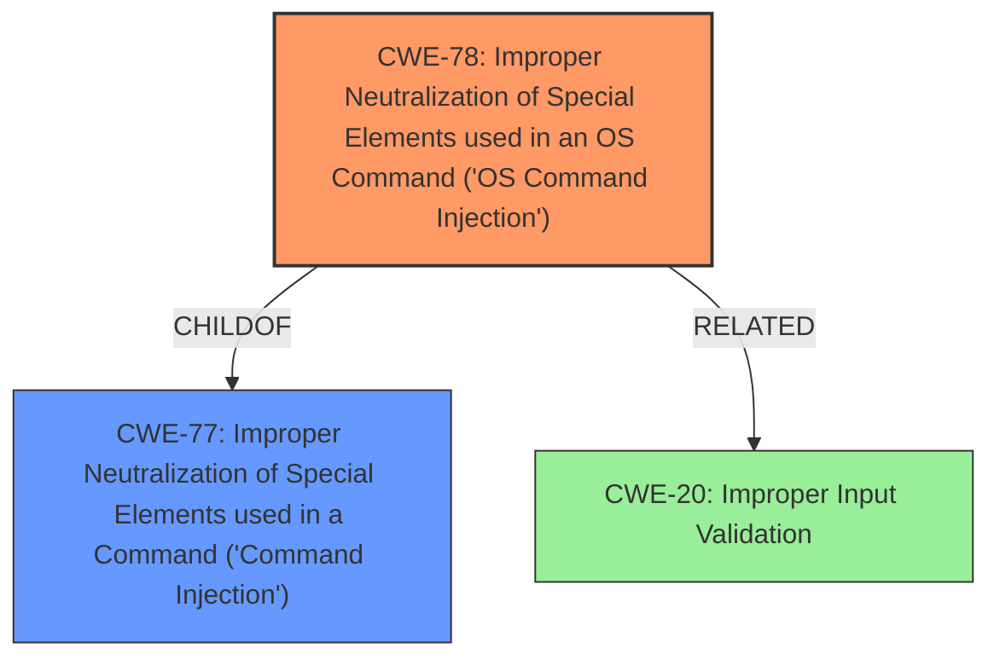

# Raw Analyzer Response for CVE-2024-53944

# Summary
| CWE ID | CWE Name | Confidence | CWE Abstraction Level | CWE Vulnerability Mapping Label | CWE-Vulnerability Mapping Notes |
|---|---|---|---|---|---|
| CWE-78 | Improper Neutralization of Special Elements used in an OS Command ('OS Command Injection') | 1.0 | Base | Primary CWE | Allowed |
| CWE-77 | Improper Neutralization of Special Elements used in a Command ('Command Injection') | 0.7 | Class | Secondary | Allowed-with-Review |
| CWE-20 | Improper Input Validation | 0.4 | Class | Secondary | Discouraged |

## Evidence and Confidence

*   **Confidence Score:** 0.9
*   **Evidence Strength:** HIGH

## Relationship Analysis
The primary weakness is CWE-78, which is a base level CWE, and a more specific version of CWE-77. Both CWE-77 and CWE-78 are related to the injection of commands. CWE-78 is a child of CWE-77 (Improper Neutralization of Special Elements used in a Command). CWE-20 is a class level CWE, and is a more generic form of input validation issues.

## Vulnerability Chain
The vulnerability chain starts with the **failure to sanitize shell metacharacters** within the JSON parameters of the /goform/formJsonAjaxReq endpoint. This **lack of input validation** (CWE-20) leads to the **command injection** (CWE-78), allowing an attacker to **execute arbitrary OS commands with root privileges**.

## Summary of Analysis
The primary CWE is CWE-78 because the vulnerability description explicitly states that the device is vulnerable to **command injection** by failing to sanitize shell metacharacters sent via JSON parameters. The impact is that attackers can execute arbitrary OS commands with root privileges.
The evidence from the vulnerability description is: "A unauthenticated remote attacker with network access can exploit a **command injection** vulnerability. The /goform/formJsonAjaxReq endpoint fails to sanitize shell metacharacters sent via JSON parameters, thus allowing attackers to execute arbitrary OS commands with root privileges."
CWE-78 is a base level CWE, which is the preferred level of abstraction.
CWE-77 was considered but CWE-78 is a more specific CWE.
CWE-20 was considered because the **failure to sanitize shell metacharacters** is an input validation issue. But the **command injection** is a more direct and specific weakness.

Relevant CWE Information:

# Enhanced Context (25 CWEs)
The following CWEs were identified as potentially relevant to this vulnerability:

## CWE-78: Improper Neutralization of Special Elements used in an OS Command ('OS Command Injection')
**Abstraction Level**: base
**Similarity Score**: 4.31
**Source**: graph

**Description**:
CWE-78: Improper Neutralization of Special Elements used in an OS Command ('OS Command Injection')

**Mapping Guidance**:
- Usage: Allowed
- Rationale: This CWE entry is at the Base level of abstraction, which is a preferred level of abstraction for mapping to the root causes of vulnerabilities.

**Relationships**:
- CANFOLLOW -> CWE-184
- CANALSOBE -> CWE-88
- CHILDOF -> CWE-77
- CHILDOF -> CWE-77
- CHILDOF -> CWE-74