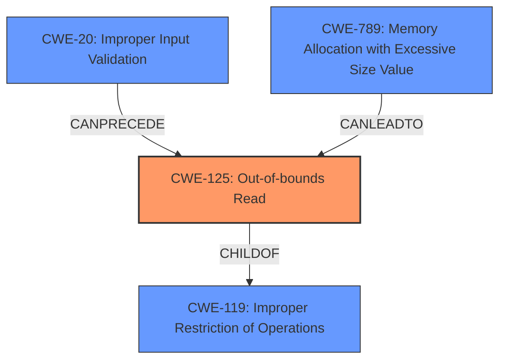

# Analysis for CVE-2024-54119

# Summary
| CWE ID | CWE Name | Confidence | CWE Abstraction Level | CWE Vulnerability Mapping Label | CWE-Vulnerability Mapping Notes |
|---|---|---|---|---|---|
| CWE-125 | Out-of-bounds Read | 0.6 | Base | Allowed | Primary CWE |
| CWE-NVD-noinfo | NVD Information Missing | 0.3 |   |   | Secondary Candidate |

## Evidence and Confidence

*   **Confidence Score:** 0.6
*   **Evidence Strength:** MEDIUM

## Relationship Analysis
The analysis considered the following CWE relationships:

*   CWE-125 (Out-of-bounds Read) is a base-level CWE, providing a specific description of the **weakness**.
*   CWE-125 is related to CWE-119 (Improper Restriction of Operations within the Bounds of a Memory Buffer) as it can be a consequence of improper buffer management.
*   CWE-20 (Improper Input Validation) could be a prerequisite to CWE-125 if the size of the input is not properly validated before being used as an index.
*   CWE-789 (Memory Allocation with Excessive Size Value) can lead to out-of-bounds reads if memory is allocated in a way that allows reading beyond the allocated region.

## Vulnerability Chain
The vulnerability chain can be described as follows:

1.  The initial **weakness** is a **cross-process screen stack vulnerability**.
2.  This could lead to an out-of-bounds read (CWE-125) if the screen stack data is accessed without proper bounds checking.
3.  The impact is a potential compromise of service confidentiality.

The chain highlights how a **cross-process screen stack vulnerability** can manifest as an out-of-bounds read, leading to a confidentiality breach.

## Summary of Analysis
The initial assessment focused on the **cross-process screen stack vulnerability** and its impact on service confidentiality. The retriever results suggested several CWEs, including CWE-125 (Out-of-bounds Read), CWE-789 (Memory Allocation with Excessive Size Value), and CWE-20 (Improper Input Validation).

Given the description of the **vulnerability** as related to a screen stack, CWE-125 (Out-of-bounds Read) seems the most likely root cause. The vulnerability involves accessing screen stack data across processes. If the bounds of the screen stack are not properly checked during cross-process access, it could lead to reading data beyond the intended buffer.

The evidence for CWE-125 is based on the following:

*   **Vulnerability Description Key Phrases:** "**Cross-process screen stack vulnerability**"
*   **CVE Reference Links Content Summary:** "**Weaknesses/Vulnerabilities Present:** Cross-process screen stack vulnerability."

The other suggested CWEs were considered but deemed less specific:

*   CWE-789 (Memory Allocation with Excessive Size Value) might be relevant if the stack allocation size is mishandled, but there's no direct evidence of this.
*   CWE-20 (Improper Input Validation) could be a contributing factor if input related to the stack is not validated, but again, there's no direct evidence.

CWE-NVD-noinfo was suggested because of similar CVE Descriptions, but it only indicates that there is no information.

The final decision is to classify the **vulnerability** primarily as CWE-125 (Out-of-bounds Read). This classification is at the base level of abstraction, providing a specific description of the **weakness**.

Relevant CWE Information:

# Enhanced Context (25 CWEs)
The following CWEs were identified as potentially relevant to this vulnerability:

## CWE-451: User Interface (UI) Misrepresentation of Critical Information
**Abstraction Level**: Class
**Similarity Score**: 0.73
**Source**: dense

**Description**:
The user interface (UI) does not properly represent critical information to the user, allowing the information - or its source - to be obscured or spoofed. This is often a component in phishing attacks.

**Mapping Guidance**:
- Usage: Allowed-with-Review
- Rationale: This CWE entry is a Class and might have Base-level children that would be more appropriate

*Not selected*: While the vulnerability occurs in the UI Extension module, there is no evidence that it leads to UI misrepresentation.

## CWE-755: Improper Handling of Exceptional Conditions
**Abstraction Level**: Class
**Similarity Score**: 0.71
**Source**: dense

**Description**:
The product does not handle or incorrectly handles an exceptional condition.

**Mapping Guidance**:
- Usage: Discouraged
- Rationale: This CWE entry is a level-1 Class (i.e., a child of a Pillar). It might have lower-level children that would be more appropriate

*Not selected*: It is a general class of error handling issue.

## CWE-497: Exposure of Sensitive System Information to an Unauthorized Control Sphere
**Abstraction Level**: Base
**Similarity Score**: 0.71
**Source**: dense

**Description**:
The product does not properly prevent sensitive system-level information from being accessed by unauthorized actors who do not have the same level of access to the underlying system as the product does.

**Mapping Guidance**:
- Usage: Allowed
- Rationale: This CWE entry is at the Base level of abstraction, which is a preferred level of abstraction for mapping to the root causes of vulnerabilities.

*Not selected*: The description doesn't mention exposure of sensitive system information.

## CWE-843: Access of Resource Using Incompatible Type ('Type Confusion')
**Abstraction Level**: Base
**Similarity Score**: 0.70
**Source**: dense

**Description**:
The product allocates or initializes a resource such as a pointer, object, or variable using one type, but it later accesses that resource using a type that is incompatible with the original type.

**Mapping Guidance**:
- Usage: Allowed
- Rationale: This CWE entry is at the Base level of abstraction, which is a preferred level of abstraction for mapping to the root causes of vulnerabilities.

*Not selected*: There is no evidence of type confusion.

## CWE-1021: Improper Restriction of Rendered UI Layers or Frames
**Abstraction Level**: Base
**Similarity Score**: 0.70
**Source**: dense

**Description**:
The web application does not restrict or incorrectly restricts frame objects or UI layers that belong to another application or domain, which can lead to user confusion about which interface the user is interacting with.

**Mapping Guidance**:
- Usage: Allowed
- Rationale: This CWE entry is at the Base level of abstraction, which is a preferred level of abstraction for mapping to the root causes of vulnerabilities.

*Not selected*: The description focuses on UI layers and frames. This is not related to the **vulnerability**.

## CWE-668: Exposure of Resource to Wrong Sphere
**Abstraction Level**: Class
**Similarity Score**: 0.70
**Source**: dense

**Description**:
The product exposes a resource to the wrong control sphere, providing unintended actors with inappropriate access to the resource.

**Mapping Guidance**:
- Usage: Discouraged
- Rationale: CWE-668 is high-level and is often misused as a catch-all when lower-level CWE IDs might be applicable. It is sometimes used for low-information vulnerability reports [REF-1287]. It is a level-1 Class (i.e., a child of a Pillar). It is not useful for trend analysis.

*Not selected*: It is too general and discouraged.

## CWE-346: Origin Validation Error
**Abstraction Level**: Class
**Similarity Score**: 0.70
**Source**: dense

**Description**:
The product does not properly verify that the source of data or communication is valid.

**Mapping Guidance**:
- Usage: Allowed-with-Review
- Rationale: This CWE entry is a Class and might have Base-level children that would be more appropriate

*Not selected*: This is specific to origin validation issues and is not mentioned in the description.

## CWE-116: Improper Encoding or Escaping of Output
**Abstraction Level**: Class
**Similarity Score**: 0.70
**Source**: dense

**Description**:
The product prepares a structured message for communication with another component, but encoding or escaping of the data