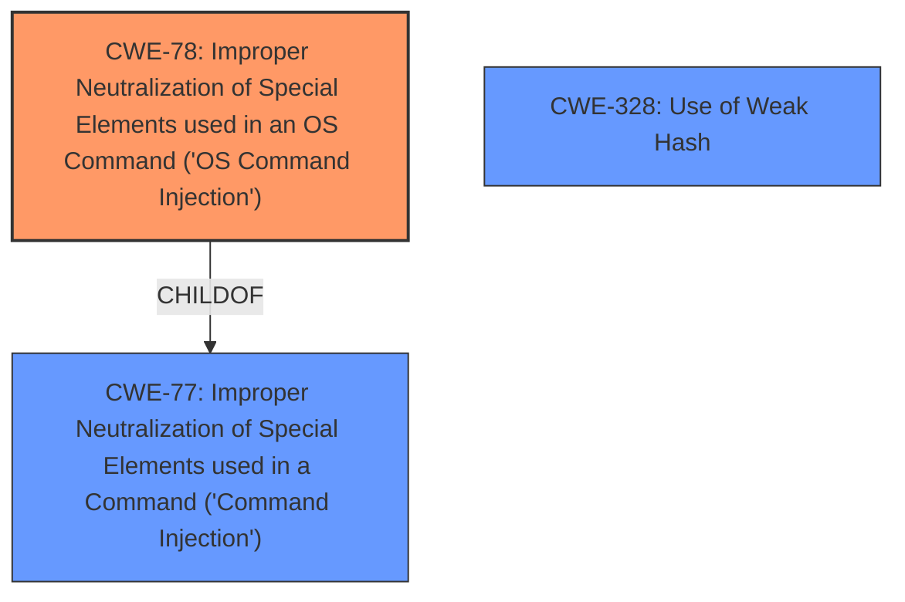

# Raw Analyzer Response for CVE-2024-54143

# Summary
| CWE ID | CWE Name | Confidence | CWE Abstraction Level | CWE Vulnerability Mapping Label | CWE-Vulnerability Mapping Notes |
|---|---|---|---|---|---|
| CWE-78 | Improper Neutralization of Special Elements used in an OS Command ('OS Command Injection') | 0.9 | Base | Primary | Allowed |
| CWE-328 | Use of Weak Hash | 0.9 | Base | Secondary | Allowed |

## Evidence and Confidence

*   **Confidence Score:** 0.9
*   **Evidence Strength:** HIGH

## Relationship Analysis
The primary CWE is CWE-78, which is a base-level CWE describing OS Command Injection. It is related to CWE-77, a class-level CWE that describes command injection more generally. CWE-78 is a child of CWE-77. CWE-328 is a base-level CWE related to the use of weak hashes. The vulnerability description clearly indicates both command injection and the use of a weak hash (truncated SHA-256).

## Vulnerability Chain
The vulnerability chain begins with two independent weaknesses:
1.  **Command Injection (CWE-78):** User input is not properly sanitized when constructing OS commands.
2.  **Use of Weak Hash (CWE-328):** Truncated SHA-256 hashes are used, reducing entropy and enabling collisions.

The attacker exploits these weaknesses to:
1. Inject arbitrary commands into the build process.
2. Generate hash collisions to serve malicious images instead of legitimate ones.
3. Deliver compromised images to unsuspecting users.

## Summary of Analysis
This analysis identifies two key weaknesses in the openwrt/asu image on demand server: command injection and the use of a weak hash. The **request hashing mechanism truncates SHA-256 hashes** to only 12 characters. This significantly reduces entropy, making it feasible for an attacker to generate collisions. By exploiting this, a previously built malicious image can be served in place of a legitimate one, allowing the attacker to poison the artifact cache and deliver compromised images to unsuspecting users. This can be combined with other attacks, such as a **command injection** in Imagebuilder that allows malicious users to inject arbitrary commands into the build process, resulting in the production of malicious firmware images signed with the legitimate build key.

CWE-78 is chosen as the primary CWE because the command injection allows malicious users to inject arbitrary commands into the build process. CWE-328 is chosen as a secondary CWE because the truncation of the SHA-256 hashes leads to collisions, which allows the attacker to serve malicious images.

The retriever results support the selection of CWE-78 and CWE-328.

Relevant CWE Information:

# Enhanced Context (25 CWEs)

## CWE-328: Use of Weak Hash
**Abstraction Level**: Base
**Similarity Score**: 0.72
**Source**: dense

**Description**:
The product uses an algorithm that produces a digest (output value) that does not meet security expectations for a hash function that allows an adversary to reasonably determine the original input (preimage attack), find another input that can produce the same hash (2nd preimage attack), or find multiple inputs that evaluate to the same hash (birthday attack).

**Mapping Guidance**:
- Usage: Allowed
- Rationale: This CWE entry is at the Base level of abstraction, which is a preferred level of abstraction for mapping to the root causes of vulnerabilities.

## CWE-78: Improper Neutralization of Special Elements used in an OS Command ('OS Command Injection')
**Abstraction Level**: base
**Similarity Score**: 4.33
**Source**: graph

**Description**:
CWE-78: Improper Neutralization of Special Elements used in an OS Command ('OS Command Injection')

**Mapping Guidance**:
- Usage: Allowed
- Rationale: This CWE entry is at the Base level of abstraction, which is a preferred level of abstraction for mapping to the root causes of vulnerabilities.

**Relationships**:
- CANFOLLOW -> CWE-184
- CANALSOBE -> CWE-88
- CHILDOF -> CWE-77
- CHILDOF -> CWE-77
- CHILDOF -> CWE-74