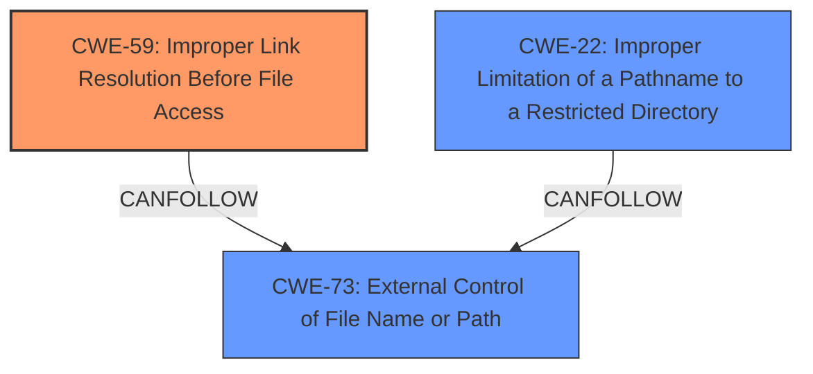

# Analysis Report for CVE-2024-54148

# Vulnerability Analysis Report: CVE-2024-54148

## Description

Gogs is an open source self-hosted Git service. A malicious user is able to commit and edit a crafted symlink file to a repository to gain SSH access to the server. The vulnerability is fixed in 0.13.1.

## Vulnerability Description Key Phrases

- **Impact:** SSH access
- **Vector:** crafted symlink file
- **Attacker:** malicious user
- **Product:** Gogs

## Analysis (with Relationship Data)

# Summary
| CWE ID | CWE Name | Confidence | CWE Abstraction Level | CWE Vulnerability Mapping Label | CWE-Vulnerability Mapping Notes |
|---|---|---|---|---|---|
| CWE-59 | Improper Link Resolution Before File Access ('Link Following') | 0.9 | Base | Allowed | Primary CWE. The system **does not properly prevent that filename from identifying a link or shortcut that resolves to an unintended resource**. |
| CWE-22 | Improper Limitation of a Pathname to a Restricted Directory ('Path Traversal') | 0.8 | Base | Allowed | Secondary CWE. The product **does not properly neutralize special elements within the pathname that can cause the pathname to resolve to a location that is outside of the restricted directory**. |
| CWE-73 | External Control of File Name or Path | 0.7 | Base | Allowed | Secondary CWE. The product uses external input to construct a pathname, but **does not properly neutralize special elements within the pathname**. |

## Evidence and Confidence

*   **Confidence Score:** 0.9
*   **Evidence Strength:** HIGH

## Relationship Analysis
The primary weakness is CWE-59 Improper Link Resolution Before File Access ('Link Following'). This occurs when the product attempts to access a file based on the filename, but it **does not properly prevent that filename from identifying a link or shortcut that resolves to an unintended resource.** CWE-22 Improper Limitation of a Pathname to a Restricted Directory ('Path Traversal') is also applicable since the crafted symlink bypasses intended access restrictions, allowing access outside the restricted directory. CWE-73 External Control of File Name or Path is also applicable because external input (the crafted symlink) controls the file path. CWE-59 can be preceded by CWE-73. CWE-22 can follow CWE-73 and CWE-20.



## Vulnerability Chain
The vulnerability chain starts with **external control of a file name or path** (CWE-73). Because the file name is not validated, it leads to **improper link resolution** (CWE-59), where a symbolic link resolves to an unintended resource. The **improper limitation of pathname** (CWE-22) allows access to resources outside the intended restricted directory.

## Summary of Analysis
The primary CWE is CWE-59 because the core issue is the **improper handling of symbolic links** leading to unauthorized file access. CWE-22 and CWE-73 are secondary because they describe the path traversal aspect and the external control of the filename, respectively. The vulnerability description mentions "path traversal in file editing UI and API", indicating that an attacker can manipulate file paths to access unintended resources. The retriever results also list CWE-59 as the top candidate. CWE-59 is at the base level of abstraction, which is a preferred level. All selections are based on the provided evidence.

Relevant CWE Information:

# Enhanced Context (25 CWEs)
The following CWEs were identified as potentially relevant to this vulnerability:

## CWE-61: UNIX Symbolic Link (Symlink) Following
**Abstraction Level**: Compound
**Similarity Score**: 0.72
**Source**: dense

**Description**:
The product, when opening a file or directory, **does not sufficiently account for when the file is a symbolic link that resolves to a target outside of the intended control sphere**. This could allow an attacker to cause the product to operate on unauthorized files.

**Mapping Guidance**:
- Usage: Allowed
- Rationale: This is a well-known Composite of multiple weaknesses that must all occur simultaneously, although it is attack-oriented in nature.

CWE-61 was considered. However, CWE-59 is a more direct and specific match, as it focuses on the **improper link resolution** itself. CWE-61 is a compound weakness.

## CWE-88: Improper Neutralization of Argument Delimiters in a Command ('Argument Injection')
**Abstraction Level**: Base
**Similarity Score**: 0.71
**Source**: dense

**Description**:
The product constructs a string for a command to be executed by a separate component
in another control sphere, but it **does not properly delimit the intended arguments, options, or switches within that command string**.

**Mapping Guidance**:
- Usage: Allowed
- Rationale: This CWE entry is at the Base level of abstraction, which is a preferred level of abstraction for mapping to the root causes of vulnerabilities.

CWE-88 was considered but is not a good fit. The vulnerability is about file access and symlink handling, not about argument injection.

## CWE-1286: Improper Validation of Syntactic Correctness of Input
**Abstraction Level**: Base
**Similarity Score**: 0.70
**Source**: dense

**Description**:
The product receives input that is expected to be well-formed - i.e., to comply with a certain syntax - but it **does not validate or incorrectly validates that the input complies with the syntax**.

**Mapping Guidance**:
- Usage: Allowed
- Rationale: This CWE entry is at the Base level of abstraction, which is a preferred level of abstraction for mapping to the root causes of vulnerabilities.

CWE-1286 was considered but is not specific enough. It refers to the syntactic correctness of input in general.

## CWE-59: Improper Link Resolution Before File Access ('Link Following')
**Abstraction Level**: Base
**Similarity Score**: 0.69
**Source**: dense

**Description**:
The product attempts to access a file based on the filename, but it **does not properly prevent that filename from identifying a link or shortcut that resolves to an unintended resource**.

**Mapping Guidance**:
- Usage: Allowed
- Rationale: This CWE entry is at the Base level of abstraction, which is a preferred level of abstraction for mapping to the root causes of vulnerabilities.

CWE-59 is the primary selection.

## CWE-212: Improper Removal of Sensitive Information Before Storage or Transfer
**Abstraction Level**: Base
**Similarity Score**: 0.69
**Source**: dense

**Description**:
The product stores, transfers, or shares a resource that contains sensitive information, but it **does not properly remove that information before the product makes the resource available to unauthorized actors**.

**Mapping Guidance**:
- Usage: Allowed
- Rationale: This CWE entry is at the Base level of abstraction, which is a preferred level of abstraction for mapping to the root causes of vulnerabilities.

CWE-212 was considered but is not relevant. The vulnerability is not about the disclosure of sensitive information.

## CWE-116: Improper Encoding or Escaping of Output
**Abstraction Level**: Class
**Similarity Score**: 0.68
**Source**: dense

**Description**:
The product prepares a structured message for communication with another component, but **encoding or escaping of the data is either missing or done incorrectly**. As a result, the intended structure of the message is not preserved.

**Mapping Guidance**:
- Usage: Allowed-with-Review
- Rationale: This CWE entry is a Class and might have Base-level children that would be more appropriate

CWE-116 was considered, but it is about encoding/escaping issues which are not relevant here.

## CWE-639: Authorization Bypass Through User-Controlled Key
**Abstraction Level**: Base
**Similarity Score**: 0.68
**Source**: dense

**Description**:
The system's authorization functionality **does not prevent one user from gaining access to another user's data or record by modifying the key value identifying the data**.

**Mapping Guidance**:
- Usage: Allowed
- Rationale: This CWE entry is at the Base level of abstraction, which is a preferred level of abstraction for mapping to the root causes of vulnerabilities.

CWE-639 was considered but is not a precise fit. It is about authorization bypass through user-controlled keys, which isn't the core issue here.

## CWE-346: Origin Validation Error
**Abstraction Level**: Class
**Similarity Score**: 0.68
**Source**: dense

**Description**:
The product **does not properly verify that the source of data or communication is valid**.

**Mapping Guidance**:
- Usage: Allowed-with-Review
- Rationale: This CWE entry is a Class and might have Base-level children that would be more appropriate

CWE-346 was considered but is not relevant. The vulnerability does not involve origin validation errors.

## CWE-918: Server-Side Request Forgery (SSRF)
**Abstraction Level**: Base
**Similarity Score**: 0.67
**Source**: dense

**Description**:
The web server receives a URL or similar request from an upstream component and


## CWE Relationship Analysis

Current CWEs represent these abstraction levels: .


### Vulnerability Chain Analysis

**Chain starting from CWE-116:**
- 116 (Improper Encoding or Escaping of Output) - ROOT


**Chain starting from CWE-88:**
- 88 (Improper Neutralization of Argument Delimiters in a Command ('Argument Injection')) - ROOT


### CWE Relationship Diagram

```mermaid
graph TD
    classDef primary fill:#f96,stroke:#333,stroke-width:2px
    classDef secondary fill:#69f,stroke:#333
    classDef tertiary fill:#9e9,stroke:#333
```


*Report generated on 2025-07-13 22:32:08*
