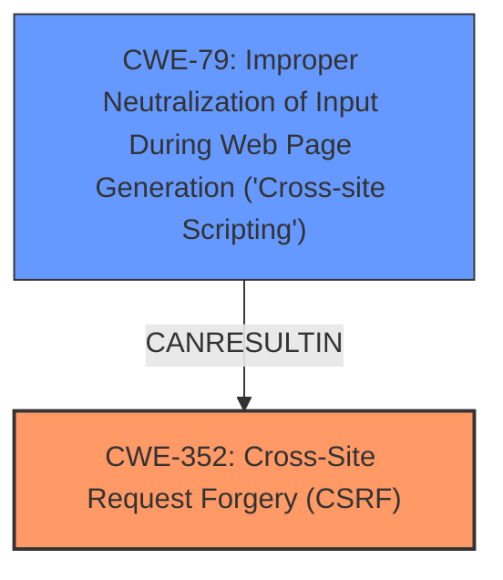

# Raw Analyzer Response for CVE-2024-54368

# Summary
| CWE ID | CWE Name | Confidence | CWE Abstraction Level | CWE Vulnerability Mapping Label | CWE-Vulnerability Mapping Notes |
|---|---|---|---|---|---|
| CWE-352 | Cross-Site Request Forgery (CSRF) | 1.0 | Compound | Allowed | Primary CWE |
| CWE-79 | Improper Neutralization of Input During Web Page Generation ('Cross-site Scripting') | 0.5 | Base | Allowed | Secondary Candidate |

## Evidence and Confidence

*   **Confidence Score:** 0.75
*   **Evidence Strength:** MEDIUM

## Relationship Analysis
The primary relationship that influenced the selection was that CWE-352 [Cross-Site Request Forgery (CSRF)] is a compound weakness. While it directly matches the **root cause** described in the vulnerability report, it can often lead to other weaknesses such as CWE-79 [Improper Neutralization of Input During Web Page Generation ('Cross-site Scripting')] or code injection. The evidence supports that CSRF can lead to code injection in this specific case, but not with enough information to directly claim code injection.

## Vulnerability Chain
The vulnerability chain starts with **CWE-352 [Cross-Site Request Forgery (CSRF)]**, which is the **root cause**. The impact of exploiting this vulnerability is code injection. It is possible that Cross-Site Scripting could be leveraged, however it is not explicitly stated in the description.

## Summary of Analysis
The initial analysis focused on identifying the **root cause** of the vulnerability. The vulnerability description and the CVE reference links content summary clearly indicate that the vulnerability is a **Cross-Site Request Forgery (CSRF)**.

The decision to select CWE-352 [Cross-Site Request Forgery (CSRF)] as the primary CWE is based on the following evidence:
*   The vulnerability description explicitly states that it is a "Cross-Site Request Forgery (CSRF) vulnerability".
*   The CVE reference links content summary confirms that the **root cause** of the vulnerability is "Cross-Site Request Forgery (CSRF)".
*   The retriever results list CWE-352 [Cross-Site Request Forgery (CSRF)] as the top combined result with a score of 0.227.

The decision to include CWE-79 [Improper Neutralization of Input During Web Page Generation ('Cross-site Scripting')] as a secondary candidate is because the vulnerability description mentions that the CSRF vulnerability allows code injection. Cross-Site Scripting can be used in conjunction with CSRF to inject code, but there is no direct evidence to claim that the vulnerability directly leverage Cross-Site Scripting.

Relevant CWE Information:
# Enhanced Context (25 CWEs)
The following CWEs were identified as potentially relevant to this vulnerability:

## CWE-352: Cross-Site Request Forgery (CSRF)
**Abstraction Level**: Compound
**Similarity Score**: 0.74
**Source**: dense

**Description**:
The web application does not, or can not, sufficiently verify whether a well-formed, valid, consistent request was intentionally provided by the user who submitted the request.

**Mapping Guidance**:
- Usage: Allowed
- Rationale: This is a well-known Composite of multiple weaknesses that must all occur simultaneously, although it is attack-oriented in nature.

## CWE-79: Improper Neutralization of Input During Web Page Generation ('Cross-site Scripting')
**Abstraction Level**: Base
**Similarity Score**: 700.06
**Source**: sparse

**Description**:
The product does not neutralize or incorrectly neutralizes user-controllable input before it is placed in output that is used as a web page that is served to other users.

**Mapping Guidance**:
- Usage: Allowed
- Rationale: This CWE entry is at the Base level of abstraction, which is a preferred level of abstraction for mapping to the root causes of vulnerabilities.

**Relationships**:
- PARENTOF -> CWE-87
- PARENTOF -> CWE-86
- PARENTOF -> CWE-85
- PARENTOF -> CWE-84
- PARENTOF -> CWE-83