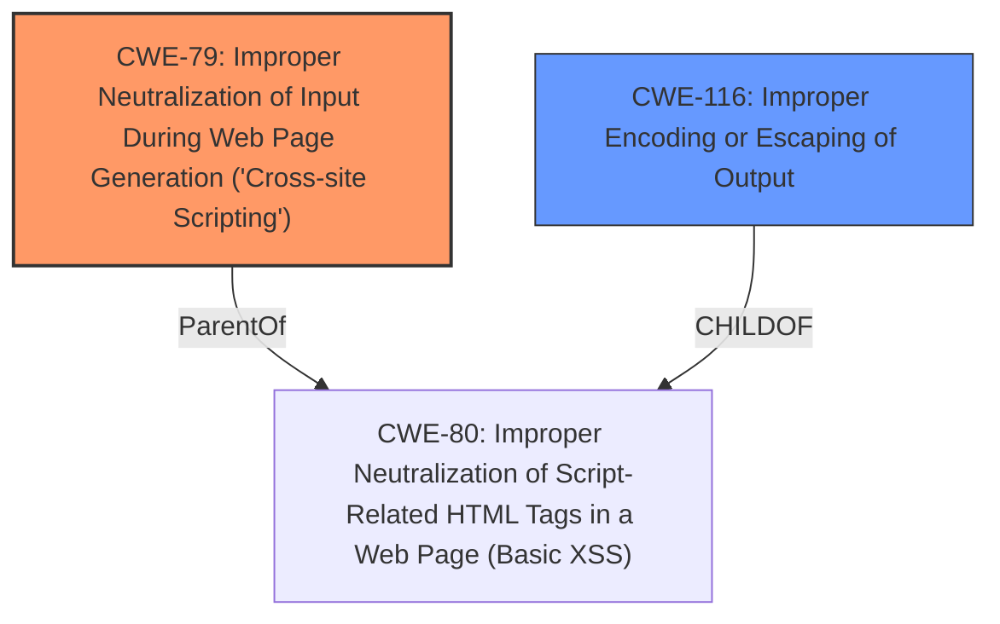

# Analysis Report for CVE-2024-5439

# Vulnerability Analysis Report: CVE-2024-5439

## Description

The Blocksy theme for WordPress is vulnerable to Reflected Cross-Site Scripting via the custom_url parameter in all versions up to, and including, 2.0.50 due to **insufficient input sanitization and output escaping**. This makes it possible for unauthenticated attackers to inject arbitrary web scripts in pages that execute if they can successfully trick a user into performing an action such as clicking on a link.

## Vulnerability Description Key Phrases

- **Rootcause:** insufficient input sanitization and output escaping
- **Weakness:** cross-site scripting
- **Impact:** inject arbitrary web scripts
- **Attacker:** unauthenticated attackers
- **Product:** Blocksy theme for WordPress
- **Version:** up to and including 2.0.50
- **Component:** custom_url parameter

## Analysis (with Relationship Data)

# Summary
| CWE ID | CWE Name | Confidence | CWE Abstraction Level | CWE Vulnerability Mapping Label | CWE-Vulnerability Mapping Notes |
|---|---|---|---|---|---|
| CWE-79 | Improper Neutralization of Input During Web Page Generation ('Cross-site Scripting') | 1.0 | Base | Allowed | Primary CWE |
| CWE-116 | Improper Encoding or Escaping of Output | 0.7 | Class | Allowed-with-Review | Secondary Candidate |

## Evidence and Confidence

*   **Confidence Score:** 0.9
*   **Evidence Strength:** HIGH

## Relationship Analysis
The primary relationship is that CWE-79 is a base-level weakness describing improper neutralization of input, a direct cause of the XSS vulnerability. CWE-116, a class-level weakness focusing on improper encoding/escaping of output, is related but less specific, as XSS is a common consequence of this issue. The choice of CWE-79 as primary reflects its more precise fit to the vulnerability description and the identified root cause, while CWE-116 is a contributing factor but at a higher abstraction.



## Vulnerability Chain
The vulnerability chain starts with the **insufficient input sanitization and output escaping** in the Blocksy theme. This leads to CWE-79 (Improper Neutralization of Input During Web Page Generation ('Cross-site Scripting')), which then allows attackers to inject arbitrary web scripts, leading to Cross-Site Scripting (XSS). The chain highlights the flow from the **root cause** (lack of sanitization/escaping) to the impact (XSS).

## Summary of Analysis
The analysis indicates that the Blocksy theme for WordPress is vulnerable to Reflected Cross-Site Scripting (XSS) due to **insufficient input sanitization and output escaping** of the `custom_url` parameter. The primary weakness is CWE-79 (Improper Neutralization of Input During Web Page Generation ('Cross-site Scripting')), as the theme **does not neutralize or incorrectly neutralizes user-controllable input before it is placed in output that is used as a web page**. This allows unauthenticated attackers to inject arbitrary web scripts.

The evidence supporting this is the vulnerability description itself, which explicitly mentions "**insufficient input sanitization and output escaping**" as the **root cause** of the XSS vulnerability. The CVE Reference Links Content Summary also confirms the lack of proper sanitization and escaping as the **root cause**, with the fix implemented by "correctly escape custom URLs in the social box."

CWE-79 is selected as the primary CWE because it directly addresses the **improper neutralization** of user input, which is the **root cause** of the XSS vulnerability. While CWE-116 (Improper Encoding or Escaping of Output) is also relevant, it's a broader class of weakness. CWE-79 is more specific to the context of web page generation and XSS.

CWE-80 (Improper Neutralization of Script-Related HTML Tags in a Web Page (Basic XSS)) was considered as it is a Variant of CWE-79, but CWE-79 was deemed more appropriate as it directly describes the **improper neutralization of input**, while CWE-80 focuses specifically on script-related HTML tags. CWE-352 (Cross-Site Request Forgery (CSRF)) was also considered, but it is not relevant as the vulnerability is related to XSS, not CSRF.


## CWE Relationship Analysis

Current CWEs represent these abstraction levels: .


### Vulnerability Chain Analysis

**Chain starting from CWE-352:**
- 352 (Cross-Site Request Forgery (CSRF)) - ROOT


**Chain starting from CWE-79:**
- 79 (Improper Neutralization of Input During Web Page Generation ('Cross-site Scripting')) - ROOT


### CWE Relationship Diagram

```mermaid
graph TD
    classDef primary fill:#f96,stroke:#333,stroke-width:2px
    classDef secondary fill:#69f,stroke:#333
    classDef tertiary fill:#9e9,stroke:#333
```


*Report generated on 2025-07-13 22:39:19*
