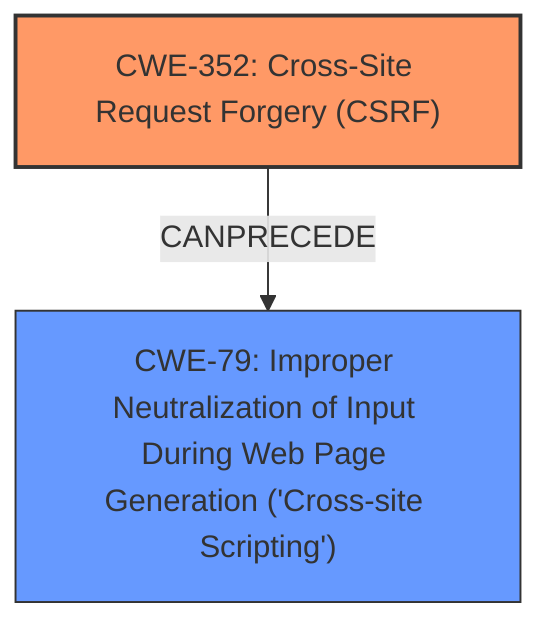

# Raw Analyzer Response for CVE-2024-54391

# Summary
| CWE ID    | CWE Name                                                                 | Confidence | CWE Abstraction Level | CWE Vulnerability Mapping Label | CWE-Vulnerability Mapping Notes |
| --------- | ------------------------------------------------------------------------ | ---------- | --------------------- | ------------------------------- | ------------------------------- |
| CWE-352   | Cross-Site Request Forgery (CSRF)                                        | 1          | Compound              | Primary                         | Allowed                         |
| CWE-79    | Improper Neutralization of Input During Web Page Generation ('Cross-site Scripting') | 0.9        | Base                  | Secondary                       | Allowed                         |

## Evidence and Confidence

*   **Confidence Score:** 0.95
*   **Evidence Strength:** HIGH

## Relationship Analysis
The primary relationship identified is that **CWE-352** (Cross-Site Request Forgery) can often precede **CWE-79** (Cross-Site Scripting), especially if the **lack of CSRF protection** allows an attacker to inject malicious scripts that are then rendered in a user's browser. **CWE-352** is a Compound CWE, while **CWE-79** is a Base CWE. I chose them because they are the most accurate and specific based on the vulnerability description.

## Vulnerability Chain
The vulnerability chain starts with the **lack of CSRF protection (CWE-352)**. This **allows** an attacker to craft malicious requests that, when executed, inject **XSS payloads** into the system. The injected payload then leads to **CWE-79 (Improper Neutralization of Input During Web Page Generation ('Cross-site Scripting'))**, as the application fails to properly neutralize the malicious input before rendering it in a web page.

## Summary of Analysis
The analysis indicates a Cross-Site Request Forgery (CSRF) vulnerability leading to Stored Cross-Site Scripting (XSS). The primary **ROOTCAUSE** is the **lack of CSRF protection**, which allows an attacker to inject malicious scripts. The injected scripts are then stored and executed, leading to XSS.

The key evidence supporting this is the vulnerability description: "Cross-Site Request Forgery (CSRF) vulnerability in Matt Walters WordPress Filter allows Stored **XSS**." This directly links the **lack of CSRF protection** to the **XSS** vulnerability.

**CWE-352** is selected as the primary CWE because the **lack of CSRF protection** is the initial **ROOTCAUSE** that enables the subsequent XSS. **CWE-79** is chosen as a secondary CWE because it represents the resulting impact of the injected script.

The other CWEs were considered but deemed less relevant:

*   CWE-434 (Unrestricted Upload of File with Dangerous Type): Not relevant as the vulnerability does not involve file uploads.
*   CWE-116 (Improper Encoding or Escaping of Output): While encoding issues can contribute to XSS, the primary issue here is the **lack of CSRF protection** enabling the injection.
*   CWE-862 (Missing Authorization): While authorization issues can be related to CSRF, the core problem is the **lack of CSRF protection** itself.
*   CWE-89 (Improper Neutralization of Special Elements used in an SQL Command ('SQL Injection')): Not relevant as the vulnerability does not involve SQL injection.
*   CWE-22 (Improper Limitation of a Pathname to a Restricted Directory ('Path Traversal')): Not relevant as the vulnerability does not involve path traversal.

The selected CWEs are at the optimal level of specificity, representing both the initial **ROOTCAUSE** (CWE-352) and the subsequent impact (CWE-79).