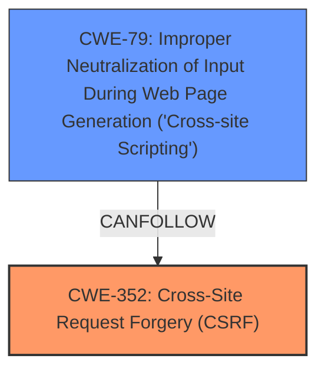

# Enhanced Analysis for CVE-2024-54394

# Summary
| CWE ID    | CWE Name                                                                         | Confidence | CWE Abstraction Level | CWE Vulnerability Mapping Label | CWE-Vulnerability Mapping Notes |
| :-------- | :------------------------------------------------------------------------------- | :--------- | :---------------------- | :------------------------------ | :------------------------------ |
| CWE-352   | Cross-Site Request Forgery (CSRF)                                                | 0.9        | Compound                | Primary                       | Allowed                       |
| CWE-79    | Improper Neutralization of Input During Web Page Generation ('Cross-site Scripting') | 0.8        | Base                    | Secondary                     | Allowed                       |

## Evidence and Confidence

*   **Confidence Score:** 0.85
*   **Evidence Strength:** HIGH

## Relationship Analysis
The primary weakness is the **lack of CSRF protection**, which directly leads to the possibility of Stored **XSS**. CWE-352 [Cross-Site Request Forgery (CSRF)] is a compound weakness that describes the **lack of verification** of requests. CWE-79 [Improper Neutralization of Input During Web Page Generation ('Cross-site Scripting')] describes the **improper neutralization** of input, leading to **XSS**. CWE-352 [Cross-Site Request Forgery (CSRF)] allows an attacker to perform actions on behalf of a user without their knowledge or consent. If the application doesn't properly neutralize user-supplied input, this can lead to stored **XSS** (CWE-79 [Improper Neutralization of Input During Web Page Generation ('Cross-site Scripting')]), where the malicious script is permanently stored on the server and executed whenever a user views the affected page.



## Vulnerability Chain
The vulnerability chain starts with the **lack of CSRF protection** (CWE-352 [Cross-Site Request Forgery (CSRF)]), which allows an attacker to inject malicious code. This injected code isn't properly neutralized (CWE-79 [Improper Neutralization of Input During Web Page Generation ('Cross-site Scripting')]), leading to Stored **XSS**.

CWE-352 (ROOT CAUSE) -> CWE-79 (IMPACT)

## Summary of Analysis
The primary **root cause** of this vulnerability is the **lack of CSRF protection**, which is best represented by CWE-352 [Cross-Site Request Forgery (CSRF)]. The resulting **XSS** is a consequence of the **lack of input validation** and can be classified as CWE-79 [Improper Neutralization of Input During Web Page Generation ('Cross-site Scripting')]. The description states "Cross-Site Request Forgery (CSRF) vulnerability in Web solution soft Mandrill WP allows Stored **XSS**". This indicates that a **lack of CSRF protection** is allowing **XSS** to occur. CWE-352 [Cross-Site Request Forgery (CSRF)] is a compound weakness but accurately describes the **root cause**.

The retriever results show high scores for CWE-352 [Cross-Site Request Forgery (CSRF)] and CWE-79 [Improper Neutralization of Input During Web Page Generation ('Cross-site Scripting')], further supporting this classification.

CWE-80 [Improper Neutralization of Script-Related HTML Tags in a Web Page (Basic XSS)] was considered, but CWE-79 [Improper Neutralization of Input During Web Page Generation ('Cross-site Scripting')] is a more general case that covers the Stored **XSS** aspect more accurately. The other CWEs from the retriever results were considered but deemed less relevant as they didn't directly address the **lack of CSRF protection** and resulting **XSS**.

Relevant CWE Information:
*   The **root cause** is the **lack of CSRF protection**
*   The weakness is Stored **XSS**
*   CWE-352 [Cross-Site Request Forgery (CSRF)] is a compound weakness
*   CWE-79 [Improper Neutralization of Input During Web Page Generation ('Cross-site Scripting')] is a base weakness


## CWE Relationship Analysis

Current CWEs represent these abstraction levels: .


### Vulnerability Chain Analysis

**Chain starting from CWE-352:**
- 352 (Cross-Site Request Forgery (CSRF)) - ROOT


**Chain starting from CWE-79:**
- 79 (Improper Neutralization of Input During Web Page Generation ('Cross-site Scripting')) - ROOT


### CWE Relationship Diagram

```mermaid
graph TD
    classDef primary fill:#f96,stroke:#333,stroke-width:2px
    classDef secondary fill:#69f,stroke:#333
    classDef tertiary fill:#9e9,stroke:#333
```