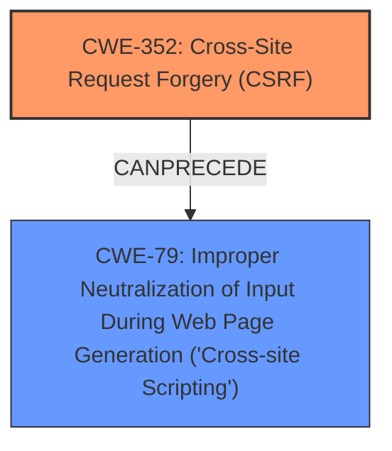

# Analysis for CVE-2024-54405

# Summary
| CWE ID | CWE Name | Confidence | CWE Abstraction Level | CWE Vulnerability Mapping Label | CWE-Vulnerability Mapping Notes |
|---|---|---|---|---|---|
| CWE-352 | Cross-Site Request Forgery (CSRF) | 1.0 | Compound | ROOTCAUSE | Allowed |
| CWE-79 | Improper Neutralization of Input During Web Page Generation ('Cross-site Scripting') | 1.0 | Base | WEAKNESS | Allowed |

## Evidence and Confidence

*   **Confidence Score:** 1.0
*   **Evidence Strength:** HIGH

## Relationship Analysis
The analysis focuses on identifying the root cause and the resulting weakness. **CWE-352** is the primary root cause due to the **lack of CSRF protection**, which allows an attacker to induce users into performing actions they do not intend to. **CWE-79** is the resulting weakness as the **lack of CSRF protection** can lead to the injection of malicious scripts into the web page, which is then executed by other users. There is no direct parent-child relationship between **CWE-352** and **CWE-79**, but they can exist in a chain where **CWE-352** allows for **CWE-79**.

## Vulnerability Chain
The vulnerability chain starts with the **lack of CSRF protection** (**CWE-352**), which allows an attacker to inject malicious input. This input is then improperly neutralized, leading to **Cross-Site Scripting** (**CWE-79**).

## Summary of Analysis
The vulnerability is classified as **CWE-352** and **CWE-79** based on the provided description and keyphrases. The primary **root cause** is the **lack of CSRF protection** (**CWE-352**), which enables the **Stored XSS** (**CWE-79**) vulnerability.

The evidence is strong, with the vulnerability description explicitly mentioning the **lack of CSRF protection** and the resulting **Stored XSS**. This aligns well with the definitions of **CWE-352** and **CWE-79**, respectively.

The selected CWEs are at the optimal level of specificity, as they accurately represent the **root cause** and the resulting **weakness** of the vulnerability.

CWEs considered but not used:

*   **CWE-116 (Improper Encoding or Escaping of Output):** While encoding issues can contribute to XSS, the primary issue here is the **lack of CSRF protection** allowing the initial injection.
*   **CWE-434 (Unrestricted Upload of File with Dangerous Type):** This CWE is not relevant as the vulnerability does not involve file uploads.
*   **CWE-1004 (Sensitive Cookie Without 'HttpOnly' Flag):** This CWE is not directly related to the reported vulnerability.
*   **CWE-80 (Improper Neutralization of Script-Related HTML Tags in a Web Page (Basic XSS)):** CWE-79 is preferred over CWE-80 because the description indicates that the XSS is stored.
*   **CWE-22 (Improper Limitation of a Pathname to a Restricted Directory ('Path Traversal')) and CWE-89 (Improper Neutralization of Special Elements used in an SQL Command ('SQL Injection')):** These CWEs are not applicable as the vulnerability is related to CSRF and XSS, not path traversal or SQL injection.
*   **CWE-40 (Path Traversal: '\\UNC\share\name\' (Windows UNC Share)):** This is specific to Windows UNC shares and is not relevant to the general CSRF and XSS issue.
*   **CWE-41 (Improper Resolution of Path Equivalence)** and **CWE-73 (External Control of File Name or Path):** These CWEs are related to file path manipulation, which is not the primary issue in this vulnerability.
*   **CWE-78 (Improper Neutralization of Special Elements used in an OS Command ('OS Command Injection')):** This CWE is not relevant as the vulnerability does not involve OS command injection.
*   **CWE-494 (Download of Code Without Integrity Check):** This CWE is not relevant as the vulnerability does not involve downloading code without integrity checks.
*   **CWE-668 (Exposure of Resource to Wrong Sphere), CWE-212 (Improper Removal of Sensitive Information Before Storage or Transfer), CWE-425 (Direct Request ('Forced Browsing')), CWE-451 (User Interface (UI) Misrepresentation of Critical Information), CWE-472 (External Control of Assumed-Immutable Web Parameter), CWE-138 (Improper Neutralization of Special Elements):** These are not directly related to CSRF and XSS.