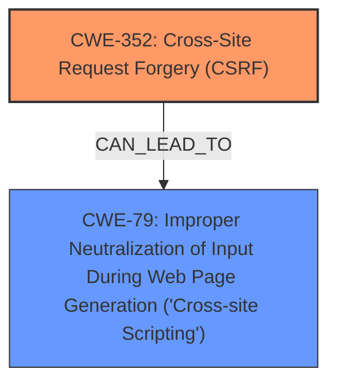

# Raw Analyzer Response for CVE-2024-54432

# Summary
| CWE ID | CWE Name | Confidence | CWE Abstraction Level | CWE Vulnerability Mapping Label | CWE-Vulnerability Mapping Notes |
|---|---|---|---|---|---|
| CWE-352 | Cross-Site Request Forgery (CSRF) | 0.9 | Compound | Primary | Allowed |
| CWE-79 | Improper Neutralization of Input During Web Page Generation ('Cross-site Scripting') | 0.9 | Base | Secondary | Allowed |

## Evidence and Confidence

*   **Confidence Score:** 0.9
*   **Evidence Strength:** HIGH

## Relationship Analysis
The primary relationship to consider is that CWE-352 [Cross-Site Request Forgery (CSRF)] can often lead to other vulnerabilities if successfully exploited. In this case, the lack of CSRF protection allows for Stored XSS (CWE-79 [Improper Neutralization of Input During Web Page Generation ('Cross-site Scripting')]). Therefore, CWE-352 is the root cause, and CWE-79 is a consequence of the **lack of CSRF protection**.

## Vulnerability Chain
The vulnerability chain starts with the **lack of CSRF protection** (CWE-352). This allows an attacker to trick a user into performing actions they did not intend to, which, in this case, results in stored XSS (CWE-79). The chain is: CWE-352 -> CWE-79. CWE-352 is the root cause, and CWE-79 is the impact.

## Summary of Analysis
The vulnerability description clearly states that the plugin is vulnerable to Cross-Site Request Forgery (CSRF) and that this leads to Stored XSS. The **root cause** of the vulnerability is the **lack of CSRF protection**, making CWE-352 the primary CWE. The **XSS vulnerability** is a direct consequence of the missing CSRF protection.

The evidence supporting this assessment includes:
*   "**rootcause:** **lack of CSRF protection**" from the "Vulnerability Description Key Phrases".
*   "**weakness:** **XSS**" from the "Vulnerability Description Key Phrases".
*   "**Root cause of vulnerability**: The WP Flipkart Importer plugin lacks sufficient protection against Cross-Site Request Forgery (CSRF) attacks." from the "CVE Reference Links Content Summary".
*   "**Impact of exploitation**: A malicious actor could force higher-privileged users to execute unwanted actions on the plugin under their current authentication. This could lead to unauthorized changes or actions within the plugin's context" from the "CVE Reference Links Content Summary".

CWE-79 is selected because the application does not neutralize user-controllable input allowing for XSS.

Other CWEs Considered:

*   CWE-434 [Unrestricted Upload of File with Dangerous Type]: Not applicable, as the vulnerability does not involve uploading files.
*   CWE-116 [Improper Encoding or Escaping of Output]: While encoding/escaping issues can contribute to XSS, the primary issue here is the **lack of CSRF protection**, which allows the attacker to inject the malicious code in the first place. Therefore, CWE-116 is not the root cause.
*   CWE-89 [Improper Neutralization of Special Elements used in an SQL Command ('SQL Injection')]: Not applicable, as the vulnerability does not involve SQL injection.
*   CWE-425 [Direct Request ('Forced Browsing')]: Not applicable, as it does not clearly describe the **lack of CSRF protection**.
*   CWE-472 [External Control of Assumed-Immutable Web Parameter]: Not applicable, as it does not clearly describe the **lack of CSRF protection**.

The selected CWEs (CWE-352 and CWE-79) are at the optimal level of specificity because they directly address the **root cause** (**lack of CSRF protection**) and the resulting impact (Stored XSS).