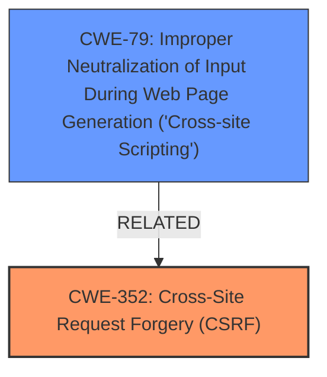

# Analysis Report for CVE-2024-54435

# Vulnerability Analysis Report: CVE-2024-54435

## Description

**Cross-Site Request Forgery (CSRF)** vulnerability in Thomas Hoefter Onlywire Multi Autosubmitter allows Stored **XSS**.This issue affects Onlywire Multi Autosubmitter from n/a through 1.2.4.

## Vulnerability Description Key Phrases

- **Rootcause:** Cross-Site Request Forgery (CSRF)
- **Weakness:** XSS
- **Impact:** Stored XSS
- **Product:** Thomas Hoefter Onlywire Multi Autosubmitter
- **Version:** n/a through 1.2.4

## Analysis (with Relationship Data)

# Summary
| CWE ID | CWE Name | Confidence | CWE Abstraction Level | CWE Vulnerability Mapping Label | CWE-Vulnerability Mapping Notes |
|---|---|---|---|---|---|
| CWE-352 | Cross-Site Request Forgery (CSRF) | 0.9 | Compound | Primary | Allowed |
| CWE-79 | Improper Neutralization of Input During Web Page Generation ('Cross-site Scripting') | 0.8 | Base | Secondary | Allowed |

## Evidence and Confidence

*   **Confidence Score:** 0.85
*   **Evidence Strength:** HIGH

## Relationship Analysis
The primary CWE is CWE-352 [CWE-352: Cross-Site Request Forgery (CSRF)], which is a Compound weakness. The secondary CWE is CWE-79 [CWE-79: Improper Neutralization of Input During Web Page Generation ('Cross-site Scripting')], which is a Base level weakness and can result from **improper** neutralization of input. CWE-352 [CWE-352: Cross-Site Request Forgery (CSRF)] can lead to actions being performed on behalf of a user without their consent, in this case, leading to Stored XSS by injecting malicious scripts.



## Vulnerability Chain
The vulnerability chain starts with a **CSRF** vulnerability (CWE-352 [CWE-352: Cross-Site Request Forgery (CSRF)]), which allows an attacker to induce unintended actions. This leads to Stored **XSS** (CWE-79 [CWE-79: Improper Neutralization of Input During Web Page Generation ('Cross-site Scripting')]) because the input is not properly neutralized.

## Summary of Analysis
The analysis is based on the provided evidence. The vulnerability description explicitly mentions both **CSRF** and **XSS**, indicating that both weaknesses are present. The "CVE Reference Links Content Summary" section further confirms that the root cause is **CSRF**, which can then lead to Stored **XSS**.

The graph relationships influenced the selection by showing the potential connections between the different weaknesses. In this case, CWE-352 [CWE-352: Cross-Site Request Forgery (CSRF)] can lead to CWE-79 [CWE-79: Improper Neutralization of Input During Web Page Generation ('Cross-site Scripting')].

The selected CWEs are at the optimal level of specificity. CWE-352 [CWE-352: Cross-Site Request Forgery (CSRF)] is a compound weakness that describes the overall attack, while CWE-79 [CWE-79: Improper Neutralization of Input During Web Page Generation ('Cross-site Scripting')] is a base weakness that describes the specific coding error that allows the attack to succeed.

CWE-79 [CWE-79: Improper Neutralization of Input During Web Page Generation ('Cross-site Scripting')] was selected because the vulnerability description indicates that Stored **XSS** is present, which means that the input is not properly neutralized before being stored and displayed to other users. The "CVE Reference Links Content Summary" also confirms this, stating that a successful **CSRF** attack could force a higher-privileged user to perform unwanted actions within the WordPress plugin, leading to the **XSS**.

CWE-352 [CWE-352: Cross-Site Request Forgery (CSRF)] was selected as the primary CWE because the vulnerability description explicitly mentions **CSRF** as the root cause. The "CVE Reference Links Content Summary" also confirms this, stating that the root cause is the presence of a **Cross-Site Request Forgery (CSRF)** vulnerability.

Other CWEs Considered but Not Used:

*   CWE-80 [CWE-80: Improper Neutralization of Script-Related HTML Tags in a Web Page (Basic XSS)]: While related to XSS, CWE-79 [CWE-79: Improper Neutralization of Input During Web Page Generation ('Cross-site Scripting')] is more general and appropriate for Stored XSS.
*   CWE-89 [CWE-89: Improper Neutralization of Special Elements used in an SQL Command ('SQL Injection')]: There is no evidence of SQL injection in the vulnerability description.
*   CWE-918 [CWE-918: Server-Side Request Forgery (SSRF)]: There is no evidence of Server-Side Request Forgery in the vulnerability description.
*   CWE-425 [CWE-425: Direct Request ('Forced Browsing')]: While access control issues are possible, the description focuses on **CSRF** and **XSS**.
*   CWE-434 [CWE-434: Unrestricted Upload of File with Dangerous Type]: This CWE is not relevant to the vulnerability description.


## CWE Relationship Analysis

Current CWEs represent these abstraction levels: .


### Vulnerability Chain Analysis

**Chain starting from CWE-89:**
- 89 (Improper Neutralization of Special Elements used in an SQL Command ('SQL Injection')) - ROOT


**Chain starting from CWE-80:**
- 80 (Improper Neutralization of Script-Related HTML Tags in a Web Page (Basic XSS)) - ROOT


### CWE Relationship Diagram

```mermaid
graph TD
    classDef primary fill:#f96,stroke:#333,stroke-width:2px
    classDef secondary fill:#69f,stroke:#333
    classDef tertiary fill:#9e9,stroke:#333
```


*Report generated on 2025-07-13 22:48:49*
