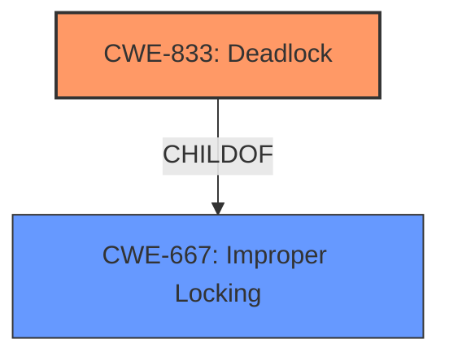

# Analysis Report for CVE-2024-54460

# Vulnerability Analysis Report: CVE-2024-54460

## Description

In the Linux kernel, the following vulnerability has been resolved Bluetooth iso Fix circular lock in iso_listen_bis This fixes the **circular locking dependency** warning below, by releasing the socket lock before enterning iso_listen_bis, to avoid any potential deadlock with hdev lock. [ 75.307983] ====================================================== [ 75.307984] WARNING possible **circular locking dependency** detected [ 75.307985] 6.12.0-rc6+ #22 Not tainted [ 75.307987] ------------------------------------------------------ [ 75.307987] kworker/u812/2623 is trying to acquire lock [ 75.307988] ffff8fde1769da58 (sk_lock-AF_BLUETOOTH-BTPROTO_ISO) at iso_connect_cfm+0x253/0x840 [bluetooth] [ 75.308021] but task is already holding lock [ 75.308022] ffff8fdd61a10078 (&hdev->lock) at hci_le_per_adv_report_evt+0x47/0x2f0 [bluetooth] [ 75.308053] which lock already depends on the new lock. [ 75.308054] the existing dependency chain (in reverse order) is [ 75.308055] -> #1 (&hdev->lock){+.+.}-{33} [ 75.308057] __mutex_lock+0xad/0xc50 [ 75.308061] mutex_lock_nested+0x1b/0x30 [ 75.308063] iso_sock_listen+0x143/0x5c0 [bluetooth] [ 75.308085] __sys_listen_socket+0x49/0x60 [ 75.308088] __x64_sys_listen+0x4c/0x90 [ 75.308090] x64_sys_call+0x2517/0x25f0 [ 75.308092] do_syscall_64+0x87/0x150 [ 75.308095] entry_SYSCALL_64_after_hwframe+0x76/0x7e [ 75.308098] -> #0 (sk_lock-AF_BLUETOOTH-BTPROTO_ISO){+.+.}-{00} [ 75.308100] __lock_acquire+0x155e/0x25f0 [ 75.308103] lock_acquire+0xc9/0x300 [ 75.308105] lock_sock_nested+0x32/0x90 [ 75.308107] iso_connect_cfm+0x253/0x840 [bluetooth] [ 75.308128] hci_connect_cfm+0x6c/0x190 [bluetooth] [ 75.308155] hci_le_per_adv_report_evt+0x27b/0x2f0 [bluetooth] [ 75.308180] hci_le_meta_evt+0xe7/0x200 [bluetooth] [ 75.308206] hci_event_packet+0x21f/0x5c0 [bluetooth] [ 75.308230] hci_rx_work+0x3ae/0xb10 [bluetooth] [ 75.308254] process_one_work+0x212/0x740 [ 75.308256] worker_thread+0x1bd/0x3a0 [ 75.308258] kthread+0xe4/0x120 [ 75.308259] ret_from_fork+0x44/0x70 [ 75.308261] ret_from_fork_asm+0x1a/0x30 [ 75.308263] other info that might help us debug this [ 75.308264] Possible unsafe locking scenario [ 75.308264] CPU0 CPU1 [ 75.308265] ---- ---- [ 75.308265] lock(&hdev->lock) [ 75.308267] lock(sk_lock- AF_BLUETOOTH-BTPROTO_ISO) [ 75.308268] lock(&hdev->lock) [ 75.308269] lock(sk_lock-AF_BLUETOOTH-BTPROTO_ISO) [ 75.308270] *** DEADLOCK *** [ 75.308271] 4 locks held by kworker/u812/2623 [ 75.308272] #0 ffff8fdd66e52148 ((wq_completion)hci0#2){+.+.}-{00}, at process_one_work+0x443/0x740 [ 75.308276] #1 ffffafb488b7fe48 ((work_completion)(&hdev->rx_work)), at process_one_work+0x1ce/0x740 [ 75.308280] #2 ffff8fdd61a10078 (&hdev->lock){+.+.}-{33} at hci_le_per_adv_report_evt+0x47/0x2f0 [bluetooth] [ 75.308304] #3 ffffffffb6ba4900 (rcu_read_lock){....}-{12}, at hci_connect_cfm+0x29/0x190 [bluetooth]

## Vulnerability Description Key Phrases

- **Rootcause:** circular locking dependency
- **Impact:** deadlock
- **Product:** Linux kernel
- **Version:** 6.12.0-rc6+
- **Component:** Bluetooth iso

## Analysis (with Relationship Data)

# Summary

| CWE ID  | CWE Name                                                                                                    | Confidence | CWE Abstraction Level | CWE Vulnerability Mapping Label | CWE-Vulnerability Mapping Notes |
| ------- | ----------------------------------------------------------------------------------------------------------- | ---------- | ----------------------- | ------------------------------- | ------------------------------- |
| CWE-833 | Deadlock                                                                                                      | 1.0        | Base                    | Primary                         | Allowed                         |
| CWE-667 | Improper Locking                                                                                                | 0.7        | Class                   | Secondary                       | Allowed-with-Review             |

## Evidence and Confidence

*   **Confidence Score:** 0.9
*   **Evidence Strength:** HIGH

## Relationship Analysis

The primary CWE identified is CWE-833 (Deadlock), which is a Base level CWE. CWE-833 is related to CWE-667 (Improper Locking) through a child-parent relationship. Since the vulnerability description explicitly mentions a **circular locking dependency** leading to a **deadlock**, CWE-833 is more specific and therefore more appropriate than its parent CWE-667.



## Vulnerability Chain

The vulnerability chain starts with a **circular locking dependency** which leads directly to a **deadlock**. Therefore:

1.  Root Cause: **Circular locking dependency**
2.  Impact: **Deadlock**

## Summary of Analysis

The vulnerability description clearly indicates a **circular locking dependency** resulting in a **deadlock**. The key phrase "fixes the **circular locking dependency** warning below, by releasing the socket lock before enterning iso_listen_bis, to avoid any potential deadlock with hdev lock" provides explicit evidence.

CWE-833 (Deadlock) directly addresses the described impact. It is a Base level CWE, providing a suitable level of specificity. CWE-667 (Improper Locking) is a Class level CWE and is a parent of CWE-833. While relevant, it is less specific than CWE-833.

The retriever results also list CWE-833 with a relatively high score, further supporting its selection.

I am highly confident in the selection of CWE-833 as the primary CWE due to the explicit mention of "deadlock" and the "circular locking dependency". The evidence is strong and the CWE aligns well with the vulnerability description.

Relevant CWE Information:

# Enhanced Context (25 CWEs)
The following CWEs were identified as potentially relevant to this vulnerability:

## CWE-667: Improper Locking
**Abstraction Level**: Class
**Similarity Score**: 0.78
**Source**: dense

**Description**:
The product does not properly acquire or release a lock on a resource, leading to unexpected resource state changes and behaviors.

**Mapping Guidance**:
- Usage: Allowed-with-Review
- Rationale: This CWE entry is a Class and might have Base-level children that would be more appropriate

## CWE-833: Deadlock
**Abstraction Level**: Base
**Similarity Score**: 0.77
**Source**: dense

**Description**:
The product contains multiple threads or executable segments that are waiting for each other to release a necessary lock, resulting in deadlock.

**Mapping Guidance**:
- Usage: Allowed
- Rationale: This CWE entry is at the Base level of abstraction, which is a preferred level of abstraction for mapping to the root causes of vulnerabilities.

## CWE-362: Concurrent Execution using Shared Resource with Improper Synchronization ('Race Condition')
**Abstraction Level**: Class
**Similarity Score**: 0.75
**Source**: dense

**Description**:
The product contains a concurrent code sequence that requires temporary, exclusive access to a shared resource, but a timing window exists in which the shared resource can be modified by another code sequence operating concurrently.

**Mapping Guidance**:
- Usage: Allowed-with-Review
- Rationale: This CWE entry is a Class and might have Base-level children that would be more appropriate

## CWE-754: Improper Check for Unusual or Exceptional Conditions
**Abstraction Level**: Class
**Similarity Score**: 0.75
**Source**: dense

**Description**:
The product does not check or incorrectly checks for unusual or exceptional conditions that are not expected to occur frequently during day to day operation of the product.

**Mapping Guidance**:
- Usage: Allowed-with-Review
- Rationale: This CWE entry is a Class and might have Base-level children that would be more appropriate

## CWE-755: Improper Handling of Exceptional Conditions
**Abstraction Level**: Class
**Similarity Score**: 0.74
**Source**: dense

**Description**:
The product does not handle or incorrectly handles an exceptional condition.

**Mapping Guidance**:
- Usage: Discouraged
- Rationale: This CWE entry is a level-1 Class (i.e., a child of a Pillar). It might have lower-level children that would be more appropriate

## CWE-824: Access of Uninitialized Pointer
**Abstraction Level**: Base
**Similarity Score**: 0.74
**Source**: dense

**Description**:
The product accesses or uses a pointer that has not been initialized.

**Mapping Guidance**:
- Usage: Allowed
- Rationale: This CWE entry is at the Base level of abstraction, which is a preferred level of abstraction for mapping to the root causes of vulnerabilities.

## CWE-703: Improper Check or Handling of Exceptional Conditions
**Abstraction Level**: Pillar
**Similarity Score**: 0.74
**Source**: dense

**Description**:
The product does not properly anticipate or handle exceptional conditions that rarely occur during normal operation of the product.

**Mapping Guidance**:
- Usage: Discouraged
- Rationale: This CWE entry is extremely high-level, a Pillar.

## CWE-367: Time-of-check Time-of-use (TOCTOU) Race Condition
**Abstraction Level**: Base
**Similarity Score**: 0.74
**Source**: dense

**Description**:
The product checks the state of a resource before using that resource, but the resource's state can change between the check and the use in a way that invalidates the results of the check. This can cause the product to perform invalid actions when the resource is in an unexpected state.

**Mapping Guidance**:
- Usage: Allowed
- Rationale: This CWE entry is at the Base level of abstraction, which is a preferred level of abstraction for mapping to the root causes of vulnerabilities.

## CWE-843: Access of Resource Using Incompatible Type ('Type Confusion')
**Abstraction Level**: Base
**Similarity Score**: 0.73
**Source**: dense

**Description**:
The product allocates or initializes a resource such as a pointer, object, or variable using one type, but it later accesses that resource using a type that is incompatible with the original type.

**Mapping Guidance**:
- Usage: Allowed
- Rationale: This CWE entry is at the Base level of abstraction, which is a preferred level of abstraction for mapping to the root causes of vulnerabilities.

## CWE-404: Improper Resource Shutdown or Release
**Abstraction Level**: Class
**Similarity Score**: 0.73
**Source**: dense

**Description**:
The product does not release or incorrectly releases a resource before it is made available for re-use.

**Mapping Guidance**:
- Usage: Allowed-with-Review
- Rationale: This CWE entry is a Class and might have Base-level children that would be more appropriate

## CWE-75: Failure to Sanitize Special Elements into a Different Plane (Special Element Injection)
**Abstraction Level**: Class
**Similarity Score**: 692.45
**Source**: sparse

**Description**:
The product does not adequately filter user-controlled input for special elements with control implications.

**Mapping Guidance**:
- Usage: Discouraged
- Rationale: This CWE entry might be under consideraton for deprecation, as it is not easily distinguishable from CWE-74.

## CWE-76: Improper Neutralization of Equivalent Special Elements
**Abstraction Level**: Base
**Similarity Score**: 682.10
**Source**: sparse

**Description**:
The product correctly neutralizes certain special elements, but it improperly neutralizes equivalent special elements.

**Mapping Guidance**:
- Usage: Allowed
- Rationale: This CWE entry is at the Base level of abstraction, which is a preferred level of abstraction for mapping to the root causes of vulnerabilities.

## CWE-667: Improper Locking
**Abstraction Level**: Class
**Similarity Score**: 677.29
**Source**: sparse

**Description**:
The product does not properly acquire or release a lock on a resource, leading to unexpected resource state changes and behaviors.

**Mapping Guidance**:
- Usage: Allowed-with-Review
- Rationale: This CWE entry is a Class and might have Base-level children that would be more appropriate

## CWE-74: Improper Neutral


## CWE Relationship Analysis

Current CWEs represent these abstraction levels: .


### Vulnerability Chain Analysis

**Chain starting from CWE-75:**
- 75 (Failure to Sanitize Special Elements into a Different Plane (Special Element Injection)) - ROOT


**Chain starting from CWE-404:**
- 404 (Improper Resource Shutdown or Release) - ROOT


### CWE Relationship Diagram

```mermaid
graph TD
    classDef primary fill:#f96,stroke:#333,stroke-width:2px
    classDef secondary fill:#69f,stroke:#333
    classDef tertiary fill:#9e9,stroke:#333
```


*Report generated on 2025-07-13 22:50:24*
