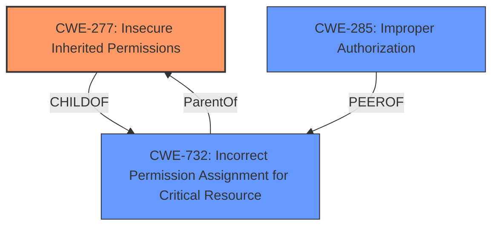

# Analysis Report for CVE-2024-54463

# Vulnerability Analysis Report: CVE-2024-54463

## Description

This issue was addressed with improved entitlements. This issue is fixed in macOS Sequoia 15. An app may be able to access removable volumes without user consent.

## Vulnerability Description Key Phrases

- **Impact:** access removable volumes without user consent
- **Product:** macOS Sequoia
- **Version:** 15

## Analysis (with Relationship Data)

# Summary
| CWE ID | CWE Name | Confidence | CWE Abstraction Level | CWE Vulnerability Mapping Label | CWE-Vulnerability Mapping Notes |
|---|---|---|---|---|---|
| CWE-277 | Insecure Inherited Permissions | 0.8 | Variant | Allowed | Primary CWE |
| CWE-732 | Incorrect Permission Assignment for Critical Resource | 0.6 | Class | Allowed-with-Review | Secondary Candidate |
| CWE-285 | Improper Authorization | 0.5 | Class | Discouraged | Secondary Candidate |

## Evidence and Confidence

*   **Confidence Score:** 0.8
*   **Evidence Strength:** MEDIUM

## Relationship Analysis
The primary CWE is CWE-277, which is a variant. The other CWEs considered are higher level classes, such as CWE-732 and CWE-285. While the description indicates an authorization issue, the fix implemented ("improved entitlements") suggests that the **root cause** is related to how permissions are handled and inherited.



## Vulnerability Chain
The vulnerability chain starts with **Insecure Inherited Permissions** (CWE-277), which leads to an application being able to "access removable volumes without user consent".

## Summary of Analysis
The initial analysis considered several CWEs, especially focusing on those related to authorization and permissions. The vulnerability description states that an app can "access removable volumes without user consent," and the fix involves "improved entitlements." This suggests that the **root cause** lies in how permissions are defined and inherited, making CWE-277 the most relevant choice. While CWE-732 (Incorrect Permission Assignment for Critical Resource) and CWE-285 (Improper Authorization) are related, they are higher-level classifications. CWE-277 provides a more specific explanation of the issue.

Relevant CWE Information:

# Enhanced Context (25 CWEs)
The following CWEs were identified as potentially relevant to this vulnerability:

## CWE-277: Insecure Inherited Permissions
**Abstraction Level**: Variant
**Similarity Score**: 0.69
**Source**: dense

**Description**:
A product defines a set of **insecure permissions** that are inherited by objects that are created by the program.

**Mapping Guidance**:
- Usage: Allowed
- Rationale: This CWE entry is at the Variant level of abstraction, which is a preferred level of abstraction for mapping to the **root causes** of vulnerabilities.

## CWE-732: Incorrect Permission Assignment for Critical Resource
**Abstraction Level**: Class
**Similarity Score**: 0.66
**Source**: dense

**Description**:
The product specifies permissions for a security-critical resource in a way that allows that resource to be read or modified by unintended actors.

**Mapping Guidance**:
- Usage: Allowed-with-Review
- Rationale: While the name itself indicates an assignment of permissions for resources, this is often misused for vulnerabilities in which "permissions" are not checked, which is an "authorization" weakness (CWE-285 or descendants) within CWE's model [REF-1287].

## CWE-285: Improper Authorization
**Abstraction Level**: Class
**Similarity Score**: 0.66
**Source**: sparse

**Description**:
The product does not perform or incorrectly performs an authorization check when an actor attempts to access a resource or perform an action.

**Mapping Guidance**:
- Usage: Discouraged
- Rationale: CWE-285 is high-level and lower-level CWEs can frequently be used instead. It is a level-1 Class (i.e., a child of a Pillar).

## CWE-787: Out-of-bounds Write
CWE-787, CWE-843, CWE-665, CWE-20, CWE-72 and CWE-825 were considered but rejected as they are not relevant to the **root cause** of the vulnerability, which appears to be related to the handling of permissions and entitlements, not memory corruption, type confusion, or input validation issues. The **impact** is access without user consent, but the **root cause** is the insecure permission inheritance.

*   **CWE-277: Insecure Inherited Permissions** - This is the primary CWE because the fix involved "improved entitlements". The description of CWE-277, "A product defines a set of **insecure permissions** that are inherited by objects that are created by the program," aligns directly with the vulnerability.
*   **CWE-732: Incorrect Permission Assignment for Critical Resource** - Considered as a secondary CWE because it is related to permission issues. However, it is a class-level CWE, and CWE-277 is more specific.
*   **CWE-285: Improper Authorization** - Considered, but the **root cause** seems to be how the permissions are inherited rather than a failure to perform an authorization check.


## CWE Relationship Analysis

Current CWEs represent these abstraction levels: .


### Vulnerability Chain Analysis

**Chain starting from CWE-72:**
- 72 (Improper Handling of Apple HFS+ Alternate Data Stream Path) - ROOT


**Chain starting from CWE-732:**
- 732 (Incorrect Permission Assignment for Critical Resource) - ROOT


### CWE Relationship Diagram

```mermaid
graph TD
    classDef primary fill:#f96,stroke:#333,stroke-width:2px
    classDef secondary fill:#69f,stroke:#333
    classDef tertiary fill:#9e9,stroke:#333
```


*Report generated on 2025-07-13 22:50:41*
