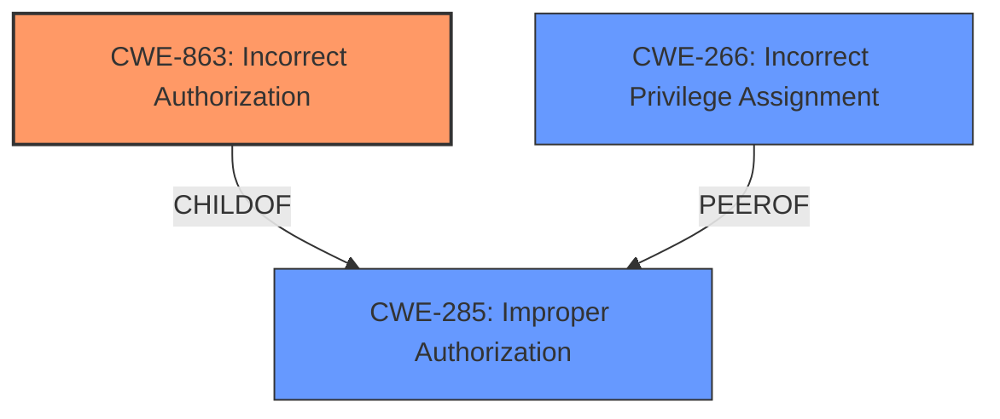

# Analysis Report for CVE-2024-54560

# Vulnerability Analysis Report: CVE-2024-54560

## Description

A **logic issue** was addressed with improved checks. This issue is fixed in iOS 18 and iPadOS 18, watchOS 11, tvOS 18, macOS Sequoia 15. A malicious app may be able to modify other apps without having App Management permission.

## Vulnerability Description Key Phrases

- **Rootcause:** logic issue
- **Product:** iOS, iPadOS, watchOS, tvOS, macOS Sequoia
- **Impact:** modify other apps
- **Attacker:** malicious app
- **Version:** 18, 18, 11, 18, 15

## Analysis (with Relationship Data)

# Summary
| CWE ID    | CWE Name                                                                 | Confidence | CWE Abstraction Level | CWE Vulnerability Mapping Label | CWE-Vulnerability Mapping Notes |
| --------- | ------------------------------------------------------------------------ | ---------- | --------------------- | ------------------------------- | ------------------------------- |
| CWE-863   | Incorrect Authorization                                                  | 0.85       | Class                 | Primary                         | Allowed-with-Review             |
| CWE-266   | Incorrect Privilege Assignment                                           | 0.75       | Base                  | Secondary                       | Allowed                         |
| CWE-285   | Improper Authorization                                                  | 0.60       | Class                 | Secondary                       | Discouraged                     |

## Evidence and Confidence

*   **Confidence Score:** 0.80
*   **Evidence Strength:** MEDIUM

## Relationship Analysis
The primary relationship influencing the selection of CWE-863 is its parent relationship to the more general CWE-285 (Improper Authorization). While both are applicable, CWE-863 provides a more specific classification by highlighting that an authorization check is performed but is done incorrectly. The guidance also suggests that instead of using the discouraged CWE-285, a more specific child should be used.



## Vulnerability Chain
The vulnerability chain starts with a **logic issue** leading to **incorrect authorization**, which results in a malicious app being able to modify other apps without proper App Management permission.
  - **Root Cause:** **Logic Issue**
  - **Weakness:** CWE-863 Incorrect Authorization
  - **Impact:** Modification of other apps without permission

## Summary of Analysis
The initial assessment focused on the **logic issue** that leads to the vulnerability. The key phrase "modify other apps without having App Management permission" strongly indicates an authorization problem. The provided guidance helped narrow down the choices between privilege and permission issues, pointing towards CWE-863 as the most appropriate. The final decision is based on the evidence from the vulnerability description, specifically the ability to bypass App Management permissions. The retriever results and graph relationships supported this decision by highlighting relevant CWEs and their connections. The selected CWEs are at the optimal level of specificity because they accurately represent the weakness and its impact, providing a clear understanding of the vulnerability.

Relevant CWE Information:

# Enhanced Context (25 CWEs)
The following CWEs were identified as potentially relevant to this vulnerability:

## CWE-266: Incorrect Privilege Assignment
**Abstraction Level**: Base
**Similarity Score**: 0.77
**Source**: dense

**Description**:
A product incorrectly assigns a privilege to a particular actor, creating an unintended sphere of control for that actor.

**Mapping Guidance**:
- Usage: Allowed
- Rationale: This CWE entry is at the Base level of abstraction, which is a preferred level of abstraction for mapping to the root causes of vulnerabilities.

## CWE-863: Incorrect Authorization
**Abstraction Level**: Class
**Similarity Score**: 1740.71
**Source**: sparse

**Description**:
The product performs an authorization check when an actor attempts to access a resource or perform an action, but it does not correctly perform the check.

**Mapping Guidance**:
- Usage: Allowed-with-Review
- Rationale: This CWE entry is a Class and might have Base-level children that would be more appropriate

## CWE-285: Improper Authorization
**Abstraction Level**: Class
**Similarity Score**: 1737.91
**Source**: sparse

**Description**:
The product does not perform or incorrectly performs an authorization check when an actor attempts to access a resource or perform an action.

**Mapping Guidance**:
- Usage: Discouraged
- Rationale: CWE-285 is high-level and lower-level CWEs can frequently be used instead. It is a level-1 Class (i.e., a child of a Pillar).

## Technical Justifications for Selected CWEs:

*   **CWE-863: Incorrect Authorization**
    *   **Matching Details:** The vulnerability description states that "A malicious app may be able to modify other apps without having App Management permission." This indicates that an authorization check is in place (the app *should* require App Management permission) but is being bypassed due to a **logic issue**. CWE-863 directly addresses scenarios where the authorization check is present but **incorrect**.
    *   **Security Implications:** Allows unauthorized modification of applications, potentially leading to data corruption, malicious code injection, or other severe impacts.
    *   **Relationship and Chain:** This CWE is a child of CWE-285 (Improper Authorization), providing a more specific classification. The vulnerability chain involves a **logic issue** (root cause) leading to **incorrect authorization** (CWE-863), resulting in unauthorized app modification.
    *   **Mapping Guidance Influence:** The guidance suggests using more specific children of CWE-285 when applicable, supporting the choice of CWE-863.
    *   **Confidence:** 0.85

*   **CWE-266: Incorrect Privilege Assignment**
    *   **Matching Details:** The description indicates the malicious app is not being assigned the correct privilege of needing "App Management permission".
    *   **Security Implications:** Allows unauthorized apps to behave as though they had proper privileges and modify other apps.
    *   **Relationship and Chain:** This CWE is related to privilege issues, and can be a peer of CWE-285.
    *   **Mapping Guidance Influence:** The guidance supports this CWE as it relates to privilege assignment.
    *   **Confidence:** 0.75

*   **CWE-285: Improper Authorization**
    *   **Matching Details:** The vulnerability involves a failure to properly restrict access to modify other apps, which falls under the general category of improper authorization.
    *   **Security Implications:** Allows unauthorized modification of applications, potentially leading to data corruption, malicious code injection, or other severe impacts.
    *   **Relationship and Chain:** CWE-285 is a parent of CWE-863.
    *   **Mapping Guidance Influence:** While the guidance discourages using CWE-285 directly when more specific CWEs are available, it remains a relevant consideration as a broader classification.
    *   **Confidence:** 0.60

## CWEs Considered But Not Used:

*   **CWE-787: Out-of-bounds Write, CWE-665: Improper Initialization, CWE-415: Double Free:** These CWEs relate to memory management issues. There is no evidence in the description to suggest memory corruption. Therefore, they were not selected.
*   **CWE-20: Improper Input Validation:** While input validation issues could potentially contribute to the **logic issue**, the primary problem is the incorrect authorization, not necessarily the lack of input validation.
*   **CWE-269: Improper Privilege Management, CWE-732: Incorrect Permission Assignment for Critical Resource**: Although related to permissions and privileges, these are Class level CWEs, and don't fit the **logic issue** that is present.


## CWE Relationship Analysis

Current CWEs represent these abstraction levels: .


### Vulnerability Chain Analysis

**Chain starting from CWE-863:**
- 863 (Incorrect Authorization) - ROOT


**Chain starting from CWE-732:**
- 732 (Incorrect Permission Assignment for Critical Resource) - ROOT


### CWE Relationship Diagram

```mermaid
graph TD
    classDef primary fill:#f96,stroke:#333,stroke-width:2px
    classDef secondary fill:#69f,stroke:#333
    classDef tertiary fill:#9e9,stroke:#333
```


*Report generated on 2025-07-13 22:56:08*
