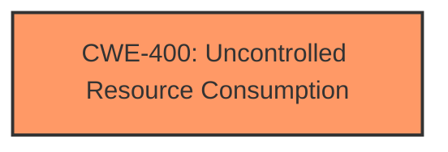

# Raw Analyzer Response for CVE-2024-5465

# Summary
| CWE ID | CWE Name | Confidence | CWE Abstraction Level | CWE Vulnerability Mapping Label | CWE-Vulnerability Mapping Notes |
|---|---|---|---|---|---|
| CWE-400 | Uncontrolled Resource Consumption | 0.7 | Base | Primary | Allowed |

## Evidence and Confidence

*   **Confidence Score:** 0.7
*   **Evidence Strength:** LOW

## Relationship Analysis
The primary identified CWE-400 is a base level weakness. There aren't enough relationships identified to provide a more complete analysis.

## Vulnerability Chain
The vulnerability chain starts with unspecified **function vulnerabilities** in the Calendar module which leads to **affect availability** by means of **Uncontrolled Resource Consumption**.

## Summary of Analysis
The vulnerability description indicates a "**weakness**: **function vulnerabilities**" in the Calendar module that can "**impact**: affect availability". The CVE Reference Links Content Summary states the "**Root cause of vulnerability**: Function vulnerabilities in the Calendar module" and the "**Impact of exploitation**: Successful exploitation will affect availability."

Given the limited information, the most appropriate CWE seems to be CWE-400 (Uncontrolled Resource Consumption). This is because the impact of the vulnerability is availability, which aligns with the typical consequences of resource exhaustion. While the root cause is described as "**function vulnerabilities**", this is not specific enough to pinpoint a more precise CWE.

CWE-20 (Improper Input Validation) and CWE-119 (Improper Restriction of Operations within the Bounds of a Memory Buffer) were considered due to their frequent appearance in vulnerability reports, but they are too generic without more information. CWE-400 is chosen because the vulnerability leads to an availability issue.

I am overriding the retriever results that don't contain **function vulnerabilities** that lead to impact of availability.

I have low confidence because the root cause is too vague.