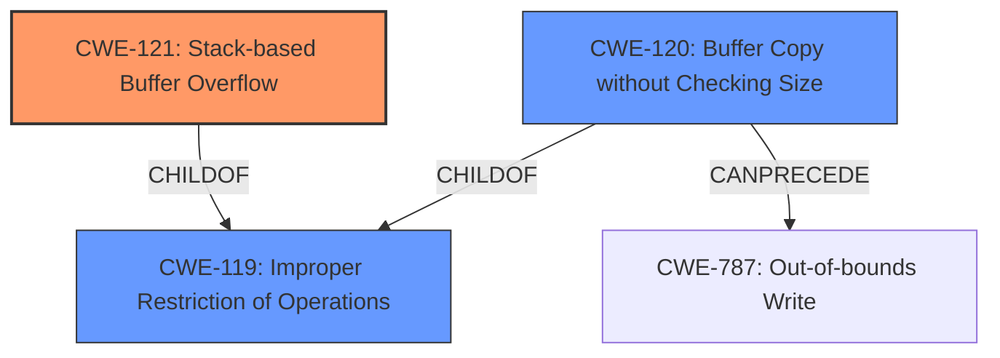

# Analysis for CVE-2024-54802

# Summary
| CWE ID | CWE Name | Confidence | CWE Abstraction Level | CWE Vulnerability Mapping Label | CWE-Vulnerability Mapping Notes |
|---|---|---|---|---|---|
| CWE-121 | Stack-based Buffer Overflow | 1.0 | Variant | Allowed | Primary CWE |
| CWE-120 | Buffer Copy without Checking Size of Input ('Classic Buffer Overflow') | 0.7 | Base | Allowed-with-Review | Secondary Candidate |
| CWE-119 | Improper Restriction of Operations within the Bounds of a Memory Buffer | 0.6 | Class | Discouraged | Secondary Candidate |

## Evidence and Confidence

*   **Confidence Score:** 0.9
*   **Evidence Strength:** HIGH

## Relationship Analysis
The primary CWE selected is CWE-121 (Stack-based Buffer Overflow), a variant of CWE-119 (Improper Restriction of Operations within the Bounds of a Memory Buffer). CWE-120 (Buffer Copy without Checking Size of Input) is also a child of CWE-119 and can precede CWE-787 (Out-of-bounds Write). The relationships guided the selection of the most specific CWE (CWE-121) while acknowledging the broader class it falls under (CWE-119).

## Vulnerability Chain
The vulnerability chain starts with an **improper** or **missing bounds check** (likely within the `strcpy` function used in the `advertise_res` function) leading to a **stack-based buffer overflow**, which can then lead to remote code execution.

## Summary of Analysis
The primary vulnerability is a **stack-based buffer overflow** (CWE-121) in the UPNP service of Netgear WNR854T. The evidence includes the vulnerability description explicitly mentioning a **stack-based buffer overflow** and the CVE analysis describing an unbounded `strcpy` into a fixed-size stack variable.

The selection of CWE-121 is based on the following:

*   The vulnerability description clearly states "**stack-based buffer overflow**"
*   The CVE analysis confirms the stack-based nature and the root cause being an unbounded `strcpy`.

CWE-120 was considered as a secondary candidate because the root cause involves copying data without proper size checking, which is characteristic of CWE-120. However, the explicit mention of "stack-based" makes CWE-121 a more precise fit. CWE-119 was also considered due to its broad scope encompassing memory buffer issues but is less specific than CWE-121.

The confidence level is high (0.9) due to direct evidence from both the vulnerability description and the CVE analysis.

Relevant CWE Information:

# Enhanced Context (25 CWEs)
The following CWEs were identified as potentially relevant to this vulnerability:

## CWE-121: Stack-based Buffer Overflow
**Abstraction Level**: Variant
**Similarity Score**: 0.73
**Source**: dense

**Description**:
A stack-based buffer overflow condition is a condition where the buffer being overwritten is allocated on the stack (i.e., is a local variable or, rarely, a parameter to a function).

**Mapping Guidance**:
- Usage: Allowed
- Rationale: This CWE entry is at the Variant level of abstraction, which is a preferred level of abstraction for mapping to the root causes of vulnerabilities.

## CWE-120: Buffer Copy without Checking Size of Input ('Classic Buffer Overflow')
**Abstraction Level**: base
**Similarity Score**: 3.65
**Source**: graph

**Description**:
CWE-120: Buffer Copy without Checking Size of Input ('Classic Buffer Overflow')

**Mapping Guidance**:
- Usage: Allowed-with-Review
- Rationale: There are some indications that this CWE ID might be misused and selected simply because it mentions "buffer overflow" - an increasingly vague term. This CWE entry is only appropriate for "Buffer Copy" operations (not buffer reads), in which where there is no "Checking [the] Size of Input", and (by implication of the copy) writing past the end of the buffer.

**Relationships**:
- PARENTOF -> CWE-785
- CANFOLLOW -> CWE-456
- CANFOLLOW -> CWE-416
- CANFOLLOW -> CWE-231
- CANFOLLOW -> CWE-170

## CWE-119: Improper Restriction of Operations within the Bounds of a Memory Buffer
**Abstraction Level**: Class
**Similarity Score**: 0.70
**Source**: dense

**Description**:
The product performs operations on a memory buffer, but it reads from or writes to a memory location outside the buffer's intended boundary. This may result in read or write operations on unexpected memory locations that could be linked to other variables, data structures, or internal program data.

**Mapping Guidance**:
- Usage: Discouraged
- Rationale: CWE-119 is commonly misused in low-information vulnerability reports when lower-level CWEs could be used instead, or when more details about the vulnerability are available.

## CWE-121: Stack-based Buffer Overflow
**Abstraction Level**: Variant
**Similarity Score**: 849.64
**Source**: sparse

**Description**:
A stack-based buffer overflow condition is a condition where the buffer being overwritten is allocated on the stack (i.e., is a local variable or, rarely, a parameter to a function).

**Mapping Guidance**:
- Usage: Allowed
- Rationale: This CWE entry is at the Variant level of abstraction, which is a preferred level of abstraction for mapping to the root causes of vulnerabilities.

### CWE Justification

*   **CWE-121: Stack-based Buffer Overflow**
    *   **Technical Explanation:** This CWE accurately describes the vulnerability because the overflow occurs in a buffer allocated on the stack. The vulnerability description explicitly mentions "**stack-based buffer overflow**," and the CVE analysis details how an unbounded `strcpy` function is used to copy data into a fixed-size buffer on the stack.
    *   **Security Implications:** This can lead to arbitrary code execution, as the attacker can overwrite return addresses and other critical data on the stack.
    *   **Relationship:** This is a variant of CWE-119 (Improper Restriction of Operations within the Bounds of a Memory Buffer).
    *   **Mapping Guidance:** Usage is ALLOWED. The CWE entry is at the Variant level of abstraction, which is a preferred level for mapping root causes.
*   **CWE-120: Buffer Copy without Checking Size of Input ('Classic Buffer Overflow')**
    *   **Technical Explanation:** The unbounded `strcpy` directly reflects the characteristic of CWE-120, as it involves copying data to a buffer without any validation of the input size.
    *   **Security Implications:** This can lead to arbitrary code execution, as the attacker can overwrite adjacent memory regions with arbitrary data.
    *   **Relationship:** This is a Base level CWE and a child of CWE-119.
    *   **Mapping Guidance:** Usage is ALLOWED-WITH-REVIEW, as it is appropriate for "Buffer Copy" operations where there's no size checking.
*   **CWE-119: Improper Restriction of Operations within the Bounds of a Memory Buffer**
    *   **Technical Explanation:** The overflow leads to writing beyond the allocated buffer limits.
    *   **Security Implications:** Overwriting memory outside the intended buffer.
    *   **Relationship:** This is a Class level CWE.
    *   **Mapping Guidance:** Usage is DISCOURAGED because CWE-121 provides more specific details.

### Other CWEs Considered and Rejected

*   CWE-190 (Integer Overflow or Wraparound), CWE-1284 (Improper Validation of Specified Quantity in Input), CWE-131 (Incorrect Calculation of Buffer Size) - While these CWEs relate to size calculations and input validation, the core issue is the missing bounds check during the buffer copy operation, making CWE-121 and CWE-120 more directly relevant.
*   CWE-74 (Improper Neutralization of Special Elements in Output Used by a Downstream Component ('Injection')), CWE-77 (Improper Neutralization of Special Elements used in a Command ('Command Injection')) - These are injection-related CWEs and do not fit the buffer overflow scenario.
*   CWE-125 (Out-of-bounds Read)