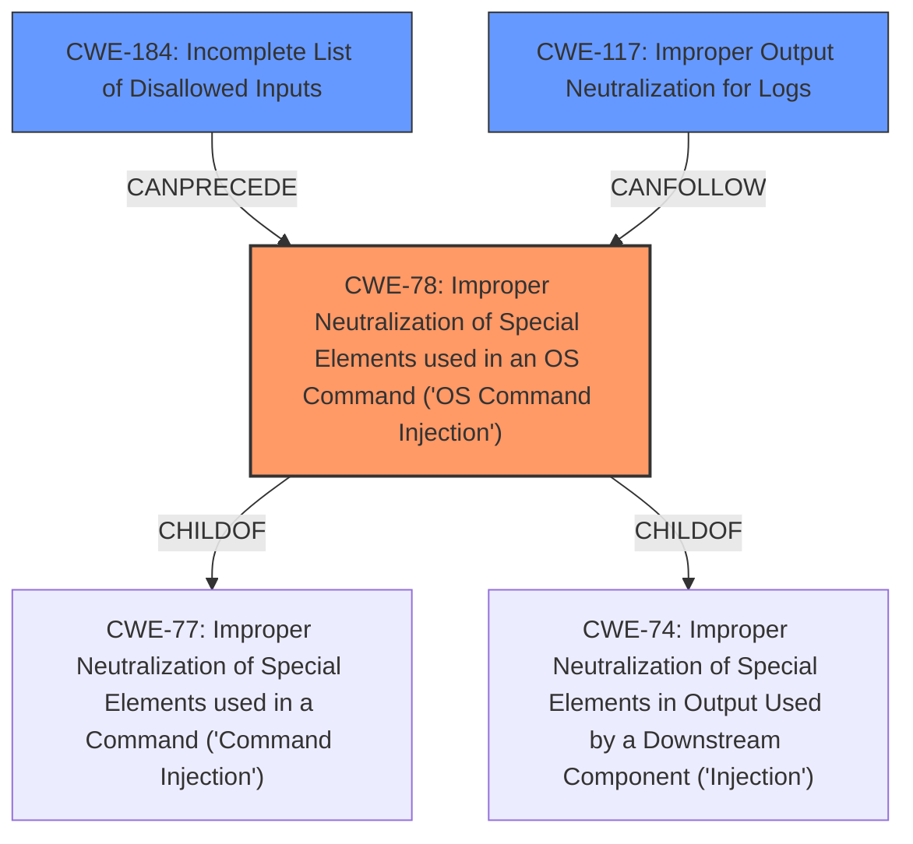

# Raw Analyzer Response for CVE-2024-54805

# Summary
| CWE ID | CWE Name | Confidence | CWE Abstraction Level | CWE Vulnerability Mapping Label | CWE-Vulnerability Mapping Notes |
|---|---|---|---|---|---|
| CWE-78 | Improper Neutralization of Special Elements used in an OS Command ('OS Command Injection') | 1.0 | Base | Allowed | Primary CWE: This is the root cause of the vulnerability. |
| CWE-184 | Incomplete List of Disallowed Inputs | 0.6 | Base | Allowed | Secondary Candidate: Input validation failure is related to the vulnerability but is not the primary root cause. |
| CWE-117 | Improper Output Neutralization for Logs | 0.5 | Base | Allowed | Secondary Candidate: Logs are involved but not the primary weakness |

## Evidence and Confidence

*   **Confidence Score:** 0.9
*   **Evidence Strength:** HIGH

## Relationship Analysis
The primary CWE is CWE-78, which is a base-level weakness describing **improper neutralization of special elements in OS commands**. This weakness directly reflects the vulnerability described. CWE-78 is a child of CWE-77 (Improper Neutralization of Special Elements used in a Command) and CWE-74 (Improper Neutralization of Special Elements in Output Used by a Downstream Component). The analysis considered CWE-77 but preferred CWE-78 because the vulnerability specifically involves OS commands. CWE-184 is related because the root cause is due to an incomplete list of disallowed inputs, but it isn't the best CWE to describe the vulnerability. CWE-117 is related because the impact of the vulnerability can be seen within logs, but it is also not the primary weakness.

## Vulnerability Chain
1.  **Root Cause:** CWE-78 - **Improper Neutralization of Special Elements used in an OS Command ('OS Command Injection')**. The router fails to properly sanitize the `email_address` parameter, allowing for the injection of shell commands.
2.  **Impact:** Command execution with root privileges. This allows an attacker to perform actions such as network eavesdropping, credential harvesting, and lateral movement.

## Summary of Analysis
The primary vulnerability is clearly an OS Command Injection (CWE-78). The provided information indicates that the `email_address` parameter is not properly sanitized, allowing an attacker to inject OS commands. The commands are then executed with root privileges via the `send_log.cgi` endpoint. This assessment is based on the provided evidence, specifically the "CVE Reference Links Content Summary" which states: "The vulnerability is a command injection within the router’s email notification functionality due to the **lack of input validation or sanitization** for the `email_address` parameter when constructing a shell command." The analysis also considered the retriever results, which listed CWE-78 as a highly relevant CWE. The hierarchical relationships and chain patterns confirm that CWE-78 is the most specific and appropriate CWE for this vulnerability. While other CWEs like CWE-184 and CWE-117 are related, they do not capture the core weakness as effectively as CWE-78. The chosen CWE is at the optimal level of specificity (Base) as it directly describes the root cause of the vulnerability.

Relevant CWE Information:

# Enhanced Context (25 CWEs)
The following CWEs were identified as potentially relevant to this vulnerability:

## CWE-790: Improper Filtering of Special Elements
**Abstraction Level**: Class
**Similarity Score**: 0.75
**Source**: dense

**Description**:
The product receives data from an upstream component, but does not filter or incorrectly filters special elements before sending it to a downstream component.

**Mapping Guidance**:
- Usage: Allowed-with-Review
- Rationale: This CWE entry is a Class and might have Base-level children that would be more appropriate

*Not Used:* This is a more general class, whereas CWE-78 is a more specific base type.

## CWE-78: Improper Neutralization of Special Elements used in an OS Command ('OS Command Injection')
**Abstraction Level**: Base
**Similarity Score**: 0.75
**Source**: dense

**Description**:
The product constructs all or part of an OS command using externally-influenced input from an upstream component, but it does not neutralize or incorrectly neutralizes special elements that could modify the intended OS command when it is sent to a downstream component.

**Mapping Guidance**:
- Usage: Allowed
- Rationale: This CWE entry is at the Base level of abstraction, which is a preferred level of abstraction for mapping to the root causes of vulnerabilities.

*Used:* The vulnerability involves **improper neutralization** within an OS command, making this a direct match.

## CWE-77: Improper Neutralization of Special Elements used in a Command ('Command Injection')
**Abstraction Level**: Class
**Similarity Score**: 0.75
**Source**: dense

**Description**:
The product constructs all or part of a command using externally-influenced input from an upstream component, but it does not neutralize or incorrectly neutralizes special elements that could modify the intended command when it is sent to a downstream component.

**Mapping Guidance**:
- Usage: Allowed-with-Review
- Rationale: CWE-77 is often misused when OS command injection (CWE-78) was intended instead [REF-1287].

*Not Used:* While related, CWE-78 is more specific as it relates to OS commands.

## CWE-74: Improper Neutralization of Special Elements in Output Used by a Downstream Component ('Injection')
**Abstraction Level**: Class
**Similarity Score**: 0.74
**Source**: dense

**Description**:
The product constructs all or part of a command, data structure, or record using externally-influenced input from an upstream component, but it does not neutralize or incorrectly neutralizes special elements that could modify how it is parsed or interpreted when it is sent to a downstream component.

**Mapping Guidance**:
- Usage: Discouraged
- Rationale: CWE-74 is high-level and often misused when lower-level weaknesses are more appropriate.

*Not Used:* CWE-74 is too general and doesn't capture the specific nature of the OS command injection.

## CWE-93: Improper Neutralization of CRLF Sequences ('CRLF Injection')
**Abstraction Level**: Base
**Similarity Score**: 0.74
**Source**: dense

**Description**:
The product uses CRLF (carriage return line feeds) as a special element, e.g. to separate lines or records, but it does not neutralize or incorrectly neutralizes CRLF sequences from inputs.

**Mapping Guidance**:
- Usage: Allowed
- Rationale: This CWE entry is at the Base level of abstraction, which is a preferred level of abstraction for mapping to the root causes of vulnerabilities.

*Not Used:* This weakness is specific to CRLF sequences, which are not relevant to the vulnerability.

## CWE-134: Use of Externally-Controlled Format String
**Abstraction Level**: Base
**Similarity Score**: 0.73
**Source**: dense

**Description**:
The product uses a function that accepts a format string as an argument, but the format string originates from an external source.

**Mapping Guidance**:
- Usage: Allowed
- Rationale: This CWE entry is at the Base level of abstraction, which is a preferred level of abstraction for mapping to the root causes of vulnerabilities.

*Not Used:* The vulnerability is not related to format string vulnerabilities.

## CWE-288: Authentication Bypass Using an Alternate Path or Channel
**Abstraction Level**: Base
**Similarity Score**: 0.73
**Source**: dense

**Description**:
The product requires authentication, but the product has an alternate path or channel that does not require authentication.

**Mapping Guidance**:
- Usage: Allowed
- Rationale: This CWE entry is at the Base level of abstraction, which is a preferred level of abstraction for mapping to the root causes of vulnerabilities.

*Not Used:* The vulnerability requires authentication and is not an authentication bypass.

## CWE-138: Improper Neutralization of Special Elements
**Abstraction Level**: Class
**Similarity Score**: 0.73
**Source**: dense

**Description**: