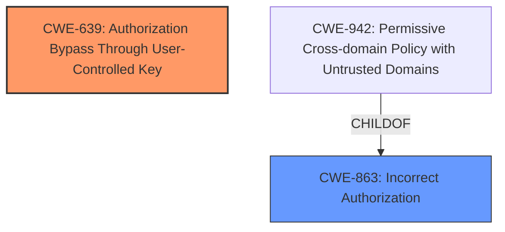

# Analysis Report for CVE-2024-55070

# Vulnerability Analysis Report: CVE-2024-55070

## Description

A **Broken Object Level Authorization** vulnerability in the component /households/permissions of hay-kot mealie v2.2.0 allows group managers to edit their own permissions.

## Vulnerability Description Key Phrases

- **Rootcause:** Broken Object Level Authorization
- **Impact:** edit their own permissions
- **Attacker:** group managers
- **Product:** hay-kot mealie
- **Version:** v2.2.0
- **Component:** /households/permissions

## Analysis (with Relationship Data)

# Summary
| CWE ID | CWE Name | Confidence | CWE Abstraction Level | CWE Vulnerability Mapping Label | CWE-Vulnerability Mapping Notes |
|---|---|---|---|---|---|
| CWE-639 | Authorization Bypass Through User-Controlled Key | 0.9 | Base | Allowed | Primary CWE. The system's authorization functionality does not prevent one user from gaining access to another user's data or record by modifying the key value identifying the data. |
| CWE-863 | Incorrect Authorization | 0.6 | Class | Allowed-with-Review | Secondary candidate. The product performs an authorization check when an actor attempts to access a resource or perform an action, but it does not correctly perform the check. |

## Evidence and Confidence

*   **Confidence Score:** 0.8
*   **Evidence Strength:** HIGH

## Relationship Analysis
The primary CWE is CWE-639, which is a Base level CWE. CWE-863 is a Class level CWE and a parent of CWE-942. CWE-639 is more specific than CWE-863 which makes it a better choice for the primary CWE.



## Vulnerability Chain
The **root cause** is **Broken Object Level Authorization** which leads to the impact that group managers can edit their own permissions, or a user can view recipes from groups they do not belong to. The vulnerability lies in the lack of proper authorization checks when handling user-controlled keys or identifiers.

## Summary of Analysis
The initial assessment identified **Broken Object Level Authorization** as the **root cause** of the vulnerability. The description highlights that group managers can edit their own permissions, which should not be allowed, indicating an authorization issue. The CVE Reference Links Content Summary confirms this, stating that users can share recipes of other groups due to insufficient validation of recipe ownership when sharing recipes.

The Retriever Results pointed to several potential CWEs, with CWE-639 (Authorization Bypass Through User-Controlled Key) being the top candidate. This CWE aligns well with the vulnerability description, as the issue involves manipulating the `recipeId` parameter, which acts as a user-controlled key, to access resources (recipes) that should be restricted.

The CWE Classification Guidance further reinforces the selection of authorization-related CWEs. It emphasizes the distinction between authentication and authorization issues and provides guidance on choosing the appropriate CWE based on the nature of the flaw.

Based on the evidence and the guidance, CWE-639 is selected as the primary CWE because it accurately captures the **root cause** of the vulnerability: the ability to bypass authorization checks by manipulating user-controlled keys.

CWE-863 (Incorrect Authorization) was considered as a secondary candidate, as it represents a broader class of authorization errors. However, CWE-639 is more specific and provides a better description of the vulnerability.

Other CWEs, such as CWE-284 (Improper Access Control), were deemed too general. CWE-266 (Incorrect Privilege Assignment) and CWE-250 (Execution with Unnecessary Privileges) were not applicable because the issue does not involve privilege misassignment or unnecessary privileges.

The final selection of CWE-639 is based on the following:

*   The vulnerability description and the CVE Reference Links Content Summary clearly indicate an authorization bypass issue.
*   CWE-639 directly addresses the manipulation of user-controlled keys to bypass authorization checks.
*   The CWE Classification Guidance supports the selection of specific authorization-related CWEs over more general ones.
*   The Retriever Results identified CWE-639 as the top candidate.

The selected CWE is at the optimal level of specificity, as it accurately reflects the **root cause** of the vulnerability and provides a clear understanding of the weakness.


## CWE Relationship Analysis

Current CWEs represent these abstraction levels: .


### Vulnerability Chain Analysis

**Chain starting from CWE-863:**
- 863 (Incorrect Authorization) - ROOT


**Chain starting from CWE-639:**
- 639 (Authorization Bypass Through User-Controlled Key) - ROOT


### CWE Relationship Diagram

```mermaid
graph TD
    classDef primary fill:#f96,stroke:#333,stroke-width:2px
    classDef secondary fill:#69f,stroke:#333
    classDef tertiary fill:#9e9,stroke:#333
```


*Report generated on 2025-07-13 23:08:39*
