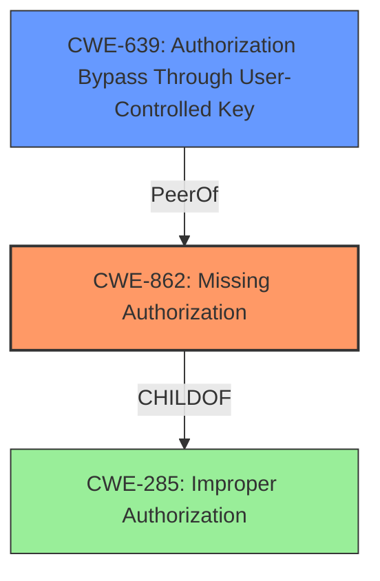

# Analysis Report for CVE-2024-55231

# Vulnerability Analysis Report: CVE-2024-55231

## Description

An **IDOR vulnerability** in the edit-notes.php module of PHPGurukul Online Notes Sharing Management System v1.0 allows unauthorized users to modify notes belonging to other accounts due to **missing authorization checks**. This flaw exposes sensitive data and enables attackers to alter another users information.

## Vulnerability Description Key Phrases

- **Rootcause:** missing authorization checks
- **Weakness:** IDOR vulnerability
- **Impact:** modify notes belonging to other accounts
- **Attacker:** unauthorized users
- **Product:** PHPGurukul Online Notes Sharing Management System
- **Version:** v1.0
- **Component:** edit-notes.php module

## Analysis (with Relationship Data)

# Summary
| CWE ID  | CWE Name                                                                          | Confidence | CWE Abstraction Level | CWE Vulnerability Mapping Label | CWE-Vulnerability Mapping Notes |
| :-------- | :---------------------------------------------------------------------------------- | :--------- | :---------------------- | :------------------------------ | :------------------------------ |
| CWE-862 | Missing Authorization                                                               | 0.9        | Class                   | Allowed-with-Review             | Primary CWE                     |
| CWE-639 | Authorization Bypass Through User-Controlled Key                                  | 0.7        | Base                    | Allowed                         | Secondary Candidate             |

## Evidence and Confidence

*   **Confidence Score:** 0.8
*   **Evidence Strength:** HIGH

## Relationship Analysis

The primary CWE identified is CWE-862 (Missing Authorization), which is a Class-level CWE. While it's generally preferred to map to Base-level CWEs when possible, in this case, the description specifically points to a **missing** authorization check, making CWE-862 a strong fit. CWE-639 (Authorization Bypass Through User-Controlled Key) is a Base-level CWE and a potential secondary candidate, as the IDOR vulnerability could be exploited by manipulating user-controlled keys. However, the core issue is the lack of an initial authorization check, making CWE-862 the more direct representation of the vulnerability.



## Vulnerability Chain

The vulnerability chain starts with the **missing authorization checks** (CWE-862). This **root cause** allows unauthorized users to modify notes belonging to other accounts, leading to an IDOR vulnerability and potential data alteration.

## Summary of Analysis

The analysis is heavily based on the provided vulnerability description, particularly the phrase "**missing authorization checks**." This directly aligns with the definition of CWE-862 (Missing Authorization). While other CWEs like CWE-639 (Authorization Bypass Through User-Controlled Key) are relevant, they represent potential exploitation methods rather than the fundamental flaw. The retriever results also support this selection, with CWE-862 being a strong candidate. The graph relationships show that CWE-862 is a child of CWE-285 (Improper Authorization), a more general category, further solidifying its appropriateness.

The selection of CWE-862 is at the optimal level of specificity because it directly addresses the core issue of **missing** authorization checks, which allows unauthorized modification of data. CWE-639 could be considered if the vulnerability description provided more details on how user-controlled keys are manipulated to bypass authorization, but in its current form, CWE-862 is a more accurate representation.

**CWE-284 (Improper Access Control):** Was considered but not used as it is too high-level. The description clearly states that authorization checks are missing.
**CWE-285 (Improper Authorization):** Was considered but not used as it is also high-level. CWE-862 is more specific.
**CWE-306 (Missing Authentication for Critical Function):** Was considered but not used because the issue is with authorization, not authentication.
**CWE-639 (Authorization Bypass Through User-Controlled Key):** Was considered as a secondary CWE, but the primary issue is the initial missing check rather than the bypass itself.

Relevant CWE Information:

# Enhanced Context (25 CWEs)
The following CWEs were identified as potentially relevant to this vulnerability:

## CWE-639: Authorization Bypass Through User-Controlled Key
**Abstraction Level**: Base
**Similarity Score**: 0.77
**Source**: dense

**Description**:
The system's authorization functionality does not prevent one user from gaining access to another user's data or record by modifying the key value identifying the data.

**Mapping Guidance**:
- Usage: Allowed
- Rationale: This CWE entry is at the Base level of abstraction, which is a preferred level of abstraction for mapping to the root causes of vulnerabilities.

## CWE-862: Missing Authorization
**Abstraction Level**: Class
**Similarity Score**: 1202.89
**Source**: sparse

**Description**:
The product does not perform or incorrectly performs an authorization check when an actor attempts to access a resource or perform an action.

**Mapping Guidance**:
- Usage: Allowed-with-Review
- Rationale: This CWE entry is a Class and might have Base-level children that would be more appropriate


## CWE Relationship Analysis

Current CWEs represent these abstraction levels: .


### Vulnerability Chain Analysis

**Chain starting from CWE-862:**
- 862 (Missing Authorization) - ROOT


**Chain starting from CWE-639:**
- 639 (Authorization Bypass Through User-Controlled Key) - ROOT


### CWE Relationship Diagram

```mermaid
graph TD
    classDef primary fill:#f96,stroke:#333,stroke-width:2px
    classDef secondary fill:#69f,stroke:#333
    classDef tertiary fill:#9e9,stroke:#333
```


*Report generated on 2025-07-13 23:11:36*
