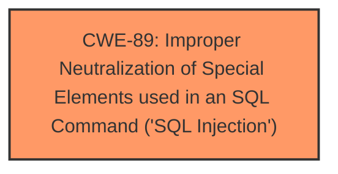

# Analysis for CVE-2024-5543

# Summary
| CWE ID | CWE Name | Confidence | CWE Abstraction Level | CWE Vulnerability Mapping Label | CWE-Vulnerability Mapping Notes |
|---|---|---|---|---|---|
| CWE-89 | Improper Neutralization of Special Elements used in an SQL Command ('SQL Injection') | 1.0 | Base | Allowed | Primary CWE. The vulnerability stems from insufficient escaping on the user-supplied `id` parameter, leading to SQL injection. |

## Evidence and Confidence

*   **Confidence Score:** 1.0
*   **Evidence Strength:** HIGH

## Relationship Analysis
The primary relationship considered was the direct match of the vulnerability description to the CWE-89 description. The retriever results strongly suggested CWE-89 as the primary candidate. No parent or child relationships were deemed more appropriate.

## Vulnerability Chain
The vulnerability chain starts with the **insufficient escaping** of the user-supplied `id` parameter, which leads directly to **time-based SQL Injection**. This allows attackers to extract sensitive information from the database.

## Summary of Analysis
The analysis is based on the vulnerability description, which states "**insufficient escaping on the user supplied parameter and lack of sufficient preparation on the existing SQL query**" as the root cause of a **time-based SQL Injection** vulnerability. The CVE Reference Links Content Summary confirms that the `id` parameter was not sanitized, allowing injection of SQL code.

The retriever results identified CWE-89 as the top candidate. The description of CWE-89, "The product constructs all or part of an SQL command using externally-influenced input from an upstream component, but it does not neutralize or incorrectly neutralizes special elements that could modify the intended SQL command," aligns directly with the vulnerability.

The selected CWE, CWE-89, is at the optimal level of specificity (Base) as it directly describes the root cause of the SQL injection vulnerability.

Other CWEs considered but not used:

*   CWE-116 (Improper Encoding or Escaping of Output): While related to input handling, it's a more general class. CWE-89 is a more specific case of improper neutralization within SQL commands.
*   CWE-425 (Direct Request ('Forced Browsing')): Not applicable, as the vulnerability is not related to authorization issues.
*   CWE-434 (Unrestricted Upload of File with Dangerous Type): Not applicable, as the vulnerability is not related to file uploads.
*   CWE-639 (Authorization Bypass Through User-Controlled Key): Not applicable, as the vulnerability is not related to authorization bypass.
*   CWE-79 (Improper Neutralization of Input During Web Page Generation ('Cross-site Scripting')): Not applicable, as the vulnerability is SQL Injection, not Cross-site Scripting.
*   CWE-90 (Improper Neutralization of Special Elements used in an LDAP Query ('LDAP Injection')): Not applicable, as the vulnerability is SQL Injection, not LDAP Injection.
*   CWE-94 (Improper Control of Generation of Code ('Code Injection')): While SQL injection *can* lead to code execution in some cases, the primary issue here is the ability to inject SQL commands and extract data, not arbitrary code execution, so this is not the appropriate CWE.
*   CWE-502 (Deserialization of Untrusted Data): Not applicable, as the vulnerability is not related to deserialization.
*   CWE-73 (External Control of File Name or Path): Not applicable, as the vulnerability is not related to file path manipulation.
Relevant CWE Information: