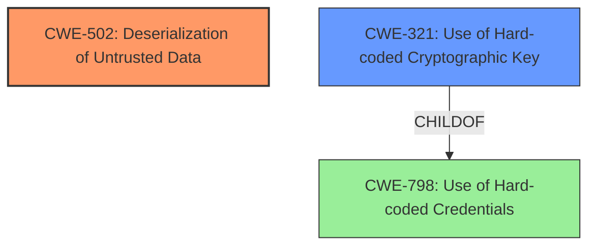

# Enhanced Analysis for CVE-2024-55556

# Summary
| CWE ID | CWE Name | Confidence | CWE Abstraction Level | CWE Vulnerability Mapping Label | CWE-Vulnerability Mapping Notes |
|---|---|---|---|---|---|
| CWE-502 | Deserialization of Untrusted Data | 1.0 | Base | Allowed | Primary CWE. The vulnerability involves arbitrary deserialization leading to remote command execution. |
| CWE-321 | Use of Hard-coded Cryptographic Key | 0.7 | Variant | Allowed | Secondary CWE. The vulnerability relies on the attacker obtaining Laravel's secret APP_KEY to decrypt and manipulate session cookies. |

## Evidence and Confidence

*   **Confidence Score:** 0.85
*   **Evidence Strength:** HIGH

## Relationship Analysis
The primary weakness is **deserialization of untrusted data** (CWE-502), which can lead to remote command execution. The attack exploits the **use of a hard-coded cryptographic key** (CWE-321) to decrypt and manipulate the session data. CWE-321 is a variant of CWE-798 (Use of Hard-coded Credentials), indicating a more specific instance of credential mismanagement. While several other CWEs were considered, the evidence points most strongly to a combination of untrusted deserialization and hard-coded key usage.



## Vulnerability Chain
1.  **Root Cause:** **Use of Hard-coded Cryptographic Key** (CWE-321) allows the attacker to decrypt and manipulate session cookies.
2.  **Weakness:** **Deserialization of Untrusted Data** (CWE-502) occurs when the manipulated session data is processed by the server.
3.  **Impact:** Remote Command Execution (RCE) is the final outcome of the deserialization process.

## Summary of Analysis
The vulnerability allows an attacker to achieve remote command execution by manipulating the laravel_session cookie. The **arbitrary deserialization** vulnerability is triggered by the attacker obtaining Laravel's secret APP_KEY, which allows them to decrypt and manipulate session cookies (laravel_session) containing serialized data. The evidence clearly points to CWE-502 as the primary weakness, as the server fails to validate the data being deserialized. The **use of a hard-coded cryptographic key** (CWE-321) is a contributing factor, as it enables the attacker to decrypt and modify the session data.

The vulnerability description states the following:
"The exploitation vector of this vulnerability relies on an attacker obtaining Laravels secret APP_KEY, which would allow them to decrypt and manipulate session cookies (laravel_session) containing serialized data. By altering this data and re-encrypting it with the APP_KEY, the attacker could trigger **arbitrary deserialization** on the server, potentially leading to remote command execution (RCE)."

The retriever results indicated a few other possible matches, which I've eliminated:
*   CWE-287 (Improper Authentication) - While the vulnerability does involve bypassing authentication, it's a consequence of the deserialization issue rather than a direct authentication flaw.
*   CWE-918 (Server-Side Request Forgery (SSRF)) and CWE-434 (Unrestricted Upload of File with Dangerous Type) - These are not relevant as the vulnerability doesn't involve server-side requests or file uploads.

The selected CWEs are at the optimal level of specificity, with CWE-502 being a Base-level weakness and CWE-321 being a Variant that further clarifies the root cause.

Relevant CWE Information:

# Enhanced Context (25 CWEs)
The following CWEs were identified as potentially relevant to this vulnerability:

## CWE-502: Deserialization of Untrusted Data
**Abstraction Level**: Base
**Similarity Score**: 0.72
**Source**: dense

**Description**:
The product deserializes untrusted data without sufficiently ensuring that the resulting data will be valid.

**Mapping Guidance**:
- Usage: Allowed
- Rationale: This CWE entry is at the Base level of abstraction, which is a preferred level of abstraction for mapping to the root causes of vulnerabilities.

## CWE-321: Use of Hard-coded Cryptographic Key
**Abstraction Level**: Variant
**Similarity Score**: 843.42
**Source**: sparse

**Description**:
The use of a hard-coded cryptographic key significantly increases the possibility that encrypted data may be recovered.

**Mapping Guidance**:
- Usage: Allowed
- Rationale: This CWE entry is at the Variant level of abstraction, which is a preferred level of abstraction for mapping to the root causes of vulnerabilities.


## CWE Relationship Analysis

Current CWEs represent these abstraction levels: .


### Vulnerability Chain Analysis

**Chain starting from CWE-321:**
- 321 (Use of Hard-coded Cryptographic Key) - ROOT


**Chain starting from CWE-502:**
- 502 (Deserialization of Untrusted Data) - ROOT


### CWE Relationship Diagram

```mermaid
graph TD
    classDef primary fill:#f96,stroke:#333,stroke-width:2px
    classDef secondary fill:#69f,stroke:#333
    classDef tertiary fill:#9e9,stroke:#333
```