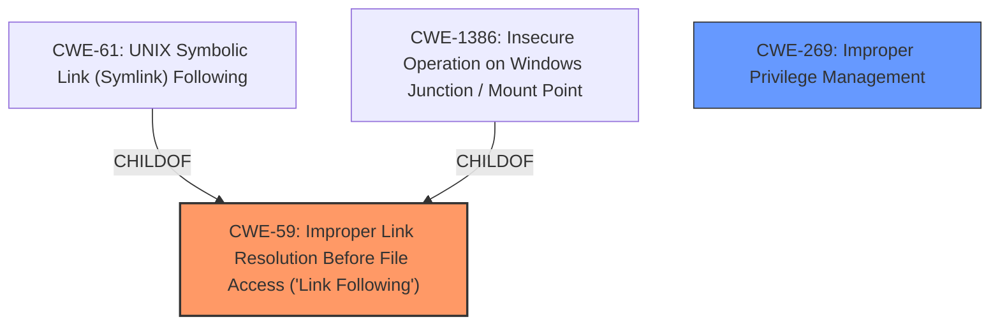

# Raw Analyzer Response for CVE-2024-55631

# Summary
| CWE ID | CWE Name | Confidence | CWE Abstraction Level | CWE Vulnerability Mapping Label | CWE-Vulnerability Mapping Notes |
|---|---|---|---|---|---|
| CWE-59 | Improper Link Resolution Before File Access ('Link Following') | 0.9 | Base | Primary | Allowed |
| CWE-269 | Improper Privilege Management | 0.6 | Class | Secondary Candidate | Discouraged |

## Evidence and Confidence

*   **Confidence Score:** 0.8
*   **Evidence Strength:** MEDIUM

## Relationship Analysis
The primary CWE selected is CWE-59, which describes the root cause of the issue, as stated in the summary of the CVE reference links content. CWE-59 has child CWEs such as CWE-61 (UNIX Symbolic Link Following) and CWE-1386 (Insecure Operation on Windows Junction / Mount Point), which are more specific but lack sufficient evidence to confirm the specific type of link being exploited. CWE-269 is a class-level CWE that is too general, but is referenced in the CVE Reference Links Content Summary, and is related to the impact of privilege escalation.

## Vulnerability Chain
The vulnerability chain begins with the **improper link resolution** (**CWE-59**), which allows a local attacker with the ability to execute low-privileged code to escalate privileges (**impact**).

## Summary of Analysis
The analysis is based primarily on the "CVE Reference Links Content Summary" which explicitly states: "Root cause of vulnerability: - An engine link following vulnerability." and "Weaknesses/vulnerabilities present: - Improper privilege management (CWE-269)." The choice of CWE-59 as the primary CWE is therefore strongly supported by the evidence provided. CWE-269 is included as a secondary candidate because it describes the impact of the vulnerability. The other potential CWEs from the retriever results were considered, but none matched the vulnerability description as closely as CWE-59. The selected CWEs are at the optimal level of specificity, with CWE-59 being a base CWE and CWE-269 being a class CWE describing the high level weakness.

Relevant CWE Information:

# Enhanced Context (25 CWEs)
The following CWEs were identified as potentially relevant to this vulnerability:

## CWE-59: Improper Link Resolution Before File Access ('Link Following')
**Abstraction Level**: Base
**Similarity Score**: 0.79
**Source**: dense

**Description**:
The product attempts to access a file based on the filename, but it does not properly prevent that filename from identifying a link or shortcut that resolves to an unintended resource.

**Mapping Guidance**:
- Usage: Allowed
- Rationale: This CWE entry is at the Base level of abstraction, which is a preferred level of abstraction for mapping to the root causes of vulnerabilities.

## CWE-269: Improper Privilege Management
**Abstraction Level**: Class
**Similarity Score**: 1681.37
**Source**: sparse

**Description**:
The product does not properly assign, modify, track, or check privileges for an actor, creating an unintended sphere of control for that actor.

**Mapping Guidance**:
- Usage: Discouraged
- Rationale: CWE-269 is commonly misused. It can be conflated with "privilege escalation," which is a technical impact that is listed in many low-information vulnerability reports [REF-1287]. It is not useful for trend analysis.