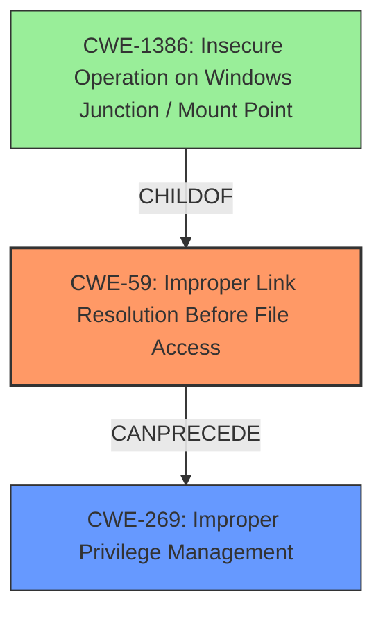

# Analysis for CVE-2024-55632

# Summary
| CWE ID | CWE Name | Confidence | CWE Abstraction Level | CWE Vulnerability Mapping Label | CWE-Vulnerability Mapping Notes |
|---|---|---|---|---|---|
| CWE-59 | Improper Link Resolution Before File Access ('Link Following') | 0.9 | Base | Allowed | Primary CWE: The vulnerability stems from improper handling of symbolic links, allowing a local attacker to escalate privileges. |
| CWE-269 | Improper Privilege Management | 0.7 | Class | Discouraged | Secondary Candidate: The root cause involves improper privilege management when following links, contributing to privilege escalation. |

## Evidence and Confidence

*   **Confidence Score:** 0.8
*   **Evidence Strength:** MEDIUM

## Relationship Analysis
The primary CWE is CWE-59, which directly addresses the link following issue. CWE-269 is a class-level weakness related to privilege management. CWE-59 can lead to privilege escalation if the link resolves to a file or directory with higher privileges. While CWE-269 is relevant, CWE-59 provides a more specific classification of the root cause.

## Vulnerability Chain
The vulnerability chain starts with **Improper Link Resolution (CWE-59)**, which allows an attacker to potentially access resources outside the intended control sphere. This leads to **Improper Privilege Management (CWE-269)**, where the system fails to adequately manage privileges associated with the accessed resource, ultimately resulting in local privilege escalation.

## Summary of Analysis
The initial assessment identified CWE-59 as the primary cause due to the "security agent link following vulnerability" description. The CVE Reference Links Content Summary section confirmed this by stating that the "**Root Cause** is vulnerability stems from a 'security agent link following' issue" and the **Weaknesses/Vulnerabilities** include **Improper Privilege Management (CWE-269)**.

The relationship analysis and retriever results both support the selection of CWE-59. The graph relationships show that CWE-59 can precede CWE-269 and that CWE-1386 is a more specific child of CWE-59 for windows systems.

The selection of CWE-59 at the Base level is appropriate because it directly addresses the root cause of the vulnerability, which is the improper handling of symbolic links. CWE-269 is a secondary weakness, related to the impact of privilege escalation.

Relevant CWE Information:

# Enhanced Context (25 CWEs)
The following CWEs were identified as potentially relevant to this vulnerability:

## CWE-59: Improper Link Resolution Before File Access ('Link Following')
**Abstraction Level**: Base

**Description**:
The product attempts to access a file based on the filename, but it does not properly prevent that filename from identifying a link or shortcut that resolves to an unintended resource.

## CWE-269: Improper Privilege Management
**Abstraction Level**: Class

**Description**:
The product does not properly assign, modify, track, or check privileges for an actor, creating an unintended sphere of control for that actor.