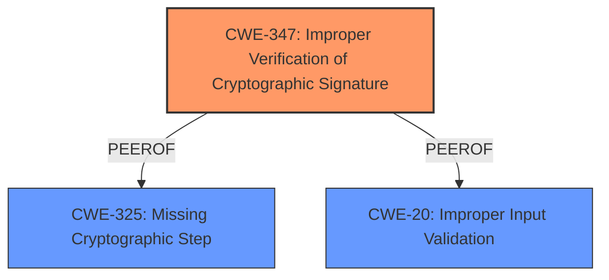

# Analysis Report for CVE-2024-55655

# Vulnerability Analysis Report: CVE-2024-55655

## Description

sigstore-python is a Python tool for generating and verifying Sigstore signatures. Versions of sigstore-python newer than 2.0.0 but prior to 3.6.0 perform **insufficient validation of the integration time** present in v2 and v3 bundles during the verification flow the integration time is verified *if* a source of signed time (such as an inclusion promise) is present, but is otherwise trusted if no source of signed time is present. This does not affect v1 bundles, as the v1 bundle format always requires an inclusion promise. Sigstore uses signed time to support verification of signatures made against short-lived signing keys. The impact and severity of this weakness is *low*, as Sigstore contains multiple other enforcing components that prevent an attacker who modifies the integration timestamp within a bundle from impersonating a valid signature. In particular, an attacker who modifies the integration timestamp can induce a Denial of Service, but in no different manner than already possible with bundle access (e.g. modifying the signature itself such that it fails to verify). Separately, an attacker could upload a *new* entry to the transparency service, and substitute their new entrys time. However, this would still be rejected at validation time, as the new entrys (valid) signed time would be outside the validity window of the original signing certificate and would nonetheless render the attacker auditable.

## Vulnerability Description Key Phrases

- **Rootcause:** insufficient validation of the integration time
- **Impact:** Denial of Service
- **Product:** sigstore-python
- **Version:** newer than 2.0.0 but prior to 3.6.0

## Analysis (with Relationship Data)

# Summary
| CWE ID | CWE Name | Confidence | CWE Abstraction Level | CWE Vulnerability Mapping Label | CWE-Vulnerability Mapping Notes |
|---|---|---|---|---|---|
| CWE-347 | Improper Verification of Cryptographic Signature | 0.9 | Base | Allowed | Primary CWE. The vulnerability stems from **insufficient validation of the integration time**, which directly relates to the improper verification of a cryptographic signature. |
| CWE-325 | Missing Cryptographic Step | 0.7 | Base | Allowed | Secondary CWE. The vulnerability is missing a critical step to ensure the integrity of signed time. |
| CWE-20 | Improper Input Validation | 0.6 | Class | Allowed | Secondary CWE. Fails to validate the timestamp from the bundle. |

## Evidence and Confidence

*   **Confidence Score:** 0.8
*   **Evidence Strength:** MEDIUM

## Relationship Analysis
The primary CWE is CWE-347 (Improper Verification of Cryptographic Signature), which has no direct parent-child relationships with the other considered CWEs in the provided data. However, its selection is influenced by its direct relevance to the **insufficient validation** issue described in the vulnerability. CWE-325 (Missing Cryptographic Step) is included as a secondary CWE because the **insufficient validation** can also be viewed as a missing step in the cryptographic process. CWE-20 (Improper Input Validation) is added because the **lack of proper validation of the "integration time"** is a failure to validate input. All chosen CWEs are at appropriate levels of abstraction.



## Vulnerability Chain
The vulnerability chain starts with **insufficient validation of the integration time** (CWE-347, CWE-325, CWE-20), leading to a potential Denial of Service (DoS).

## Summary of Analysis
The initial assessment, based on the provided evidence, strongly suggests that the primary weakness is the **insufficient validation of the integration time** within Sigstore bundles. This **insufficient validation** can be classified as CWE-347 (Improper Verification of Cryptographic Signature) because the integration time is part of a cryptographic signature verification process. It can also be classified as CWE-325 because it is a missing step to ensure the integrity of signed time. It can also be classified as CWE-20 (Improper Input Validation) because it's a failure to validate input. The impact, as stated in the description, is primarily a Denial of Service (DoS). The confidence in this assessment is high, supported by the explicit mention of "**insufficient validation**" in the vulnerability description and the CVE reference links.

Relevant CWE Information:

# Enhanced Context (25 CWEs)
The following CWEs were identified as potentially relevant to this vulnerability:

## CWE-347: Improper Verification of Cryptographic Signature
**Abstraction Level**: Base
**Similarity Score**: 0.72
**Source**: dense

**Description**:
The product does not verify, or incorrectly verifies, the cryptographic signature for data.

**Mapping Guidance**:
- Usage: Allowed
- Rationale: This CWE entry is at the Base level of abstraction, which is a preferred level of abstraction for mapping to the root causes of vulnerabilities.

## CWE-325: Missing Cryptographic Step
**Abstraction Level**: base
**Similarity Score**: 3.10
**Source**: graph

**Description**:
CWE-325: Missing Cryptographic Step

**Mapping Guidance**:
- Usage: Allowed
- Rationale: This CWE entry is at the Base level of abstraction, which is a preferred level of abstraction for mapping to the root causes of vulnerabilities.

**Relationships**:
- PEEROF -> CWE-358
- CHILDOF -> CWE-573
- PARENTOF -> CWE-325

## CWE-20: Improper Input Validation
**Abstraction Level**: Class
**Similarity Score**: N/A

**Description**:
The product does not validate, or incorrectly validates, input.

**Mapping Guidance**:
- Usage: Allowed
- Rationale: This CWE entry is a general class of vulnerabilities that can be applicable.

### Justification for CWE-347: Improper Verification of Cryptographic Signature
The vulnerability description explicitly mentions "**insufficient validation of the integration time**" which is part of the cryptographic signature verification process. This aligns directly with CWE-347, which describes products that do not verify or incorrectly verify the cryptographic signature for data.
*   **Technical Explanation:** The sigstore-python library **fails to properly validate the integration time** within v2 and v3 bundles, leading to a vulnerability. An attacker could potentially modify this timestamp, which could lead to denial of service.
*   **Security Implications:** The **insufficient validation** can lead to bypassing intended security checks, potentially allowing malicious actors to compromise the system.
*   **Relationship Analysis:** CWE-347 is a base-level CWE, providing a specific description of the vulnerability.
*   **Mapping Guidance:** The mapping guidance for CWE-347 allows its usage, as it's a base-level CWE.

### Justification for CWE-325: Missing Cryptographic Step
The **insufficient validation** can be seen as a missing step in the cryptographic process.
*   **Technical Explanation:** The sigstore-python library does not verify, or incorrectly verifies, the cryptographic signature for data, because it **fails to properly validate the integration time**. This translates to a missing step that is necessary for proper verification.
*   **Security Implications:** The **missing cryptographic step** can lead to bypassing intended security checks, potentially allowing malicious actors to compromise the system.
*   **Relationship Analysis:** The vulnerability can be classified as a missing step in the cryptographic process.
*   **Mapping Guidance:** The mapping guidance for CWE-325 allows its usage, as it's a base-level CWE.

### Justification for CWE-20: Improper Input Validation
The vulnerability involves **insufficient validation of the integration time**, which can be considered an input.
*   **Technical Explanation:** The sigstore-python library does not adequately validate the integration time. This lack of validation makes it possible for attackers to modify the timestamp, potentially leading to denial of service.
*   **Security Implications:** **Improper input validation** can lead to unexpected behavior and security vulnerabilities, such as denial of service.
*   **Relationship Analysis:** The integration time is an input from the bundle.
*   **Mapping Guidance:** The mapping guidance for CWE-20 allows its usage, as it is applicable.

### CWEs Considered but Not Used:

*   **CWE-295: Improper Certificate Validation:** While related to cryptographic processes, the vulnerability is specifically about the integration time and not the certificate itself. Therefore, it's not the most appropriate CWE.
*   **CWE-327: Use of a Broken or Risky Cryptographic Algorithm:** The vulnerability does not involve the use of a broken or risky algorithm, but rather the **improper validation** of data related to the cryptographic process.
*   **CWE-367: Time-of-check Time-of-use (TOCTOU) Race Condition:** This CWE is not applicable as there's no race condition involved in the vulnerability.
*   **CWE-1390: Weak Authentication:** Authentication is not the primary issue; it's the **validation** of the integration time.
*   **CWE-203: Observable Discrepancy & CWE-208: Observable Timing Discrepancy:** These are related to information leakage through observable differences, which is not the primary concern in this vulnerability.
*   **CWE-287: Improper Authentication:** Authentication is not the primary issue; it's the **validation** of the integration time.
*   **CWE-328: Use of Weak Hash:** This CWE is not applicable as there's no weak hashing algorithm involved in the vulnerability.
*   **CWE-609: Double-Checked Locking:** This CWE is not applicable as double-checked locking is not involved in the vulnerability.


## CWE Relationship Analysis

Current CWEs represent these abstraction levels: .


### Vulnerability Chain Analysis

**Chain starting from CWE-1390:**
- 1390 (Weak Authentication) - ROOT


**Chain starting from CWE-609:**
- 609 (Double-Checked Locking) - ROOT


### CWE Relationship Diagram

```mermaid
graph TD
    classDef primary fill:#f96,stroke:#333,stroke-width:2px
    classDef secondary fill:#69f,stroke:#333
    classDef tertiary fill:#9e9,stroke:#333
```


*Report generated on 2025-07-13 23:20:13*
