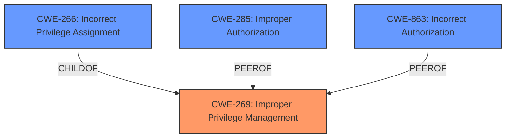

# Analysis Report for CVE-2024-5566

# Vulnerability Analysis Report: CVE-2024-5566

## Description

An **improper privilege management** vulnerability allowed users to migrate private repositories without having appropriate scopes defined on the related Personal Access Token. This vulnerability affected all versions of GitHub Enterprise Server prior to 3.14 and was fixed in version 3.13.1, 3.12.6, 3.11.12, 3.10.14, and 3.9.17.

## Vulnerability Description Key Phrases

- **Rootcause:** improper privilege management
- **Impact:** migrate private repositories
- **Attacker:** users
- **Product:** GitHub Enterprise Server
- **Version:** prior to 3.14

## Analysis (with Relationship Data)

# Summary
| CWE ID | CWE Name | Confidence | CWE Abstraction Level | CWE Vulnerability Mapping Label | CWE-Vulnerability Mapping Notes |
|---|---|---|---|---|---|
| CWE-269 | Improper Privilege Management | 0.75 | Class | Primary CWE | Discouraged |
| CWE-266 | Incorrect Privilege Assignment | 0.65 | Base | Secondary Candidate | Allowed |
| CWE-285 | Improper Authorization | 0.5 | Class | Secondary Candidate | Discouraged |
| CWE-863 | Incorrect Authorization | 0.5 | Class | Secondary Candidate | Allowed-with-Review |

## Evidence and Confidence

*   **Confidence Score:** 0.7
*   **Evidence Strength:** MEDIUM

## Relationship Analysis
The primary relationship influencing the choice of CWE-269 is its direct relevance to the vulnerability description's key phrase, "**improper privilege management**". While CWE-269 is a Class-level CWE and is generally discouraged, in this case, it directly reflects the stated root cause. CWE-266 (Incorrect Privilege Assignment) is a more specific Base CWE and a child of CWE-269. CWE-285 (Improper Authorization) and CWE-863 (Incorrect Authorization) are also relevant because they relate to authorization issues. The abstraction levels guide the selection towards more specific CWEs when the evidence supports it, but the evidence here primarily points to a general issue of privilege management.



## Vulnerability Chain
The vulnerability chain starts with **improper privilege management** (CWE-269) leading to the impact where users could migrate private repositories without appropriate scopes.

## Summary of Analysis
The initial analysis identified CWE-269 as the primary candidate due to the explicit mention of "**improper privilege management**" in both the vulnerability description and the CVE reference summary. This aligns directly with the stated root cause. Despite CWE-269 being a Class-level CWE and generally discouraged, its direct relevance to the described weakness makes it the most appropriate initial classification.

The retriever results also support this, with CWE-269 listed as a potential candidate. While other CWEs like CWE-266, CWE-285 and CWE-863 were considered, they represent more specific types of privilege or authorization issues.

The evidence provided is the vulnerability description stating that the **improper privilege management** allowed users to migrate private repositories without appropriate scopes.

I am overriding the general mapping guidance to select a more specific child CWE if the evidence is strong. In this case, the evidence is not strong enough to determine a more specific CWE than the general **Improper Privilege Management**.

Relevant CWE Information:

# Enhanced Context (25 CWEs)
The following CWEs were identified as potentially relevant to this vulnerability:

## CWE-266: Incorrect Privilege Assignment
**Abstraction Level**: Base
**Similarity Score**: 0.78
**Source**: dense

**Description**:
A product incorrectly assigns a privilege to a particular actor, creating an unintended sphere of control for that actor.

**Mapping Guidance**:
- Usage: Allowed
- Rationale: This CWE entry is at the Base level of abstraction, which is a preferred level of abstraction for mapping to the root causes of vulnerabilities.

## CWE-269: Improper Privilege Management
**Abstraction Level**: Class
**Similarity Score**: 0.73
**Source**: dense

**Description**:
The product does not properly assign, modify, track, or check privileges for an actor, creating an unintended sphere of control for that actor.

**Mapping Guidance**:
- Usage: Discouraged
- Rationale: CWE-269 is commonly misused. It can be conflated with "privilege escalation," which is a technical impact that is listed in many low-information vulnerability reports [REF-1287]. It is not useful for trend analysis.

## CWE-285: Improper Authorization
**Abstraction Level**: Class
**Similarity Score**: 1438.00
**Source**: sparse

**Description**:
The product does not perform or incorrectly performs an authorization check when an actor attempts to access a resource or perform an action.

**Mapping Guidance**:
- Usage: Discouraged
- Rationale: CWE-285 is high-level and lower-level CWEs can frequently be used instead. It is a level-1 Class (i.e., a child of a Pillar).

## CWE-863: Incorrect Authorization
**Abstraction Level**: Class
**Similarity Score**: 1465.36
**Source**: sparse

**Description**:
The product performs an authorization check when an actor attempts to access a resource or perform an action, but it does not correctly perform the check.

**Mapping Guidance**:
- Usage: Allowed-with-Review
- Rationale: This CWE entry is a Class and might have Base-level children that would be more appropriate

**CWE-269: Improper Privilege Management**: This is the primary CWE because the vulnerability description and CVE summary explicitly state "**improper privilege management**" as the root cause. The impact is that users could migrate private repositories without appropriate scopes. While CWE-269 is discouraged due to its high-level nature, it accurately reflects the stated weakness.

**CWE-266: Incorrect Privilege Assignment**: This is a secondary candidate because it's a more specific case of **improper privilege management** where a privilege is incorrectly assigned. However, the description doesn't provide enough detail to confirm that the issue was specifically an incorrect assignment rather than a broader management problem.

**CWE-285: Improper Authorization**: This is another secondary candidate because the vulnerability could be interpreted as a failure to properly authorize the action of migrating repositories. However, authorization is a specific aspect of privilege management, and the description focuses more on the overall management of privileges. This is a Class level CWE and discouraged.

**CWE-863: Incorrect Authorization**: This is also a secondary candidate as it could be that the authorization check was not correctly performed. The description focuses more on the overall management of privileges. This is a Class level CWE and allowed with review.


## CWE Relationship Analysis

Current CWEs represent these abstraction levels: .


### Vulnerability Chain Analysis

**Chain starting from CWE-266:**
- 266 (Incorrect Privilege Assignment) - ROOT


**Chain starting from CWE-269:**
- 269 (Improper Privilege Management) - ROOT


### CWE Relationship Diagram

```mermaid
graph TD
    classDef primary fill:#f96,stroke:#333,stroke-width:2px
    classDef secondary fill:#69f,stroke:#333
    classDef tertiary fill:#9e9,stroke:#333
```


*Report generated on 2025-07-13 23:20:30*
