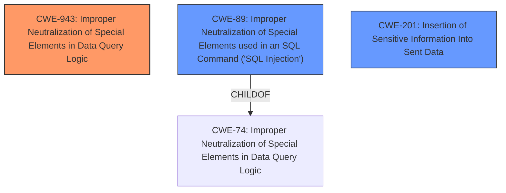

# Analysis Report for CVE-2024-55663

# Vulnerability Analysis Report: CVE-2024-55663

## Description

XWiki Platform is a generic wiki platform. Starting in version 11.10.6 and prior to versions 13.10.5 and 14.3-rc-1, in `getdocument.vm` the ordering of the returned documents is defined from an **unsanitized request parameter** (request.sort) and can allow any user to inject HQL. Depending on the used database backend, the attacker may be able to not only obtain confidential information such as password hashes from the database, but also execute UPDATE/INSERT/DELETE queries. This has been patched in 13.10.5 and 14.3-rc-1. There is no known workaround, other than upgrading XWiki.

## Vulnerability Description Key Phrases

- **Rootcause:** unsanitized request parameter
- **Impact:** ['obtain confidential information', 'execute UPDATE/INSERT/DELETE queries']
- **Attacker:** any user
- **Product:** XWiki Platform
- **Version:** 11.10.6 to 13.10.5 and 14.3-rc-1
- **Component:** getdocument.vm

## Analysis (with Relationship Data)

# Summary

| CWE ID  | CWE Name                                                                                   | Confidence | CWE Abstraction Level | CWE Vulnerability Mapping Label | CWE-Vulnerability Mapping Notes |
| :-------- | :----------------------------------------------------------------------------------------- | :--------- | :---------------------- | :------------------------------ | :------------------------------ |
| CWE-943   | Improper Neutralization of Special Elements in Data Query Logic                         | 0.90       | Class                   | Primary CWE                     | Allowed-with-Review             |
| CWE-89    | Improper Neutralization of Special Elements used in an SQL Command ('SQL Injection') | 0.75       | Base                    | Secondary Candidate             | Allowed                       |
| CWE-201   | Insertion of Sensitive Information Into Sent Data                                       | 0.65       | Base                    | Secondary Candidate             | Allowed                       |

## Evidence and Confidence

*   **Confidence Score:** 0.80
*   **Evidence Strength:** HIGH

## Relationship Analysis

The primary CWE selected is CWE-943, a Class-level weakness describing **improper neutralization of special elements in data query logic**. This vulnerability exhibits the characteristics of this weakness by allowing injection of HQL commands. While CWE-943 is a Class, it is more specific to the data query context than its parents.

CWE-89 is a Base-level weakness and a child of CWE-74, describing **improper neutralization of special elements used in an SQL command ('SQL Injection')**. While HQL is not SQL, the underlying principle of injecting code into a query language applies.

CWE-201 is a Base-level weakness describing **insertion of sensitive information into sent data**. This relates to the impact of the vulnerability, where an attacker can extract sensitive data.



## Vulnerability Chain

The vulnerability chain starts with the **unsanitized request parameter** which leads to HQL injection, ultimately resulting in information disclosure and potential data manipulation.

1.  **Root Cause:** **Unsanitized request parameter** (`request.sort`)
2.  **Weakness:** CWE-943 Improper Neutralization of Special Elements in Data Query Logic
3.  **Impact:** Information Disclosure (password hashes) and Data Manipulation (UPDATE/INSERT/DELETE queries)
4.  **Result:** Potential for complete system compromise

## Summary of Analysis

The primary vulnerability is the **improper neutralization** of the `request.sort` parameter, which allows for HQL injection. The CVE description states: "the ordering of the returned documents is defined from an **unsanitized request parameter** (request.sort) and can allow any user to inject HQL."

The most appropriate CWE is CWE-943 Improper Neutralization of Special Elements in Data Query Logic. Although CWE-943 is a Class, it's more specific to data query logic than its parent and accurately captures the nature of the vulnerability.

CWE-89 (SQL Injection) was considered because HQL injection is similar in principle to SQL injection. However, since it's HQL and not SQL, CWE-943 is more appropriate, as it's more generalized to any data query logic.

CWE-201 (Insertion of Sensitive Information Into Sent Data) reflects the potential impact of the vulnerability, where sensitive information can be extracted from the database. This could be considered a secondary weakness.

The final selection is based on the root cause - the **improper neutralization** leading to HQL injection (CWE-943), with the impact being potential information disclosure (CWE-201) and data manipulation (CWE-89). The selected CWEs are at an appropriate level of specificity, focusing on the core weakness and its immediate consequences.


## CWE Relationship Analysis

Current CWEs represent these abstraction levels: .


### Vulnerability Chain Analysis

**Chain starting from CWE-89:**
- 89 (Improper Neutralization of Special Elements used in an SQL Command ('SQL Injection')) - ROOT


**Chain starting from CWE-201:**
- 201 (Insertion of Sensitive Information Into Sent Data) - ROOT


### CWE Relationship Diagram

```mermaid
graph TD
    classDef primary fill:#f96,stroke:#333,stroke-width:2px
    classDef secondary fill:#69f,stroke:#333
    classDef tertiary fill:#9e9,stroke:#333
```


*Report generated on 2025-07-13 23:20:45*
