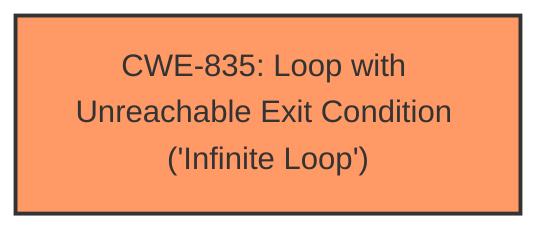

# Analysis for CVE-2024-5569

# Summary
| CWE ID | CWE Name | Confidence | CWE Abstraction Level | CWE Vulnerability Mapping Label | CWE-Vulnerability Mapping Notes |
|---|---|---|---|---|---|
| CWE-835 | Loop with Unreachable Exit Condition ('Infinite Loop') | 1.0 | Base | Allowed | Primary CWE: The vulnerability is directly caused by an **infinite loop** when processing a specially crafted zip file. |

## Evidence and Confidence

*   **Confidence Score:** 1.0
*   **Evidence Strength:** HIGH

## Relationship Analysis
The primary relationship influencing the decision is the direct match of the vulnerability description to the definition of CWE-835. There are no specific parent-child or chain relationships that significantly alter the mapping, as the evidence points strongly to the **infinite loop** as the root cause. The base level of abstraction for CWE-835 is appropriate, given that the description clearly indicates a loop with an unreachable exit condition.

## Vulnerability Chain
The vulnerability chain consists of:
1.  A specially crafted zip file with malformed paths.
2.  Improper handling of these malformed paths by the zipp library and CPython's zipfile module, leading to an **infinite loop** (CWE-835).
3.  Denial of service (DoS) as the application becomes unresponsive.

The root cause is the **infinite loop** triggered by the malformed zip file, and the impact is denial of service.

## Summary of Analysis
The analysis is based on direct evidence from the vulnerability description and CVE reference links. The vulnerability is triggered by processing a specially crafted zip file, which leads to an **infinite loop**.

The evidence supporting the selection of CWE-835 is:
*   "The vulnerability is triggered when processing a specially crafted zip file that leads to an **infinite loop**."
*   "The **infinite loop** can be initiated through the use of functions affecting the `Path` module in both zipp and zipfile, such as `joinpath`, the overloaded division operator, and `iterdir`."
*   "Although the **infinite loop** is not resource exhaustive, it prevents the application from responding."
*   "Root cause of vulnerability: The root cause is the library's improper handling of malformed paths within zip files. Specifically, it failed to properly sanitize paths containing multiple slashes, parent directory references (`..`), and other irregularities. This could lead to unexpected behavior when accessing files within the zip archive."

The retriever results also strongly suggest CWE-835 as the best match, given its highest score.

The selected CWE, CWE-835, is at the optimal level of specificity because it directly and accurately describes the root cause of the vulnerability.

Relevant CWE Information:

# Enhanced Context (25 CWEs)
The following CWEs were identified as potentially relevant to this vulnerability:

## CWE-835: Loop with Unreachable Exit Condition ('Infinite Loop')
**Abstraction Level**: Base
**Similarity Score**: 0.74
**Source**: dense

**Description**:
The product contains an iteration or loop with an exit condition that cannot be reached, i.e., an infinite loop.

**Mapping Guidance**:
- Usage: Allowed
- Rationale: This CWE entry is at the Base level of abstraction, which is a preferred level of abstraction for mapping to the root causes of vulnerabilities.

## CWE-59: Improper Link Resolution Before File Access ('Link Following')
**Abstraction Level**: Base
**Similarity Score**: 0.71

## CWE-407: Inefficient Algorithmic Complexity
**Abstraction Level**: Class
**Similarity Score**: 0.71

## CWE-23: Relative Path Traversal
**Abstraction Level**: Base
**Similarity Score**: 0.71

## CWE-703: Improper Check or Handling of Exceptional Conditions
**Abstraction Level**: Pillar
**Similarity Score**: 0.71

## CWE-754: Improper Check for Unusual or Exceptional Conditions
**Abstraction Level**: Class
**Similarity Score**: 0.70

## CWE-125: Out-of-bounds Read
**Abstraction Level**: Base
**Similarity Score**: 0.70

## CWE-789: Memory Allocation with Excessive Size Value
**Abstraction Level**: Variant
**Similarity Score**: 0.70

## CWE-674: Uncontrolled Recursion
**Abstraction Level**: Class
**Similarity Score**: 0.70

## CWE-41: Improper Resolution of Path Equivalence
**Abstraction Level**: Base
**Similarity Score**: 0.70

## CWE-835: Loop with Unreachable Exit Condition ('Infinite Loop')
**Abstraction Level**: Base
**Similarity Score**: 1243.02

## CWE-1284: Improper Validation of Specified Quantity in Input
**Abstraction Level**: Base
**Similarity Score**: 1152.99

## CWE-789: Memory Allocation with Excessive Size Value
**Abstraction Level**: Variant
**Similarity Score**: 1150.92

## CWE-59: Improper Link Resolution Before File Access ('Link Following')
**Abstraction Level**: Base
**Similarity Score**: 1148.96

## CWE-22: Improper Limitation of a Pathname to a Restricted Directory ('Path Traversal')
**Abstraction Level**: Base
**Similarity Score**: 1139.38

## CWE-1325: Improperly Controlled Sequential Memory Allocation
**Abstraction Level**: base
**Similarity Score**: 4.39

## CWE-1284: Improper Validation of Specified Quantity in Input
**Abstraction Level**: base
**Similarity Score**: 4.33

## CWE-770: Allocation of Resources Without Limits or Throttling
**Abstraction Level**: base
**Similarity Score**: 3.30

## CWE-789: Memory Allocation with Excessive Size Value
**Abstraction Level**: Variant
**Similarity Score**: 3.01

## CWE-1322: Use of Blocking Code in Single-threaded, Non-blocking Context
**Abstraction Level**: base
**Similarity Score**: 2.87

## CWE-606: Unchecked Input for Loop Condition
**Abstraction Level**: base
**Similarity Score**: 2.87

## CWE-476: NULL Pointer Dereference
**Abstraction Level**: base
**Similarity Score**: 2.73

## CWE-59: Improper Link Resolution Before File Access ('Link Following')
**Abstraction Level**: Base
**Similarity Score**: 2.62

## CWE-22: Improper Limitation of a Pathname to a Restricted Directory ('Path Traversal')
**Abstraction Level**: Base
**Similarity Score**: 2.62

## CWE-1333: Inefficient Regular Expression Complexity
**Abstraction Level**: base
**Similarity Score**: 2.47

**CWEs Considered but Not Used:**

*   **CWE-674: Uncontrolled Recursion:** While recursion can lead to excessive resource consumption, the description specifically mentions an **infinite loop**, not uncontrolled recursion.
*   **CWE-789: Memory Allocation with Excessive Size Value:** This CWE is related to memory allocation issues, which are not explicitly described in the vulnerability.
*   **CWE-22: Improper Limitation of a Pathname to a Restricted Directory ('Path Traversal'):** While malformed paths contribute to the vulnerability, the primary issue is the **infinite loop**, not path traversal.
*   **CWE-59: Improper Link Resolution Before File Access ('Link Following'):** Similar to path traversal, this is a contributing factor, but the core weakness is the **infinite loop**.
*   **CWE-1284: Improper Validation of Specified Quantity in Input:** This vulnerability doesn't seem to involve improper validation of input quantities directly.
*   **CWE-770: Allocation of Resources Without Limits or Throttling:** This CWE is related to resource management, which is not the primary issue here. The description states the loop is "not resource exhaustive."