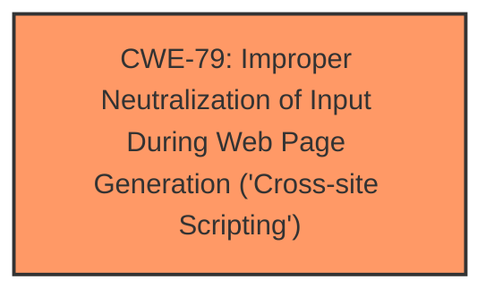

# Analysis for CVE-2024-5584

# Summary
| CWE ID | CWE Name | Confidence | CWE Abstraction Level | CWE Vulnerability Mapping Label | CWE-Vulnerability Mapping Notes |
|---|---|---|---|---|---|
| CWE-79 | Improper Neutralization of Input During Web Page Generation ('Cross-site Scripting') | 1.0 | Base | Primary | Allowed |

## Evidence and Confidence

*   **Confidence Score:** 1.0
*   **Evidence Strength:** HIGH

## Relationship Analysis
The primary relationship considered was the parent-child relationship. CWE-79 is a Base level CWE, which is a preferred level of abstraction. While it has more specific children, the description aligns well with the general case of improper neutralization.

## Vulnerability Chain
The chain of events is as follows:
1.  **Insufficient input sanitization and output escaping** of the 'Color Profile' parameter.
2.  **Stored Cross-Site Scripting (XSS)** vulnerability.
3.  Attacker injects arbitrary web scripts into pages.
4.  When a user accesses the injected page, the script executes.

The **Primary CWE** is CWE-79, which is the root cause in this chain.

## Summary of Analysis
The vulnerability description clearly states that the Bookly plugin is vulnerable to **Stored Cross-Site Scripting** due to **insufficient input sanitization and output escaping**. The "CVE Reference Links Content Summary" also highlights **insufficient input sanitization and output escaping** as the root cause, leading to the XSS vulnerability.

CWE-79, "Improper Neutralization of Input During Web Page Generation ('Cross-site Scripting')", directly addresses this scenario. The description of CWE-79 states: "The product does not neutralize or incorrectly neutralizes user-controllable input before it is placed in output that is used as a web page that is served to other users." This perfectly aligns with the vulnerability where the 'Color Profile' parameter isn't properly sanitized before being rendered in a web page, allowing for XSS attacks.

The Retriever Results also lists CWE-79 with a good score, further supporting this choice.

Other CWEs Considered:

*   CWE-116: "Improper Encoding or Escaping of Output": While this is related, CWE-79 is more specific to XSS, making it a better fit.
*   CWE-352: "Cross-Site Request Forgery (CSRF)": This is not relevant as the vulnerability is related to XSS, not CSRF.
*   CWE-862: "Missing Authorization": The vulnerability is not due to missing authorization but due to improper handling of input.
*   CWE-434: "Unrestricted Upload of File with Dangerous Type": This is not relevant as the vulnerability is not related to file uploads.

The selection of CWE-79 is at the optimal level of specificity as it directly addresses the root cause of the XSS vulnerability.