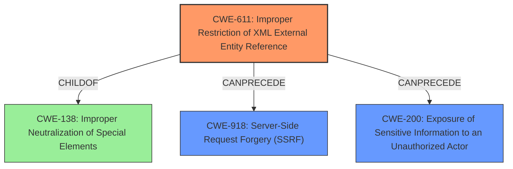

# Analysis Report for CVE-2024-55875

# Vulnerability Analysis Report: CVE-2024-55875

## Description

http4k is a functional toolkit for Kotlin HTTP applications. Prior to version 5.41.0.0, there is a potential **XXE** (XML External Entity Injection) vulnerability when http4k handling malicious XML contents within requests, which might allow attackers to read local sensitive information on server, trigger **Server-side Request Forgery** and even execute code under some circumstances. Version 5.41.0.0 contains a patch for the issue.

## Vulnerability Description Key Phrases

- **Rootcause:** improper XML parsing
- **Weakness:** ['Server-side Request Forgery', 'XXE']
- **Impact:** ["['read local sensitive information'", "'server-side request forgery'", "'execute code']"]
- **Vector:** malicious XML contents
- **Attacker:** attackers
- **Product:** http4k
- **Version:** prior to 5.41.0.0

## Analysis (with Relationship Data)

# Summary
| CWE ID | CWE Name | Confidence | CWE Abstraction Level | CWE Vulnerability Mapping Label | CWE-Vulnerability Mapping Notes |
|---|---|---|---|---|---|
| CWE-611 | Improper Restriction of XML External Entity Reference | 1.0 | Base | Primary | Allowed |
| CWE-918 | Server-Side Request Forgery (SSRF) | 0.9 | Base | Secondary | Allowed |
| CWE-200 | Exposure of Sensitive Information to an Unauthorized Actor | 0.7 | Class | Secondary | Allowed |

## Evidence and Confidence

*   **Confidence Score:** 0.9
*   **Evidence Strength:** HIGH

## Relationship Analysis
The primary weakness is **CWE-611: Improper Restriction of XML External Entity Reference**, which can lead to **CWE-918: Server-Side Request Forgery (SSRF)** and **CWE-200: Exposure of Sensitive Information to an Unauthorized Actor**. CWE-611 is a child of CWE-138 (Improper Neutralization of Special Elements), indicating a failure to sanitize XML input. The relationships show a clear progression from the root cause (improper XML handling) to the resulting impacts (SSRF and information exposure). The base level of CWE-611 is appropriate as it directly addresses the specific vulnerability mechanism.



## Vulnerability Chain
The vulnerability chain starts with **improper XML parsing** due to a lack of restriction of XML External Entity References (**CWE-611**). This allows an attacker to inject malicious XML, leading to potential **Server-Side Request Forgery (SSRF) (CWE-918)**, the ability to **read local sensitive information (CWE-200)**, and potentially execute code.
  - The **root cause** is the **improper** handling of XML entities (**CWE-611**).
  - This leads to the **impact** of SSRF (**CWE-918**), Information Disclosure (**CWE-200**), and potentially Code Execution.

## Summary of Analysis
Based on the provided evidence, the primary weakness is **CWE-611: Improper Restriction of XML External Entity Reference**. The vulnerability description explicitly mentions the potential for **XXE** when handling malicious XML content. This aligns directly with the description of CWE-611, which states that the product processes an XML document that can contain XML entities with URIs that resolve to documents outside of the intended sphere of control. The resulting impacts, such as **Server-side Request Forgery** and reading local sensitive information, further support this classification.

The retriever results also strongly suggest CWE-611 as the most relevant CWE, with a high score across different keyphrases (ROOTCAUSE, WEAKNESS, IMPACT, VECTOR, ATTACKER, PRODUCT, VERSION). The relationships confirm that CWE-611 can lead to CWE-918 and CWE-200.

The selection of CWE-611 is at the optimal level of specificity because it directly addresses the root cause of the vulnerability, which is the **improper** handling of XML external entities. While higher-level CWEs like CWE-138 (Improper Neutralization of Special Elements) could apply, CWE-611 provides a more precise and actionable classification.

CWE-918 (Server-Side Request Forgery) is a secondary weakness because it is a potential outcome of the **XXE** vulnerability. If the **improper** handling of XML allows external entities to make requests to internal resources, it results in SSRF. Similarly, CWE-200 (Exposure of Sensitive Information to an Unauthorized Actor) is a secondary weakness because the **XXE** vulnerability can be exploited to read local files containing sensitive information.

Other CWEs were considered but deemed less appropriate:

*   CWE-776 (Improper Restriction of Recursive Entity References in DTDs ('XML Entity Expansion')): While related to XML vulnerabilities, this CWE focuses on recursive entity definitions, which is not the primary issue described in the vulnerability.
*   CWE-125 (Out-of-bounds Read): This CWE is not directly related to the **XXE** vulnerability described.
*   CWE-502 (Deserialization of Untrusted Data): This CWE is relevant to deserialization issues, not XML parsing.
*   CWE-1336 (Improper Neutralization of Special Elements Used in a Template Engine): This CWE is related to template engines, which is not the focus of the vulnerability.
*   CWE-941 (Incorrectly Specified Destination in a Communication Channel): While it relates to communication channels, it is not the primary issue.
*   CWE-89 (Improper Neutralization of Special Elements used in an SQL Command ('SQL Injection')): This is relevant to SQL injection, not XML parsing.

The evidence strongly supports the selection of CWE-611 as the primary CWE, with CWE-918 and CWE-200 as secondary weaknesses.


## CWE Relationship Analysis

Current CWEs represent these abstraction levels: .


### Vulnerability Chain Analysis

**Chain starting from CWE-502:**
- 502 (Deserialization of Untrusted Data) - ROOT


**Chain starting from CWE-89:**
- 89 (Improper Neutralization of Special Elements used in an SQL Command ('SQL Injection')) - ROOT


### CWE Relationship Diagram

```mermaid
graph TD
    classDef primary fill:#f96,stroke:#333,stroke-width:2px
    classDef secondary fill:#69f,stroke:#333
    classDef tertiary fill:#9e9,stroke:#333
```


*Report generated on 2025-07-13 23:21:52*
