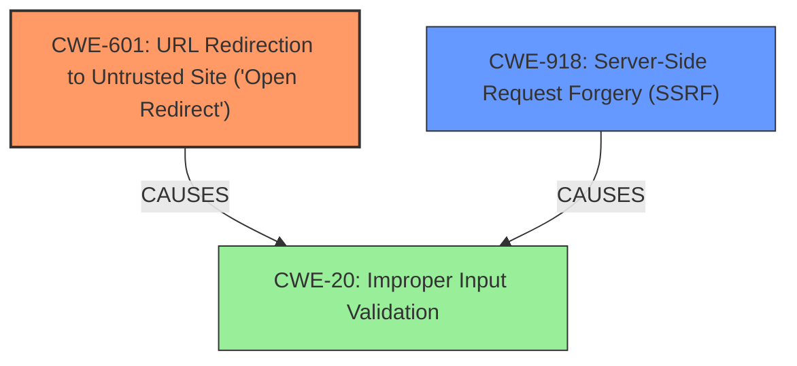

# Analysis Report for CVE-2024-55892

# Vulnerability Analysis Report: CVE-2024-55892

## Description

TYPO3 is a free and open source Content Management Framework. Applications that use `TYPO3\\CMS\\Core\\Http\\Uri` to parse externally provided URLs (e.g., via a query parameter) and validate the host of the parsed URL may be vulnerable to **open redirect or SSRF** attacks if the URL is used after passing the validation checks. Users are advised to update to TYPO3 versions 9.5.49 ELTS, 10.4.48 ELTS, 11.5.42 LTS, 12.4.25 LTS, 13.4.3 which fix the problem described. There are no known workarounds for this vulnerability.

## Vulnerability Description Key Phrases

- **Weakness:** open redirect or SSRF
- **Impact:** SSRF attacks
- **Product:** TYPO3
- **Component:** TYPO3\CMS\Core\Http\Uri

## Analysis (with Relationship Data)

# Summary

| CWE ID | CWE Name | Confidence | CWE Abstraction Level | CWE Vulnerability Mapping Label | CWE-Vulnerability Mapping Notes |
|---|---|---|---|---|---|
| CWE-601 | URL Redirection to Untrusted Site ('Open Redirect') | 0.9 | Base | Allowed | Primary CWE. The vulnerability description explicitly mentions "open redirect". |
| CWE-918 | Server-Side Request Forgery (SSRF) | 0.9 | Base | Allowed | Secondary. The vulnerability description explicitly mentions "SSRF attacks" as a potential impact. |

## Evidence and Confidence

*   **Confidence Score:** 0.9
*   **Evidence Strength:** HIGH

## Relationship Analysis

The primary relationship to consider is that both CWE-601 and CWE-918 can arise from improper input validation, specifically related to URLs. While neither is a direct parent/child of the other, they represent distinct attack vectors stemming from a common **root cause** of **improper URL handling**. The abstraction level for both is Base, which is appropriate.



## Vulnerability Chain

The vulnerability chain starts with **improper handling of externally provided URLs** by the `TYPO3\CMS\Core\Http\Uri` component. This **weakness** allows attackers to craft malicious URLs that can either:

1.  Redirect users to untrusted sites (CWE-601).
2.  Force the server to make requests to unintended destinations, leading to SSRF (CWE-918).

Thus, the chain is: Improper URL Handling -> Open Redirect (CWE-601) OR SSRF (CWE-918).

## Summary of Analysis

The analysis is based on the vulnerability description, which explicitly mentions "open redirect or SSRF attacks" and the use of `TYPO3\CMS\Core\Http\Uri` for parsing URLs.

*   **CWE-601 (URL Redirection to Untrusted Site ('Open Redirect'))** is selected because the vulnerability description explicitly mentions "open redirect." The CVE Reference Links Content Summary also states that "An attacker could redirect a user to a malicious website." This aligns directly with the definition of CWE-601.

*   **CWE-918 (Server-Side Request Forgery (SSRF))** is selected because the vulnerability description mentions "SSRF attacks" as a potential impact. The CVE Reference Links Content Summary also explicitly states "An attacker could potentially make requests to internal resources," which is a core characteristic of SSRF.

Both CWEs are at the Base level of abstraction, which is appropriate for these vulnerabilities. They represent distinct attack vectors that arise from a common root cause of improper URL handling. The Retriever Results also list both CWE-601 and CWE-918 as the top matches.

Other CWEs Considered but Not Used:

*   CWE-209 (Generation of Error Message Containing Sensitive Information): While error messages *could* potentially disclose information, this is not the primary **weakness** or impact described in the vulnerability.
*   CWE-79 (Improper Neutralization of Input During Web Page Generation ('Cross-site Scripting')): XSS is not mentioned, so it is not relevant.
*   CWE-425 (Direct Request ('Forced Browsing')) is about inadequate authorization checks on URLs. While related to URL handling, it's not as precise as CWE-601 or CWE-918.
*   CWE-22 (Improper Limitation of a Pathname to a Restricted Directory ('Path Traversal')): This is about file paths, not URLs.
*   CWE-611 (Improper Restriction of XML External Entity Reference): This is specific to XML, while the vulnerability description does not mention XML.


## CWE Relationship Analysis

Current CWEs represent these abstraction levels: .


### Vulnerability Chain Analysis

**Chain starting from CWE-611:**
- 611 (Improper Restriction of XML External Entity Reference) - ROOT


**Chain starting from CWE-601:**
- 601 (URL Redirection to Untrusted Site ('Open Redirect')) - ROOT


### CWE Relationship Diagram

```mermaid
graph TD
    classDef primary fill:#f96,stroke:#333,stroke-width:2px
    classDef secondary fill:#69f,stroke:#333
    classDef tertiary fill:#9e9,stroke:#333
```


*Report generated on 2025-07-13 23:23:00*
