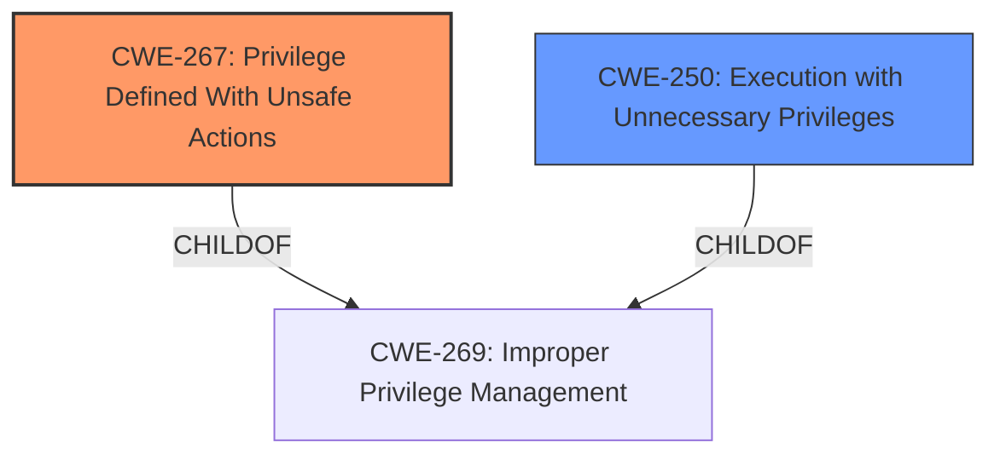

# Enhanced Analysis for CVE-2024-55950

# Summary
| CWE ID | CWE Name | Confidence | CWE Abstraction Level | CWE Vulnerability Mapping Label | CWE-Vulnerability Mapping Notes |
|---|---|---|---|---|---|
| CWE-267 | Privilege Defined With Unsafe Actions | 0.8 | Base | Primary | Allowed |
| CWE-250 | Execution with Unnecessary Privileges | 0.7 | Base | Secondary | Allowed |

## Evidence and Confidence

*   **Confidence Score:** 0.75
*   **Evidence Strength:** MEDIUM

## Relationship Analysis
The primary relationship that influenced the selection was the hierarchical structure related to privilege and permission management. CWE-267 is a base level CWE, representing the specific issue of unsafe actions being associated with a privilege. CWE-250 is also at the base level and represents execution with unnecessary privileges, which is a related but distinct weakness.



## Vulnerability Chain
The vulnerability chain starts with **overly permissive entitlements**, which leads to the ability to perform unsafe actions and ultimately enables code injection, TCC bypass, and unauthorized access to sensitive resources.

## Summary of Analysis
The initial assessment identified that the vulnerability is rooted in **overly permissive entitlements**. The analysis of the vulnerability description and the CVE reference summary revealed that the Tabby terminal emulator possesses powerful permissions that are unnecessary for its core functionality and plugin system, creating potential security vulnerabilities. Specifically, the presence of entitlements such as `com.apple.security.cs.allow-dyld-environment-variables` and `com.apple.security.cs.disable-library-validation`, combined with access to camera, microphone, and personal folders, allows for code injection and TCC bypass.

The provided evidence supports the selection of CWE-267 (Privilege Defined With Unsafe Actions) because the **overly permissive entitlements** grant the application privileges that enable unsafe actions like code injection. The evidence also supports the selection of CWE-250 (Execution with Unnecessary Privileges), because Tabby is executing with higher privileges than necessary, and these privileges are the root cause of the vulnerability.

The retriever results included candidates like CWE-426 (Untrusted Search Path), CWE-918 (Server-Side Request Forgery (SSRF)), and CWE-639 (Authorization Bypass Through User-Controlled Key). These were rejected because they do not directly relate to the root cause of the vulnerability, which is the presence of **overly permissive entitlements**.

The selection of CWE-267 and CWE-250 is at the optimal level of specificity because they represent the specific weaknesses that led to the vulnerability. They are both base-level CWEs, which is the preferred level of abstraction.

Relevant CWE Information:

# Enhanced Context (25 CWEs)
The following CWEs were identified as potentially relevant to this vulnerability:

## CWE-267: Privilege Defined With Unsafe Actions
**Abstraction Level**: Base
**Similarity Score**: 0.80
**Source**: dense

**Description**:
A particular privilege, role, capability, or right can be used to perform unsafe actions that were not intended, even when it is assigned to the correct entity.

**Mapping Guidance**:
- Usage: Allowed
- Rationale: This CWE entry is at the Base level of abstraction, which is a preferred level of abstraction for mapping to the root causes of vulnerabilities.

## CWE-250: Execution with Unnecessary Privileges
**Abstraction Level**: base
**Similarity Score**: 2.47
**Source**: graph

**Description**:
CWE-250: Execution with Unnecessary Privileges

**Mapping Guidance**:
- Usage: Allowed
- Rationale: This CWE entry is at the Base level of abstraction, which is a preferred level of abstraction for mapping to the root causes of vulnerabilities.

**Relationships**:
- CHILDOF -> CWE-657
- CHILDOF -> CWE-269
- PARENTOF -> CWE-250
- PARENTOF -> CWE-250

## Technical Explanation for CWE-267 (Privilege Defined With Unsafe Actions)
*   **How the vulnerability's details match the CWE's characteristics:** The Tabby terminal emulator possesses entitlements (privileges) that are not necessary for its functionality but enable unsafe actions such as code injection. This aligns directly with the CWE's description of a privilege allowing unintended unsafe actions.
*   **The security implications and potential impact:** The ability to inject code allows attackers to bypass security controls, access sensitive resources (camera, microphone, personal folders), and compromise the system.
*   **Any parent-child relationships or chain patterns that influenced your mapping:** CWE-267 is a child of CWE-269 (Improper Privilege Management), which is a more general class. However, CWE-267 is more specific and accurately represents the weakness.
*   **Whether the weakness is primary or secondary in the vulnerability:** This is the primary weakness.
*   **How the official MITRE mapping guidance influenced your decision:** The mapping guidance for CWE-267 allows its usage.

## Technical Explanation for CWE-250 (Execution with Unnecessary Privileges)
*   **How the vulnerability's details match the CWE's characteristics:** The Tabby terminal emulator runs with entitlements that are not required for its proper functioning, allowing for code injection vulnerabilities. This matches the CWE's description of execution with unnecessary privileges.
*   **The security implications and potential impact:** Running with elevated privileges allows attackers to perform actions they would not normally be able to, leading to TCC bypass and access to sensitive data.
*   **Any parent-child relationships or chain patterns that influenced your mapping:** CWE-250 is a child of CWE-269 (Improper Privilege Management), but it is more specific to the case of unnecessary privileges.
*   **Whether the weakness is primary or secondary in the vulnerability:** This is a secondary weakness that contributes to the exploitability.
*   **How the official MITRE mapping guidance influenced your decision:** The mapping guidance for CWE-250 allows its usage.

## CWEs Considered But Not Used
*   **CWE-266 (Incorrect Privilege Assignment)**: While related, the core issue isn't about incorrect assignment but rather the actions enabled by the privileges themselves.
*   **CWE-426 (Untrusted Search Path)**: This is not directly relevant as the vulnerability does not involve the use of an untrusted search path.
*   **CWE-918 (Server-Side Request Forgery (SSRF))**: This is not applicable as the vulnerability does not involve server-side requests.
*   **CWE-639 (Authorization Bypass Through User-Controlled Key)**: This is not relevant as the vulnerability does not involve bypassing authorization through user-controlled keys.
*   **CWE-863 (Incorrect Authorization)**: This is not directly relevant as the vulnerability is more about **overly permissive entitlements** than incorrect authorization checks.
*   **CWE-732 (Incorrect Permission Assignment for Critical Resource)**: This is not applicable as the vulnerability is not about incorrect permission assignments for critical resources.
*   **CWE-201 (Insertion of Sensitive Information Into Sent Data)**: This is not applicable as the vulnerability does not involve the insertion of sensitive information into sent data.
*   **CWE-367 (Time-of-check Time-of-use (TOCTOU) Race Condition)**: This is not applicable as the vulnerability does not involve race conditions.
*   **CWE-306 (Missing Authentication for Critical Function)**: This is not applicable as the vulnerability does not involve missing authentication.
*   **CWE-277 (Insecure Inherited Permissions)**: This is somewhat related, but the core issue is the **overly permissive entitlements**, not necessarily insecure inheritance.
*   **CWE-98 (Improper Control of Filename for Include/Require Statement in PHP Program ('PHP Remote File Inclusion'))**: This is not applicable as the vulnerability does not involve PHP remote file inclusion.


## CWE Relationship Analysis

Current CWEs represent these abstraction levels: .


### Vulnerability Chain Analysis

**Chain starting from CWE-863:**
- 863 (Incorrect Authorization) - ROOT


**Chain starting from CWE-732:**
- 732 (Incorrect Permission Assignment for Critical Resource) - ROOT


### CWE Relationship Diagram

```mermaid
graph TD
    classDef primary fill:#f96,stroke:#333,stroke-width:2px
    classDef secondary fill:#69f,stroke:#333
    classDef tertiary fill:#9e9,stroke:#333
```