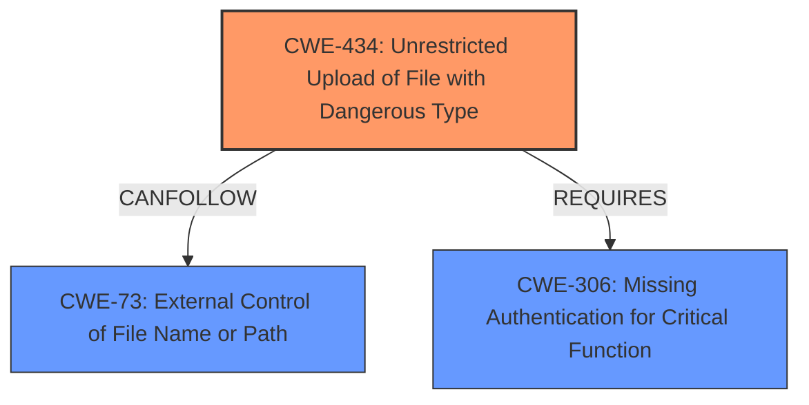

# Analysis for CVE-2024-55956

# Summary
| CWE ID | CWE Name | Confidence | CWE Abstraction Level | CWE Vulnerability Mapping Label | CWE-Vulnerability Mapping Notes |
|---|---|---|---|---|---|
| CWE-434 | Unrestricted Upload of File with Dangerous Type | 0.9 | Base | Allowed | Primary CWE. The vulnerability is due to the ability to upload a file with a dangerous type, which leads to code execution. |
| CWE-73 | External Control of File Name or Path | 0.7 | Base | Allowed | Secondary CWE. The **root cause** involves external control of the filename, enabling the upload of files to the autorun directory. |
| CWE-306 | Missing Authentication for Critical Function | 0.6 | Base | Allowed | Secondary CWE. The **default settings of the Autorun directory** allow an unauthenticated user to import and execute arbitrary commands. |

## Evidence and Confidence

*   **Confidence Score:** 0.8
*   **Evidence Strength:** HIGH

## Relationship Analysis
The primary CWE is CWE-434, representing the **unrestricted upload of a file with a dangerous type** which is the core of the vulnerability. CWE-73 and CWE-306 are contributing factors. CWE-73 explains how the location for file upload is determined, and CWE-306 explains why this upload is possible for an unauthenticated user.

## Vulnerability Chain
1.  **Missing Authentication (CWE-306)**: Allows unauthenticated users to interact with the system.
2.  **External Control of File Name or Path (CWE-73)**: Attackers control the destination of uploaded files.
3.  **Unrestricted Upload of File with Dangerous Type (CWE-434)**: Attackers upload malicious files (e.g., scripts) without proper validation.
4.  **Code Execution (Impact)**: The system executes the uploaded malicious code, leading to remote code execution.

## Summary of Analysis
The primary weakness is CWE-434, as the vulnerability hinges on the ability to upload a file with a dangerous type without restrictions. This is supported by the **Vulnerability Description Key Phrases** which highlights the **default settings of the Autorun directory** and the ability to "import and execute arbitrary Bash or PowerShell commands." The **CVE Reference Links Content Summary** states that the "core weakness is the ability to write files to any location on the server's file system due to improper input validation of the file import process." The **abuse of autorun feature** leads to code execution. CWE-73 is selected as a secondary weakness because the location where the file is uploaded is controlled by the attacker. CWE-306 is selected as a secondary weakness because the attacker is unauthenticated.

I considered other CWEs like CWE-22 (Path Traversal), CWE-78 (OS Command Injection), and CWE-95 (Eval Injection). However, they are not as accurate as CWE-434, CWE-73, and CWE-306. CWE-22 is not suitable because the file isn't necessarily traversing paths to get outside of a restricted directory. CWE-78 isn't suitable as the commands aren't directly injected but rather uploaded. CWE-95 isn't suitable because the uploaded file doesn't directly use eval().