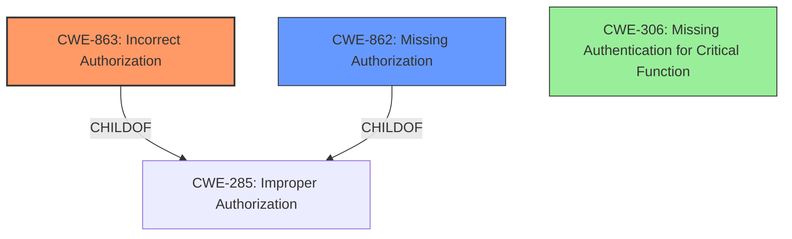

# Raw Analyzer Response for CVE-2024-55963

# Summary

| CWE ID  | CWE Name                                                       | Confidence | CWE Abstraction Level | CWE Vulnerability Mapping Label | CWE-Vulnerability Mapping Notes |
| ------- | -------------------------------------------------------------- | ---------- | --------------------- | ------------------------------- | ------------------------------- |
| CWE-863 | Incorrect Authorization                                        | 0.9        | Class                 | Primary                         | Allowed-with-Review           |
| CWE-862 | Missing Authorization                                        | 0.7        | Class                 | Secondary                         | Allowed-with-Review           |
| CWE-306 | Missing Authentication for Critical Function                   | 0.6        | Base                  | Secondary                         | Allowed                         |

## Evidence and Confidence

*   **Confidence Score:** 0.9
*   **Evidence Strength:** HIGH

## Relationship Analysis

The primary relationship influencing the CWE selection is the hierarchical structure related to authorization. CWE-863 (Incorrect Authorization) is a child of CWE-285 (Improper Authorization) and is closely related to CWE-862 (Missing Authorization). Given the description mentions "**incorrect access control checks**," but provides further details showing that the check should be for "super user permissions" this points to authorization rather than authentication. The choice between CWE-863 and CWE-862 depends on whether a check exists but is flawed (863) or if a check is completely missing (862). In this case, evidence suggests the checks are present but not correctly implemented, favoring CWE-863.

## Vulnerability Chain

The vulnerability chain starts with **incorrect access control checks** (CWE-863), which leads to an unauthorized user triggering a server restart, resulting in a denial-of-service (DoS) impact.

Vulnerability Chain:
1.  **Incorrect Access Control Checks** (CWE-863) - Root Cause
2.  Unauthorized User Action (Server Restart)
3.  Denial of Service (DoS) - Impact

## Summary of Analysis

The initial assessment, guided by the vulnerability description and retriever results, points to access control issues. The description explicitly mentions "**incorrect access control checks**," which is crucial evidence. The CVE Reference Links Content Summary reinforces this by stating that the root cause is due to incorrect access control checks on the restart API, failing to verify super user permissions for incoming requests. The guidance clearly states that if the issue involves improper or missing role checks, CWE-285 (Improper Authorization) or its children like CWE-863 (Incorrect Authorization) or CWE-862 (Missing Authorization) are more appropriate than the generic CWE-284 (Improper Access Control).

The retriever results also suggest CWE-863 (Incorrect Authorization) as the top candidate. Given the evidence that access control checks exist but are not correctly implemented, CWE-863 is selected as the primary CWE.

CWE-862 (Missing Authorization) is a secondary candidate, as the description could also imply a missing check. However, the phrase "**incorrect access control checks**" suggests a flawed implementation rather than a complete absence.

CWE-306 (Missing Authentication for Critical Function) is also considered since the description does not explicitly state whether the user was authenticated. However, the focus is on authorization rather than authentication, and based on the description the assumption is that the user is authenticated.

The final selection prioritizes CWE-863 due to the explicit mention of incorrect checks, making it the most specific and accurate representation of the vulnerability's root cause.

Relevant CWE Information:

# Enhanced Context (25 CWEs)
The following CWEs were identified as potentially relevant to this vulnerability:

## CWE-863: Incorrect Authorization
**Abstraction Level**: Class
**Similarity Score**: 2404.38
**Source**: sparse

**Description**:
The product performs an authorization check when an actor attempts to access a resource or perform an action, but it does not correctly perform the check.

**Mapping Guidance**:
- Usage: Allowed-with-Review
- Rationale: This CWE entry is a Class and might have Base-level children that would be more appropriate

## CWE-862: Missing Authorization
**Abstraction Level**: Class
**Similarity Score**: 2168.14
**Source**: sparse

**Description**:
The product does not perform an authorization check when an actor attempts to access a resource or perform an action.

**Mapping Guidance**:
- Usage: Allowed-with-Review
- Rationale: This CWE entry is a Class and might have Base-level children that would be more appropriate

## CWE-306: Missing Authentication for Critical Function
**Abstraction Level**: Base
**Similarity Score**: 2176.77
**Source**: sparse

**Description**:
The product does not perform any authentication for functionality that requires a provable user identity or consumes a significant amount of resources.

**Mapping Guidance**:
- Usage: Allowed
- Rationale: This CWE entry is at the Base level of abstraction, which is a preferred level of abstraction for mapping to the root causes of vulnerabilities.