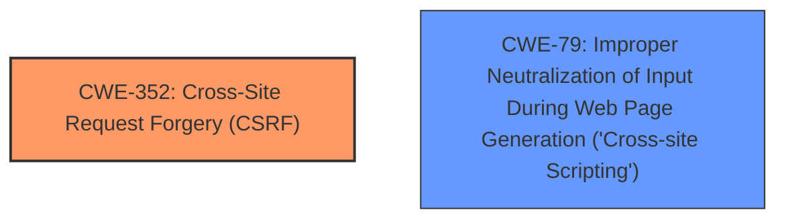

# Analysis for CVE-2024-56015

# Summary
| CWE ID | CWE Name | Confidence | CWE Abstraction Level | CWE Vulnerability Mapping Label | CWE-Vulnerability Mapping Notes |
|---|---|---|---|---|---|
| CWE-352 | Cross-Site Request Forgery (CSRF) | 1.0 | Compound | Primary | Allowed |
| CWE-79 | Improper Neutralization of Input During Web Page Generation ('Cross-site Scripting') | 1.0 | Base | Secondary | Allowed |

## Evidence and Confidence

*   **Confidence Score:** 1.0
*   **Evidence Strength:** HIGH

## Relationship Analysis
The vulnerability description clearly states the presence of both a **Cross-Site Request Forgery (CSRF)** vulnerability and a Reflected **XSS** vulnerability. CWE-352 is a Compound CWE that directly represents the **CSRF** vulnerability. CWE-79 is a Base CWE that directly represents the **XSS** vulnerability. While there may be potential relationships between these vulnerabilities in some cases, the description treats them as distinct issues. The chosen CWEs are at the Base and Compound levels, which are preferred for mapping.

## Vulnerability Chain
The vulnerability chain involves two distinct weaknesses:

1.  **Lack of CSRF protection (CWE-352):** The application does not properly verify the origin of requests, making it vulnerable to CSRF attacks.
2.  **Reflected XSS (CWE-79):** The application does not properly neutralize user-controllable input before including it in web pages, leading to reflected XSS.

These vulnerabilities are distinct and not directly chained, though they can be exploited in conjunction in some attack scenarios. The primary root cause is the **lack of CSRF protection**, leading to the **CSRF** vulnerability (CWE-352). The secondary vulnerability is the **improper neutralization of input**, leading to the Reflected **XSS** vulnerability (CWE-79).

## Summary of Analysis
The analysis is based on direct evidence from the vulnerability description, which explicitly mentions **Cross-Site Request Forgery (CSRF)** and Reflected **XSS**.

The selection of CWE-352 and CWE-79 is directly supported by the vulnerability description and aligns with the standard definitions of these weaknesses.

The selected CWEs are at the optimal level of specificity, representing the specific nature of the **CSRF** and Reflected **XSS** vulnerabilities.

The vulnerability description states: "**Cross-Site Request Forgery** (CSRF) vulnerability in John Godley Tidy Up allows Reflected **XSS**."

This clearly indicates the presence of both a **CSRF** vulnerability and a Reflected **XSS** vulnerability.

The retriever results provide strong support for these classifications, with CWE-352 and CWE-79 being highly ranked for their respective weaknesses.

Relevant CWE Information:
The key phrases "lack of CSRF protection", "**Cross-Site Request Forgery**", and "**XSS**" are all present in the vulnerability description. The "Vulnerability Description Key Phrases" section provides a focused analysis of these key phrases, further supporting the selection of CWE-352 and CWE-79.