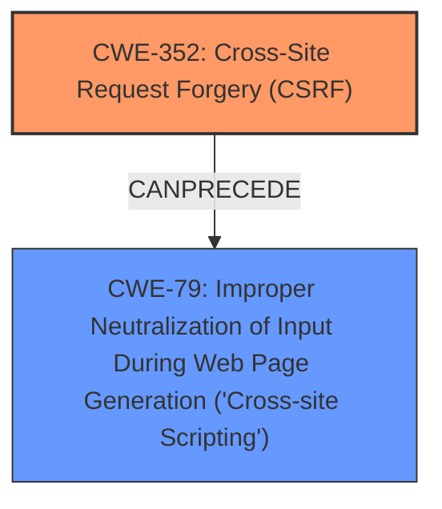

# Analysis for CVE-2024-56017

# Summary
| CWE ID | CWE Name | Confidence | CWE Abstraction Level | CWE Vulnerability Mapping Label | CWE-Vulnerability Mapping Notes |
|---|---|---|---|---|---|
| CWE-352 | Cross-Site Request Forgery (CSRF) | 1.0 | Compound | ROOTCAUSE | Allowed |
| CWE-79 | Improper Neutralization of Input During Web Page Generation ('Cross-site Scripting') | 1.0 | Base | WEAKNESS | Allowed |

## Evidence and Confidence

*   **Confidence Score:** 1.0
*   **Evidence Strength:** HIGH

## Relationship Analysis
The primary relationship is that **CWE-352** Cross-Site Request Forgery (CSRF) can lead to other vulnerabilities like **CWE-79** Improper Neutralization of Input During Web Page Generation ('Cross-site Scripting'). CSRF allows an attacker to induce users into performing actions they do not intend to, which in this case, results in stored XSS due to **improper neutralization** of input.

## Vulnerability Chain
The vulnerability chain starts with **CWE-352** Cross-Site Request Forgery (CSRF) due to a **lack of CSRF protection**. This allows an attacker to inject malicious scripts into the application. The injected scripts are then stored and executed by other users due to **CWE-79** Improper Neutralization of Input During Web Page Generation ('Cross-site Scripting').

## Summary of Analysis
The vulnerability description clearly states a Cross-Site Request Forgery (CSRF) vulnerability leading to Stored Cross-Site Scripting (XSS). The analysis is based on the provided evidence. The **ROOTCAUSE** is the **lack of CSRF protection**, which maps to **CWE-352**. The **WEAKNESS** is Stored **XSS**, which occurs due to **improper neutralization** of input, mapping to **CWE-79**.

The graph relationships influenced the selection by showing how **CWE-352** can lead to **CWE-79**. The selected CWEs are at the optimal level of specificity, with **CWE-352** being a Compound weakness and **CWE-79** being a Base weakness.

**Evidence:**
- **ROOTCAUSE: 'lack of CSRF protection'**: This clearly indicates the absence of CSRF protection, leading to **CWE-352**.
- **WEAKNESS: 'XSS'**: This directly points to the presence of Cross-Site Scripting, which results from **improper neutralization** of input, leading to **CWE-79**.

**CWE Considerations:**
- **CWE-352**: Cross-Site Request Forgery (CSRF) is selected because the application **lacks CSRF protection**, allowing attackers to forge requests on behalf of legitimate users.
- **CWE-79**: Improper Neutralization of Input During Web Page Generation ('Cross-site Scripting') is selected because the application does not properly neutralize user-controllable input before placing it in a web page, leading to stored XSS.

CWEs considered but not used:
- CWE-434: Unrestricted Upload of File with Dangerous Type was considered due to its presence in the retriever results, but it is not relevant to the vulnerability description, which focuses on CSRF and XSS.
- CWE-116: Improper Encoding or Escaping of Output was considered because XSS often involves **improper encoding**, but CWE-79 is a better fit because it specifically addresses the **improper neutralization** leading to XSS.
- CWE-862: Missing Authorization was considered, but the primary issue is the **lack of CSRF protection**, not a general missing authorization check.