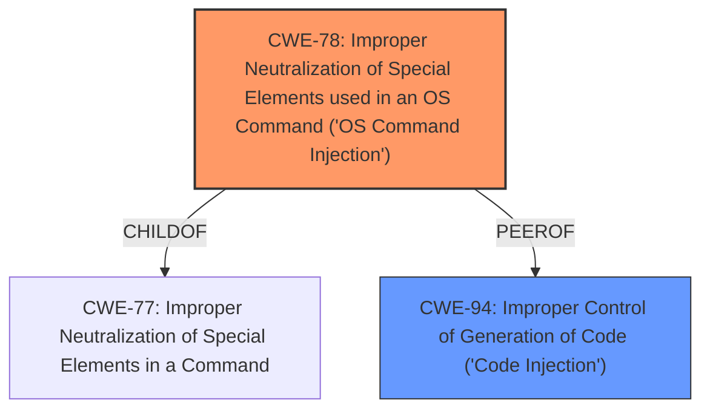

# Enhanced Analysis for CVE-2024-56084

# Summary
| CWE ID | CWE Name | Confidence | CWE Abstraction Level | CWE Vulnerability Mapping Label | CWE-Vulnerability Mapping Notes |
|---|---|---|---|---|---|
| CWE-78 | Improper Neutralization of Special Elements used in an OS Command ('OS Command Injection') | 0.9 | Base | Primary CWE | Allowed |
| CWE-94 | Improper Control of Generation of Code ('Code Injection') | 0.7 | Base | Secondary Candidate | Allowed-with-Review |

## Evidence and Confidence

*   **Confidence Score:** 0.9
*   **Evidence Strength:** HIGH

## Relationship Analysis
The primary relationship that influenced the decision was the ChildOf relationship between CWE-78 and CWE-77 (which is mentioned in the CVE description), indicating that OS Command Injection is a specific type of command injection. The Retriever Results also support CWE-78. CWE-94, while also relevant, is a broader category, and CWE-78 is a more specific and accurate fit for this vulnerability.



## Vulnerability Chain
The vulnerability chain starts with the **improper neutralization** of input, leading to OS command injection and ultimately resulting in Remote Code Execution.
1.  **Root Cause:** **Improper Neutralization** of Special Elements used in OS Command (CWE-78)
2.  Impact: Remote Code Execution

## Summary of Analysis
The analysis is based on the provided evidence, which indicates that authenticated users can inject payloads leading to remote code execution. The CVE Reference Links Content Summary explicitly states that the vulnerability is classified as CWE-77, which refers to Command Injection. However, CWE-78, "Improper Neutralization of Special Elements used in an OS Command ('OS Command Injection')", is a more specific child of CWE-77 and is therefore a better fit. The retriever results also list CWE-78. The graph relationships show that CWE-78 is a child of CWE-77, further supporting this choice. CWE-94, "Improper Control of Generation of Code ('Code Injection')", was also considered, but it's a more general case of code injection and less precise than CWE-78, which directly addresses the OS command injection aspect.

The selected CWEs are at the optimal level of specificity because CWE-78 directly addresses the **improper neutralization** of input leading to OS command execution, as indicated by the vulnerability description. The evidence from "CVE Reference Links Content Summary" states that the vulnerability stems from the ability of authenticated users to inject malicious payloads while creating a Universal Normalizer. These injected payloads are then executed, leading to Remote Code Execution (RCE).

Relevant CWE Information:

# Enhanced Context (25 CWEs)
The following CWEs were identified as potentially relevant to this vulnerability:

## CWE-74: Improper Neutralization of Special Elements in Output Used by a Downstream Component ('Injection')
**Abstraction Level**: Class
**Similarity Score**: 0.76
**Source**: dense

**Description**:
The product constructs all or part of a command, data structure, or record using externally-influenced input from an upstream component, but it does not neutralize or incorrectly neutralizes special elements that could modify how it is parsed or interpreted when it is sent to a downstream component.

**Mapping Guidance**:
- Usage: Discouraged
- Rationale: CWE-74 is high-level and often misused when lower-level weaknesses are more appropriate.

## CWE-78: Improper Neutralization of Special Elements used in an OS Command ('OS Command Injection')
**CWE-78** is selected as the primary CWE. The vulnerability allows authenticated users to inject payloads that are then executed, leading to Remote Code Execution. This directly aligns with the description of CWE-78, which involves **improper neutralization** of special elements used in an OS command.

## CWE-94: Improper Control of Generation of Code ('Code Injection')
**CWE-94** is considered as a secondary CWE. While the vulnerability does involve code injection, CWE-78 is more specific in that it is related to OS commands.


## CWE Relationship Analysis

Current CWEs represent these abstraction levels: .


### Vulnerability Chain Analysis

**Chain starting from CWE-74:**
- 74 (Improper Neutralization of Special Elements in Output Used by a Downstream Component ('Injection')) - ROOT


**Chain starting from CWE-77:**
- 77 (Improper Neutralization of Special Elements used in a Command ('Command Injection')) - ROOT


### CWE Relationship Diagram

```mermaid
graph TD
    classDef primary fill:#f96,stroke:#333,stroke-width:2px
    classDef secondary fill:#69f,stroke:#333
    classDef tertiary fill:#9e9,stroke:#333
```