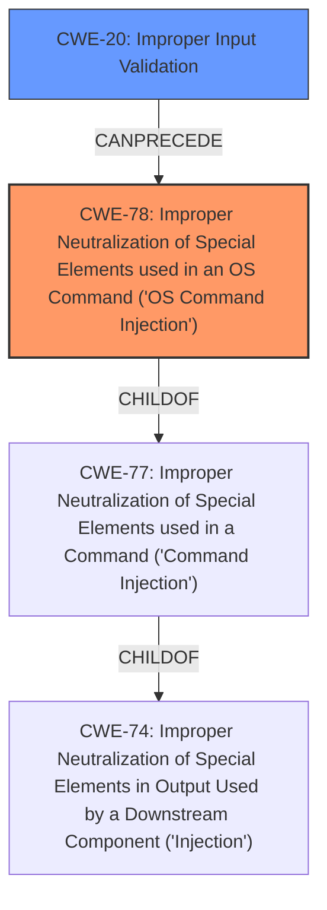

# Analysis Report for CVE-2024-56133

# Vulnerability Analysis Report: CVE-2024-56133

## Description

Improper **Input Validation vulnerability** of Authenticated User in Progress LoadMaster allows **OS Command Injection**. This issue affects Product Affected Versions LoadMaster From 7.2.55.0 to 7.2.60.1 (inclusive) From 7.2.49.0 to 7.2.54.12 (inclusive) 7.2.48.12 and all prior versions ECS All prior versions to 7.2.60.1 (inclusive)

## Vulnerability Description Key Phrases

- **Rootcause:** ['Input Validation vulnerability', 'Improper Input Validation']
- **Weakness:** OS Command Injection
- **Attacker:** Authenticated User
- **Product:** ['Progress LoadMaster', 'ECS']
- **Version:** ['7.2.48.12 and all prior versions', 'All prior versions to 7.2.60.1', '7.2.49.0 to 7.2.54.12', '7.2.55.0 to 7.2.60.1']

## Analysis (with Relationship Data)

# Summary
| CWE ID | CWE Name | Confidence | CWE Abstraction Level | CWE Vulnerability Mapping Label | CWE-Vulnerability Mapping Notes |
|---|---|---|---|---|---|
| CWE-78 | Improper Neutralization of Special Elements used in an OS Command ('OS Command Injection') | 1.0 | Base | Primary | Allowed |
| CWE-20 | Improper Input Validation | 0.8 | Class | Secondary | Discouraged |

## Evidence and Confidence

*   **Confidence Score:** 0.9
*   **Evidence Strength:** HIGH

## Relationship Analysis
The primary relationship influencing the decision is that CWE-78 is a specific type of injection, being a child of CWE-77 (Improper Neutralization of Special Elements used in a Command ('Command Injection')), which itself is a child of CWE-74 (Improper Neutralization of Special Elements in Output Used by a Downstream Component ('Injection')). CWE-20 is a broader category of weakness that can often precede injection vulnerabilities. The choice of CWE-78 is preferred as it gives a more specific description of the **OS Command Injection** vulnerability.



## Vulnerability Chain
The vulnerability chain starts with **Improper Input Validation** (CWE-20), which leads to **OS Command Injection** (CWE-78). The **lack of proper input validation** allows an attacker to inject malicious OS commands into the system.

## Summary of Analysis
The primary **weakness** is **OS Command Injection**, which occurs because of **improper input validation**. The vulnerability description clearly states "Improper **Input Validation vulnerability** of Authenticated User in Progress LoadMaster allows **OS Command Injection**." This indicates that the root cause is the **improper input validation**, but the direct consequence and more specific vulnerability is the **OS Command Injection**.

CWE-78 is the most specific and appropriate CWE because the vulnerability is explicitly an **OS Command Injection**. CWE-20 is related because **improper input validation** is the root cause that allows the **OS Command Injection** to occur.

The selection of CWE-78 is at the base level of abstraction, which is preferred. CWE-20 is a class level CWE, so it is less specific. The evidence is quite strong because the vulnerability description contains both "**Input Validation vulnerability**" and "**OS Command Injection**".

Relevant CWE Information:
*   CWE-20: Improper Input Validation
*   CWE-77: Improper Neutralization of Special Elements used in a Command ('Command Injection')
*   CWE-78: Improper Neutralization of Special Elements used in an OS Command ('OS Command Injection')
*   CWE-74: Improper Neutralization of Special Elements in Output Used by a Downstream Component ('Injection')
*   CWE-912: Hidden Functionality
*   CWE-288: Authentication Bypass Using an Alternate Path or Channel
*   CWE-22: Improper Limitation of a Pathname to a Restricted Directory ('Path Traversal')
*   CWE-269: Improper Privilege Management


## CWE Relationship Analysis

Current CWEs represent these abstraction levels: .


### Vulnerability Chain Analysis

**Chain starting from CWE-288:**
- 288 (Authentication Bypass Using an Alternate Path or Channel) - ROOT


**Chain starting from CWE-77:**
- 77 (Improper Neutralization of Special Elements used in a Command ('Command Injection')) - ROOT


### CWE Relationship Diagram

```mermaid
graph TD
    classDef primary fill:#f96,stroke:#333,stroke-width:2px
    classDef secondary fill:#69f,stroke:#333
    classDef tertiary fill:#9e9,stroke:#333
```


*Report generated on 2025-07-13 23:31:37*
