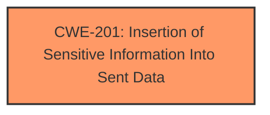

# Analysis for CVE-2024-56136

# Summary
| CWE ID | CWE Name | Confidence | CWE Abstraction Level | CWE Vulnerability Mapping Label | CWE-Vulnerability Mapping Notes |
|---|---|---|---|---|---|
| CWE-201 | Insertion of Sensitive Information Into Sent Data | 0.9 | Base | Allowed | Primary CWE: The server sends sensitive information (email existence) in its response, which it should not be doing. |

## Evidence and Confidence

*   **Confidence Score:** 0.9
*   **Evidence Strength:** HIGH

## Relationship Analysis
The primary CWE selected is CWE-201, which directly addresses the information disclosure aspect of the vulnerability. The retriever results included several CWEs related to authorization and authentication, but these were not directly related to the root cause of this vulnerability.

## Vulnerability Chain
The vulnerability chain is straightforward:

1.  The server **improperly includes sensitive information** (email existence) in its error responses.
2.  An unauthenticated attacker can then use this information to determine if an email address is in use.
    *   **Root Cause:** CWE-201 Insertion of Sensitive Information Into Sent Data
    *   **Impact:** Information Disclosure

## Summary of Analysis
The primary focus of this vulnerability is the **insertion of sensitive information** into the server's response. The Zulip server reveals whether an email address is associated with an account, even if the login attempt is made on the wrong subdomain. The **root cause** lies in the fact that the server's error response exposes this information, which it should not.

The evidence for this assessment is strong, as the vulnerability description and the CVE reference link content summary explicitly state the information disclosure.

> "Zulip server ... are vulnerable to an information disclose attack, where, if a Zulip server is hosting multiple organizations, an unauthenticated user can make a request and determine if an email address is in use by a user."

The retriever results also listed CWE-201 as a potentially relevant CWE. While other CWEs such as those related to authorization and authentication were also suggested, they do not directly address the core issue of sensitive information being leaked in the response.

Therefore, CWE-201 is the most appropriate and specific CWE to map to this vulnerability. It accurately represents the root cause of the information disclosure.

Relevant CWE Information:

# Enhanced Context (25 CWEs)
The following CWEs were identified as potentially relevant to this vulnerability:

## CWE-201: Insertion of Sensitive Information Into Sent Data
**Abstraction Level**: Base
**Similarity Score**: 0.73
**Source**: dense

**Description**:
The code transmits data to another actor, but a portion of the data includes sensitive information that should not be accessible to that actor.

**Mapping Guidance**:
- Usage: Allowed
- Rationale: This CWE entry is at the Base level of abstraction, which is a preferred level of abstraction for mapping to the root causes of vulnerabilities.