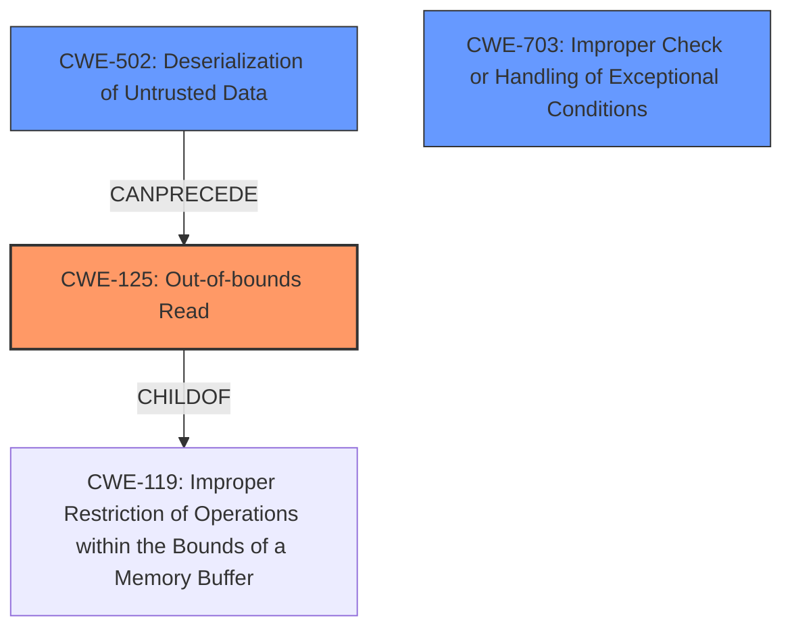

# Raw Analyzer Response for CVE-2024-5629

```markdown
# Summary
| CWE ID    | CWE Name                                                                        | Confidence | CWE Abstraction Level | CWE Vulnerability Mapping Label | CWE-Vulnerability Mapping Notes |
| --------- | ------------------------------------------------------------------------------- | ---------- | --------------------- | ------------------------------- | ------------------------------- |
| CWE-125   | Out-of-bounds Read                                                              | 1          | Base                  | Primary CWE                     | Allowed                         |
| CWE-502   | Deserialization of Untrusted Data                                               | 0.8        | Base                  | Secondary Candidate             | Allowed                         |
| CWE-703   | Improper Check or Handling of Exceptional Conditions                               | 0.6        | Pillar                  | Secondary Candidate             | Discouraged                         |

## Evidence and Confidence

*   **Confidence Score:** 0.9
*   **Evidence Strength:** HIGH

## Relationship Analysis
The primary relationship is that **improper deserialization** can lead to an **out-of-bounds read**. CWE-125 is a child of CWE-119 (Improper Restriction of Operations within the Bounds of a Memory Buffer), but CWE-125 is more specific and therefore preferred. CWE-502 can precede CWE-125 because the untrusted data is the source of the read. CWE-703 is a very general case, however the 'deserialization of malformed BSON to raise an exception' could also be viewed as not properly handling the exceptional condition.



## Vulnerability Chain
The vulnerability chain starts with **deserialization** of malformed BSON, leading to an **out-of-bounds read**, and ultimately resulting in the exposure of arbitrary application memory.

`CWE-502` (Deserialization of Untrusted Data) -> `CWE-125` (Out-of-bounds Read) -> Information Exposure

## Summary of Analysis
The analysis indicates that the primary weakness is an **out-of-bounds read** (`CWE-125`) caused by **deserialization** of malformed BSON data (`CWE-502`).

The vulnerability description explicitly states: "An **out-of-bounds read** in the bson module of PyMongo 4.6.2 or earlier allows **deserialization** of malformed BSON provided by a Server to raise an exception which may contain arbitrary application memory." This statement directly supports the selection of CWE-125 as the primary weakness.

The graph relationships influenced the selection by highlighting the potential chain from deserialization to out-of-bounds read. This led to the inclusion of CWE-502 as a secondary CWE to represent the initial cause of the vulnerability.

The selected CWEs are at the optimal level of specificity because they accurately represent the root cause and the immediate consequence of the vulnerability. CWE-125 is a Base level CWE, which is preferred, and it directly describes the **out-of-bounds read**. CWE-502 is also a Base level CWE and describes the **deserialization** of untrusted data that leads to the **out-of-bounds read**.

Relevant CWE Information:

# Enhanced Context (25 CWEs)
The following CWEs were identified as potentially relevant to this vulnerability:

## CWE-703: Improper Check or Handling of Exceptional Conditions
**Abstraction Level**: Pillar
**Similarity Score**: 0.73
**Source**: dense

**Description**:
The product does not properly anticipate or handle exceptional conditions that rarely occur during normal operation of the product.

**Mapping Guidance**:
- Usage: Discouraged
- Rationale: This CWE entry is extremely high-level, a Pillar.

**Reasoning:**
CWE-703 was considered because the vulnerability involves the application not properly handling malformed BSON data, which can be seen as an exceptional condition. However, it is a high-level (Pillar) CWE, making it less specific than CWE-125 and CWE-502, so it was only considered as a secondary candidate. The exception being thrown with arbitrary application memory could be considered an improper handling of the condition.

## CWE-824: Access of Uninitialized Pointer
**Abstraction Level**: Base
**Similarity Score**: 0.72
**Source**: dense

**Description**:
The product accesses or uses a pointer that has not been initialized.

**Mapping Guidance**:
- Usage: Allowed
- Rationale: This CWE entry is at the Base level of abstraction, which is a preferred level of abstraction for mapping to the root causes of vulnerabilities.

**Reasoning:**
CWE-824 was considered because an **out-of-bounds read** could potentially involve reading from an uninitialized pointer. However, the vulnerability description specifically mentions **out-of-bounds read** and **deserialization** of malformed BSON. There is no direct evidence of an uninitialized pointer being accessed.

## CWE-696: Incorrect Behavior Order
**Abstraction Level**: Class
**Similarity Score**: 0.72
**Source**: dense

**Description**:
The product performs multiple related behaviors, but the behaviors are performed in the wrong order in ways which may produce resultant weaknesses.

**Mapping Guidance**:
- Usage: Allowed-with-Review
- Rationale: This CWE entry is a Class and might have Base-level children that would be more appropriate

**Reasoning:**
CWE-696 was considered because the **deserialization** process might involve performing actions in an incorrect order. However, there's no direct evidence provided in the description that indicates incorrect order of operations.

## CWE-212: Improper Removal of Sensitive Information Before Storage or Transfer
**Abstraction Level**: Base
**Similarity Score**: 0.72
**Source**: dense

**Description**:
The product stores, transfers, or shares a resource that contains sensitive information, but it does not properly remove that information before the product makes the resource available to unauthorized actors.

**Mapping Guidance**:
- Usage: Allowed
- Rationale: This CWE entry is at the Base level of abstraction, which is a preferred level of abstraction for mapping to the root causes of vulnerabilities.

**Reasoning:**
CWE-212 was considered since the impact is arbitrary application memory, the application may be exposing sensitive information. However, it is the **out-of-bounds read** that is the rootcause for the exposure.

## CWE-502: Deserialization of Untrusted Data
**Abstraction Level**: Base
**Similarity Score**: 0.72
**Source**: dense

**Description**:
The product deserializes untrusted data without sufficiently ensuring that the resulting data will be valid.

**Mapping Guidance**:
- Usage: Allowed
- Rationale: This CWE entry is at the Base level of abstraction, which is a preferred level of abstraction for mapping to the root causes of vulnerabilities.

**Reasoning:**
CWE-502 is highly relevant because the vulnerability description mentions "deserialization of malformed BSON". It is a direct cause of the **out-of-bounds read**, making it a strong secondary candidate.

## CWE-497: Exposure of Sensitive System Information to an Unauthorized Control Sphere
**Abstraction Level**: Base
**Similarity Score**: 0.72
**Source**: dense

**Description**:
The product does not properly prevent sensitive system-level information from being accessed by unauthorized actors who do not have the same level of access to the underlying system as the product does.

**Mapping Guidance**:
- Usage: Allowed
- Rationale: This CWE entry is at the Base level of abstraction, which is a preferred level of abstraction for mapping to the root causes of vulnerabilities.

**Reasoning:**
CWE-497 was considered because arbitrary application memory is exposed. However, it is the **out-of-bounds read** that is the cause of the exposure, not necessarily the system level information.

## CWE-138: Improper Neutralization of Special Elements
**Abstraction Level**: Class
**Similarity Score**: 0.72
**Source**: dense

**Description**:
The product receives input from an upstream component, but it does not neutralize or incorrectly neutralizes special elements that could be interpreted as control elements or syntactic markers when they are sent to a downstream component.

**Mapping Guidance**:
- Usage: Discouraged
- Rationale: This CWE entry is a level-1 Class (i.e., a child of a Pillar). It might have lower-level children that would be more appropriate

**Reasoning:**