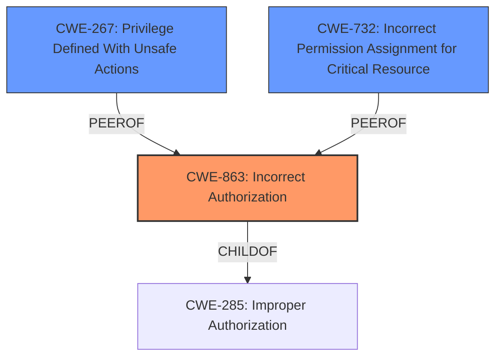

# Analysis Report for CVE-2024-56321

# Vulnerability Analysis Report: CVE-2024-56321

## Description

GoCD is a continuous deliver server. GoCD versions 18.9.0 through 24.4.0 (inclusive) can allow GoCD admins to abuse the backup configuration post-backup script feature to potentially execute arbitrary scripts on the hosting server or container as GoCDs user, rather than pre-configured scripts. In practice the impact of this vulnerability is limited, as in most configurations a user who can log into the GoCD UI as an admin also has host administration permissions for the host/container that GoCD runs on, in order to manage artifact storage and other service-level configuration options. Additionally, since a GoCD admin has ability to configure and schedule pipelines tasks on all GoCD agents available to the server, the fundamental functionality of GoCD allows co-ordinated task execution similar to that of post-backup-scripts. However in restricted environments where the host administration is separated from the role of a GoCD admin, this may be unexpected. The issue is fixed in GoCD 24.5.0. Post-backup scripts can no longer be executed from within certain sensitive locations on the GoCD server. No known workarounds are available.

## Vulnerability Description Key Phrases

- **Impact:** execute arbitrary scripts on the hosting server
- **Attacker:** GoCD admins
- **Product:** GoCD
- **Version:** 18.9.0 through 24.4.0
- **Component:** backup configuration post-backup script feature

## Analysis (with Relationship Data)

# Summary
| CWE ID | CWE Name | Confidence | CWE Abstraction Level | CWE Vulnerability Mapping Label | CWE-Vulnerability Mapping Notes |
|---|---|---|---|---|---|
| CWE-863 | Incorrect Authorization | 0.8 | Class | Allowed-with-Review | Primary CWE |
| CWE-267 | Privilege Defined With Unsafe Actions | 0.6 | Base | Allowed | Secondary Candidate |
| CWE-732 | Incorrect Permission Assignment for Critical Resource | 0.5 | Class | Allowed-with-Review | Secondary Candidate |

## Evidence and Confidence

*   **Confidence Score:** 0.8
*   **Evidence Strength:** MEDIUM

## Relationship Analysis
The primary relationship that influenced the decision was the parent-child relationship between CWE-285 (Improper Authorization) and CWE-863 (Incorrect Authorization). While both could apply, CWE-863 is a more specific description of the **incorrect authorization** **weakness**. The guidance provided also emphasizes that CWE-285 is discouraged when more specific CWEs exist. CWE-732 was considered due to the mention of resource permissions, but ultimately, the vulnerability lies in the **incorrect authorization** rather than the assignment of permissions.



## Vulnerability Chain
The vulnerability chain starts with an **incorrect authorization** mechanism (CWE-863), allowing a GoCD admin to execute arbitrary scripts. This leads to a potential impact of arbitrary script execution on the server.

## Summary of Analysis
The initial analysis focused on identifying the root cause of the vulnerability. The vulnerability description highlights that GoCD admins can **abuse** the backup configuration post-backup script feature to execute arbitrary scripts. This indicates a flaw in the authorization or access control mechanism. The CVE Reference Links Content Summary further clarifies that the root cause is an **improper validation of the location of the post-backup script**, leading to unrestricted script execution.

Based on this evidence, CWE-863 (Incorrect Authorization) was identified as the primary CWE. This is because the vulnerability involves an authorization check that is not correctly performed, allowing unauthorized script execution. The MITRE guidance on privileges vs. permissions, specifically the authorization section, supports this mapping.

CWE-267 (Privilege Defined With Unsafe Actions) was also considered as the GoCD admin privilege is being leveraged to execute the scripts.

CWE-732 (Incorrect Permission Assignment for Critical Resource) was considered but not selected as the primary CWE. While the vulnerability involves access to a critical resource (the server's script execution capability), the core issue is the incorrect authorization logic that allows the admin to bypass intended restrictions, rather than the permission assignment itself.

The selected CWEs are at the optimal level of specificity, representing the root cause and potential contributing factors.

Relevant CWE Information:

# Enhanced Context (25 CWEs)
The following CWEs were identified as potentially relevant to this vulnerability:

## CWE-267: Privilege Defined With Unsafe Actions
**Abstraction Level**: Base
**Similarity Score**: 0.79
**Source**: dense

**Description**:
A particular privilege, role, capability, or right can be used to perform unsafe actions that were not intended, even when it is assigned to the correct entity.

**Mapping Guidance**:
- Usage: Allowed
- Rationale: This CWE entry is at the Base level of abstraction, which is a preferred level of abstraction for mapping to the root causes of vulnerabilities.

## CWE-732: Incorrect Permission Assignment for Critical Resource
**Abstraction Level**: Class
**Similarity Score**: 1724.65
**Source**: sparse

**Description**:
The product specifies permissions for a security-critical resource in a way that allows that resource to be read or modified by unintended actors.

**Mapping Guidance**:
- Usage: Allowed-with-Review
- Rationale: While the name itself indicates an assignment of permissions for resources, this is often misused for vulnerabilities in which "permissions" are not checked, which is an "authorization" weakness (CWE-285 or descendants) within CWE's model [REF-1287].


## CWE Relationship Analysis

Current CWEs represent these abstraction levels: .


### Vulnerability Chain Analysis

**Chain starting from CWE-863:**
- 863 (Incorrect Authorization) - ROOT


**Chain starting from CWE-285:**
- 285 (Improper Authorization) - ROOT


### CWE Relationship Diagram

```mermaid
graph TD
    classDef primary fill:#f96,stroke:#333,stroke-width:2px
    classDef secondary fill:#69f,stroke:#333
    classDef tertiary fill:#9e9,stroke:#333
```


*Report generated on 2025-07-13 23:38:16*
