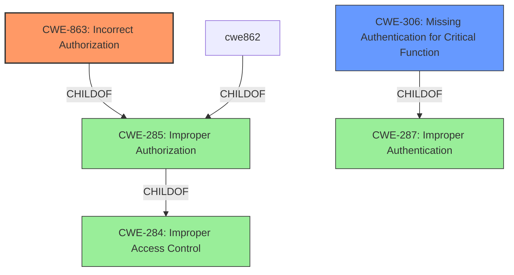

# Raw Analyzer Response for CVE-2024-56323

# Summary
| CWE ID   | CWE Name                                               | Confidence | CWE Abstraction Level | CWE Vulnerability Mapping Label | CWE-Vulnerability Mapping Notes |
| :--------- | :----------------------------------------------------- | :--------- | :-------------------- | :------------------------------ | :-------------------------------- |
| CWE-863 | Incorrect Authorization | 0.9 | Class | Allowed-with-Review | Primary CWE |
| CWE-306 | Missing Authentication for Critical Function | 0.6 | Base | Allowed | Secondary |

## Evidence and Confidence

*   **Confidence Score:** 0.8
*   **Evidence Strength:** HIGH

## Relationship Analysis
The primary relationship influencing the selection is the parent-child relationship between CWE-287 (Improper Authentication), CWE-862 (Missing Authorization), CWE-863 (Incorrect Authorization), and CWE-285 (Improper Authorization). CWE-284 (Improper Access Control) is a very high-level CWE and should be avoided. The guidance clearly distinguishes between authentication and authorization issues, which helped narrow down the choices. The vulnerability is an authorization bypass, pointing towards CWE-863 as the most appropriate.

## Vulnerability Chain
The vulnerability chain involves a **lack of proper authorization** checks in the OpenFGA engine, leading to an **authorization bypass**.

1.  The root cause is the **incorrect authorization** logic, where the system fails to properly validate user permissions when conditions and contextual tuples with caching are used in the `Check` and `ListObjects` APIs.
2.  This leads to the **authorization bypass**, where an attacker can gain unauthorized access to resources or functionalities.
3.  The impact is high confidentiality, integrity, and availability risks for subsequent systems.

## Summary of Analysis
The primary weakness is **authorization bypass**. The vulnerability description and the CVE reference summary both point to a flaw in the authorization logic when handling conditions, contextual tuples, and caching. The **authorization bypass** occurs because the system **incorrectly authorizes** the user's access, leading to unintended access to resources.

The initial assessment based on the description was that it's an authorization issue, and CWE-863 fits best. The guidance further reinforced this by clearly stating that when authorization checks are present but flawed, CWE-863 is the appropriate choice.

CWE-284, CWE-285, and CWE-862 were considered but ruled out. CWE-284 is too high-level. CWE-285 is a general authorization flaw, and CWE-862 indicates that authorization checks are missing. In this case, the checks exist but are implemented incorrectly.

CWE-306 **Missing Authentication for Critical Function** was considered because when calling Check API or ListObjects with a model that uses [conditions](https//openfga.dev/docs/modeling/conditions), and calling Check API or ListObjects API with [contextual tuples](https//openfga.dev/docs/concepts#what-are-contextual-tuples) that include conditions, it may lead to missing authentication when OpenFGA is configured with caching enabled (`OPENFGA_CHECK_QUERY_CACHE_ENABLED`).

The selected CWEs are at the optimal level of specificity because they directly address the root cause and nature of the vulnerability. CWE-863 describes the **incorrect authorization**, and CWE-306 describes the case where it could lead to **missing authentication**.

Relevant CWE Information:

# Enhanced Context (25 CWEs)
The following CWEs were identified as potentially relevant to this vulnerability:

## CWE-863: Incorrect Authorization
**Abstraction Level**: Class
**Similarity Score**: 2561.28
**Source**: sparse

**Description**:
The product performs an authorization check when an actor attempts to access a resource or perform an action, but it does not correctly perform the check.

**Mapping Guidance**:
- Usage: Allowed-with-Review
- Rationale: This CWE entry is a Class and might have Base-level children that would be more appropriate

## CWE-306: Missing Authentication for Critical Function
**Abstraction Level**: base
**Similarity Score**: 2.47
**Source**: graph

**Description**:
CWE-306: Missing Authentication for Critical Function

**Mapping Guidance**:
- Usage: Allowed
- Rationale: This CWE entry is at the Base level of abstraction, which is a preferred level of abstraction for mapping to the root causes of vulnerabilities.