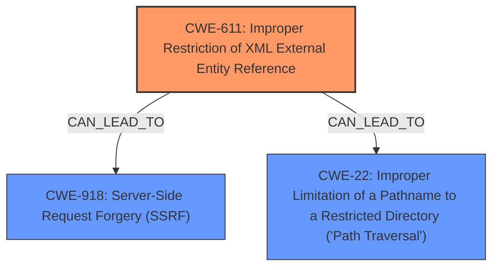

# Raw Analyzer Response for CVE-2024-56324

# Summary
| CWE ID | CWE Name | Confidence | CWE Abstraction Level | CWE Vulnerability Mapping Label | CWE-Vulnerability Mapping Notes |
|---|---|---|---|---|---|
| CWE-611 | Improper Restriction of XML External Entity Reference | 1.0 | Base | Primary | Allowed |
| CWE-918 | Server-Side Request Forgery (SSRF) | 0.7 | Base | Secondary Candidate | Allowed |
| CWE-22 | Improper Limitation of a Pathname to a Restricted Directory ('Path Traversal') | 0.7 | Base | Secondary Candidate | Allowed |

## Evidence and Confidence

*   **Confidence Score:** 0.9
*   **Evidence Strength:** HIGH

## Relationship Analysis
The primary relationship is that CWE-611 [Improper Restriction of XML External Entity Reference] is the root cause, potentially leading to other vulnerabilities like CWE-918 [Server-Side Request Forgery (SSRF)] and CWE-22 [Improper Limitation of a Pathname to a Restricted Directory ('Path Traversal')]. These are not direct parent-child relationships, but rather potential consequences of the XXE vulnerability. The abstraction levels are all Base, providing a good level of specificity.

## Vulnerability Chain
The vulnerability chain starts with the **improper handling of XML input** by the GoCD server, leading to **CWE-611 [Improper Restriction of XML External Entity Reference]**. This can then potentially lead to:
1.  **CWE-918 [Server-Side Request Forgery (SSRF)]**: By exploiting the XXE vulnerability to make the server send requests to internal or external resources.
2.  **CWE-22 [Improper Limitation of a Pathname to a Restricted Directory ('Path Traversal')]**: By using XXE to read arbitrary files from the server.

## Summary of Analysis
The primary vulnerability is clearly **CWE-611 [Improper Restriction of XML External Entity Reference]**. The "CVE Reference Links Content Summary" explicitly states that the root cause is the **improper handling of XML input** leading to **XML External Entity (XXE) injection vulnerability (CWE-611)**. This is strong evidence. The vulnerability description also mentions that the XXE vulnerability can potentially lead to SSRF and directory traversal, which are represented by CWE-918 and CWE-22 respectively.

The retriever results also strongly support CWE-611, with the highest score by a significant margin. The relationships described in the vulnerability description suggest a chain where XXE is the root cause, leading to other potential issues. The abstraction level of Base is appropriate for all selected CWEs.

I considered other CWEs from the retriever results, such as CWE-90 [Improper Neutralization of Special Elements used in an LDAP Query ('LDAP Injection')], CWE-88 [Improper Neutralization of Argument Delimiters in a Command ('Argument Injection')], and CWE-776 [Improper Restriction of Recursive Entity References in DTDs ('XML Entity Expansion')], but these are less relevant given the specific description of an XXE vulnerability. They represent different kinds of injection or XML-related issues, but the evidence strongly points to XXE as the primary issue.

My assessment is based on strong evidence from the vulnerability description and the "CVE Reference Links Content Summary." The graph relationships confirm that XXE can lead to other vulnerabilities, justifying the inclusion of CWE-918 and CWE-22 as secondary candidates. The selected CWEs are at the optimal level of specificity, representing the root cause and potential consequences of the vulnerability.