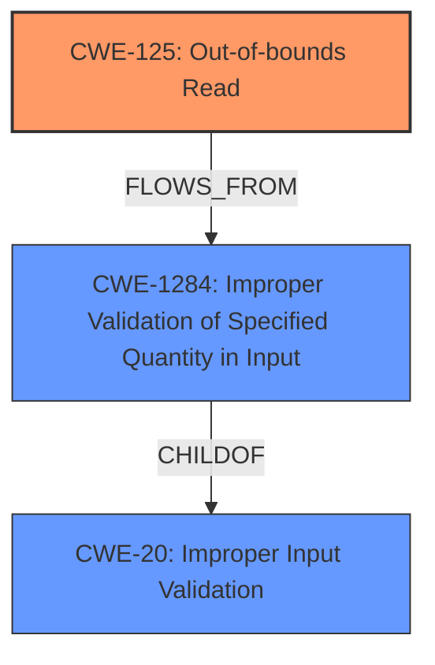

# Analysis for CVE-2024-5642

# Summary

| CWE ID    | CWE Name                                                               | Confidence | CWE Abstraction Level | CWE Vulnerability Mapping Label | CWE-Vulnerability Mapping Notes |
| --------- | ---------------------------------------------------------------------- | ---------- | --------------------- | ------------------------------- | ------------------------------- |
| CWE-125   | Out-of-bounds Read                                                     | 0.9        | Base                  | Primary                         | Allowed                       |
| CWE-1284  | Improper Validation of Specified Quantity in Input                     | 0.7        | Base                  | Secondary                       | Allowed                       |
| CWE-20    | Improper Input Validation                                              | 0.6        | Class                 | Secondary                       | Discouraged                    |

## Evidence and Confidence

*   **Confidence Score:** 0.8
*   **Evidence Strength:** HIGH

## Relationship Analysis

The primary weakness is CWE-125 **Out-of-bounds Read**, as the vulnerability description explicitly mentions a "**buffer over-read**". CWE-125 is a base-level CWE, which aligns with the preferred level of abstraction. The retriever results also list CWE-125 as the top candidate.

CWE-1284 **Improper Validation of Specified Quantity in Input** is considered a secondary weakness, stemming from CPython's failure to validate the input list size before passing it to OpenSSL. It is related to CWE-20, but more specific.

CWE-20 **Improper Input Validation** is a high-level class. Because there is a failure to validate the input to `SSLContext.set_npn_protocols()`, allowing an invalid empty list to be passed to the underlying OpenSSL API, CWE-20 is included, but rated as discouraged.

## Vulnerability Chain

The vulnerability chain starts with **Improper Input Validation** (CWE-20, Class) where CPython **fails to validate** the size of the input list passed to `SSLContext.set_npn_protocols()`. This leads to **Improper Validation of Specified Quantity in Input** (CWE-1284, Base) because the quantity (size of the list) is not validated. Consequently, an invalid empty list is passed to the OpenSSL API, triggering a **Buffer Over-read** (CWE-125, Base) in OpenSSL's `SSL_select_next_proto` function. The final impact is the disclosure of potentially sensitive information due to memory being read out of bounds.

## Summary of Analysis

The vulnerability is primarily an **out-of-bounds read** (CWE-125) that occurs because the input to `SSLContext.set_npn_protocols()` is not properly validated. The vulnerability description and CVE reference links content summary confirm the **buffer over-read** caused by the **lack of input validation**.

The selection of CWE-125 is strongly supported by the vulnerability description which states "...This results in a **buffer over-read** when NPN is used...". The CVE Reference Links Content Summary also states "**Buffer Over-read:** The primary vulnerability is a buffer over-read in OpenSSL's `SSL_select_next_proto` function when handling an empty list of protocols.". This makes it very evident that the primary CWE is CWE-125.

CWE-1284 is added to reflect the **Improper Validation of Specified Quantity in Input** that led to the vulnerability. The CVE Reference Links Content Summary states "**Improper Input Validation:** CPython failed to validate the input to `SSLContext.set_npn_protocols()`, allowing an invalid empty list to be passed to the underlying OpenSSL API.". This shows a clear lack of input validation of the input quantity.

CWE-20 is added as the more general **Improper Input Validation** (parent of CWE-1284) that led to the vulnerability. The CVE Reference Links Content Summary states "**Improper Input Validation:** CPython failed to validate the input to `SSLContext.set_npn_protocols()`, allowing an invalid empty list to be passed to the underlying OpenSSL API.".

The chosen CWEs are at the optimal level of specificity, with CWE-125 being a base CWE representing the direct cause, and CWE-1284 and CWE-20 representing the **improper input validation** that led to the vulnerability.

CWEs considered but not used:

*   CWE-476 **NULL Pointer Dereference**: While possible, there is no direct mention of null pointer dereference, so it is not included.
*   CWE-126 **Buffer Over-read**: While very similar to CWE-125, the description specifically states a read, so CWE-125 is preferred.
*   CWE-170 **Improper Null Termination**: There is no indication of null termination issues in the description.
*   CWE-193 **Off-by-one Error**: No evidence of an off-by-one error.
*   CWE-617 **Reachable Assertion**: No assertions involved in this vulnerability.
*   CWE-824 **Access of Uninitialized Pointer**: No uninitialized pointers involved.
*   CWE-1325 **Improperly Controlled Sequential Memory Allocation**: This is not directly related to the vulnerability.
*   CWE-327 **Use of a Broken or Risky Cryptographic Algorithm**: The vulnerability does not stem from a broken or risky cryptographic algorithm.
*   CWE-703 **Improper Check or Handling of Exceptional Conditions** - Too high level, and doesn't precisely match the **improper input validation**.
*   CWE-754 **Improper Check for Unusual or Exceptional Conditions** - Too high level, and doesn't precisely match the **improper input validation**.
*   CWE-843 **Access of Resource Using Incompatible Type ('Type Confusion')** - There is no type confusion, so it is not included.
*   CWE-212 **Improper Removal of Sensitive Information Before Storage or Transfer** - There is no sensitive information handling issue.
*   CWE-131 **Incorrect Calculation of Buffer Size** - The issue is not an incorrect calculation of the buffer size itself but rather the lack of validation of the provided input.