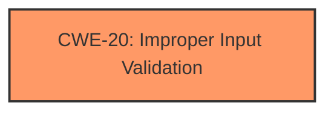

# Analysis Report for CVE-2024-56437

# Vulnerability Analysis Report: CVE-2024-56437

## Description

Vulnerability of input parameters not being verified in the widget framework module Impact Successful exploitation of this vulnerability may affect availability.

## Vulnerability Description Key Phrases

- **Rootcause:** improper input parameter verification
- **Impact:** affect availability
- **Product:** widget framework module

## Analysis (with Relationship Data)

# Summary
| CWE ID | CWE Name | Confidence | CWE Abstraction Level | CWE Vulnerability Mapping Label | CWE-Vulnerability Mapping Notes |
|---|---|---|---|---|---|
| CWE-20 | Improper Input Validation | 0.8 | Class | Primary CWE | Discouraged |

## Evidence and Confidence

*   **Confidence Score:** 0.8
*   **Evidence Strength:** MEDIUM

## Relationship Analysis
The primary identified CWE is CWE-20, which is a Class-level CWE. While it is discouraged to use Class-level CWEs, the provided evidence is high-level and lacks the specificity to pinpoint a more precise Base or Variant CWE. CWE-20 is a parent of more specific input validation CWEs, but without further information, it serves as the most appropriate, albeit generic, classification.



## Vulnerability Chain
The vulnerability chain starts with **improper input validation** (CWE-20), which leads to a potential impact on availability.

## Summary of Analysis
The vulnerability description indicates a failure to properly verify input parameters in a widget framework module, which can lead to an impact on availability. The key phrase "rootcause: **improper input parameter verification**" points directly to an input validation issue.

The Retriever Results list CWE-20 as a potential candidate, although it is listed as "Discouraged". The rationale for discouraging its use is that it's often misused in low-information vulnerability reports, and more specific CWEs should be used when available. However, given the limited information provided in the vulnerability description, CWE-20 remains the most appropriate choice.

The "CVE Reference Links Content Summary" reinforces the vulnerability description, stating "Vulnerability of input parameters not being verified in the widget framework module" and that "Successful exploitation of this vulnerability may affect availability."

Other CWEs were considered but not selected:
*   CWE-94 (Improper Control of Generation of Code ('Code Injection')): While code injection is a possible outcome of **improper input validation**, there's no specific evidence to support this.
*   CWE-233 (Improper Handling of Parameters): This is related to input handling, but CWE-20 is a more general and suitable fit based on the description.
*   CWE-125 (Out-of-bounds Read): This is not directly suggested by the description which focuses on validation.
*   CWE-116 (Improper Encoding or Escaping of Output): This is not directly suggested by the description which focuses on validation.
*   CWE-78 (Improper Neutralization of Special Elements used in an OS Command ('OS Command Injection')): Similar to CWE-94, this is a possible outcome, but there is no direct evidence.
* CWE-129 (Improper Validation of Array Index): Lacks the specifics on what kind of validation issue is happening.

I am retaining CWE-20 as the primary CWE because it aligns with the stated **root cause** of "improper input parameter verification" and the limited detail provided.


## CWE Relationship Analysis

Current CWEs represent these abstraction levels: .


### Vulnerability Chain Analysis

**Chain starting from CWE-116:**
- 116 (Improper Encoding or Escaping of Output) - ROOT


**Chain starting from CWE-94:**
- 94 (Improper Control of Generation of Code ('Code Injection')) - ROOT


### CWE Relationship Diagram

```mermaid
graph TD
    classDef primary fill:#f96,stroke:#333,stroke-width:2px
    classDef secondary fill:#69f,stroke:#333
    classDef tertiary fill:#9e9,stroke:#333
```


*Report generated on 2025-07-13 23:42:54*
