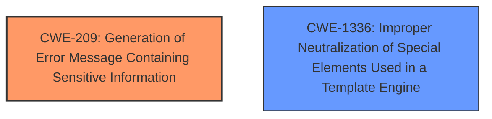

# Enhanced Analysis for CVE-2024-56526

# Summary

| CWE ID | CWE Name | Confidence | CWE Abstraction Level | CWE Vulnerability Mapping Label | CWE-Vulnerability Mapping Notes |
|---|---|---|---|---|---|
| CWE-209 | Generation of Error Message Containing Sensitive Information | 0.8 | Base | Allowed | Primary CWE |
| CWE-1336 | Improper Neutralization of Special Elements Used in a Template Engine | 0.6 | Base | Allowed | Secondary Candidate |

## Evidence and Confidence

*   **Confidence Score:** 0.7
*   **Evidence Strength:** HIGH

## Relationship Analysis
The primary CWE is CWE-209, which represents the generation of an error message containing sensitive information. CWE-1336, a potential secondary CWE, relates to improper neutralization within a template engine. There are no direct parent-child relationships between the selected CWEs, but CWE-209 could potentially be preceded by a weakness related to input validation or data handling. The selection of CWE-209 is based on the direct evidence of sensitive information exposure through error messages. CWE-1336 is included to account for the involvement of the template engine.



## Vulnerability Chain
The vulnerability chain starts with a **Smarty syntax error** within a CMS page template. This **error** leads to premature flushing of PHP's output buffer, resulting in the exposure of sensitive user information (e.g., password reset links). The chain culminates in the potential for an attacker to change the password of any user account without authorization.

Root Cause: **Smarty syntax error** within the CMS page template
Weakness: Improper error handling leading to premature output buffer flush.
Impact: Exposure of sensitive user information (CWE-209), potential account takeover.

## Summary of Analysis
The initial assessment identifies the **Smarty syntax error** as the root cause, ultimately leading to the exposure of sensitive information (password reset link). The core issue is that a syntax error in the Smarty template causes PHP's output buffering to flush prematurely, revealing the sensitive information. This aligns directly with CWE-209, "Generation of Error Message Containing Sensitive Information."

The evidence from the "CVE Reference Links Content Summary" section clearly states: "A syntax error in a Smarty template (specifically a plain HTML template) causes PHP's output buffering to flush prematurely, revealing sensitive information."

The retriever results also suggest CWE-209 as a potential candidate. CWE-1336, "Improper Neutralization of Special Elements Used in a Template Engine," is also considered because the **error** occurs within the Smarty template engine. However, the primary issue isn't the *neutralization* of template elements, but rather the *handling of errors* within the template engine that leads to information disclosure.

CWE-79 "Improper Neutralization of Input During Web Page Generation ('Cross-site Scripting')" was considered because the impact involves a web page. However, the root cause is not related to improper input neutralization, but rather an error in the Smarty template.

The selected CWEs are at an optimal level of specificity. CWE-209 directly addresses the information disclosure aspect, while CWE-1336 acknowledges the role of the template engine in the vulnerability.

Relevant CWE Information:

# Enhanced Context (25 CWEs)
The following CWEs were identified as potentially relevant to this vulnerability:

## CWE-1336: Improper Neutralization of Special Elements Used in a Template Engine
**Abstraction Level**: Base
**Similarity Score**: 0.74
**Source**: dense

**Description**:
The product uses a template engine to insert or process externally-influenced input, but it does not neutralize or incorrectly neutralizes special elements or syntax that can be interpreted as template expressions or other code directives when processed by the engine.

**Mapping Guidance**:
- Usage: Allowed
- Rationale: This CWE entry is at the Base level of abstraction, which is a preferred level of abstraction for mapping to the root causes of vulnerabilities.

## CWE-209: Generation of Error Message Containing Sensitive Information
**Abstraction Level**: Base
**Similarity Score**: 0.72
**Source**: dense

**Description**:
The product generates an error message that includes sensitive information about its environment, users, or associated data.

**Mapping Guidance**:
- Usage: Allowed
- Rationale: This CWE entry is at the Base level of abstraction, which is a preferred level of abstraction for mapping to the root causes of vulnerabilities.


## CWE Relationship Analysis

Current CWEs represent these abstraction levels: .


### Vulnerability Chain Analysis

**Chain starting from CWE-79:**
- 79 (Improper Neutralization of Input During Web Page Generation ('Cross-site Scripting')) - ROOT


**Chain starting from CWE-1336:**
- 1336 (Improper Neutralization of Special Elements Used in a Template Engine) - ROOT


### CWE Relationship Diagram

```mermaid
graph TD
    classDef primary fill:#f96,stroke:#333,stroke-width:2px
    classDef secondary fill:#69f,stroke:#333
    classDef tertiary fill:#9e9,stroke:#333
```