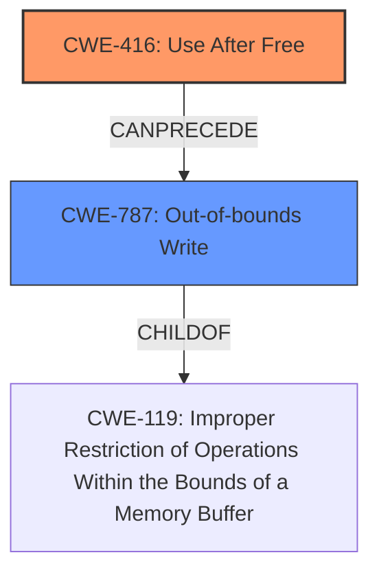

# Analysis Report for CVE-2024-56548

# Vulnerability Analysis Report: CVE-2024-56548

## Description

In the Linux kernel, the following vulnerability has been resolved hfsplus dont query the device logical block size multiple times Devices block sizes may change. One of these cases is a loop device by using ioctl LOOP_SET_BLOCK_SIZE. While this may cause other issues like IO being rejected, in the case of hfsplus, it will allocate a block by using that size and potentially write out-of-bounds when hfsplus_read_wrapper calls hfsplus_submit_bio and the latter function reads a different io_size. Using a new min_io_size initally set to sb_min_blocksize works for the purposes of the original fix, since it will be set to the max between HFSPLUS_SECTOR_SIZE and the first seen logical block size. We still use the max between HFSPLUS_SECTOR_SIZE and min_io_size in case the latter is not initialized. Tested by mounting an hfsplus filesystem with loop block sizes 512, 1024 and 4096. The produced KASAN report before the fix looks like this [ 419.944641] ================================================================== [ 419.945655] BUG KASAN slab-**use-after-free** in hfsplus_read_wrapper+0x659/0xa0a [ 419.946703] Read of size 2 at addr ffff88800721fc00 by task repro/10678 [ 419.947612] [ 419.947846] CPU 0 UID 0 PID 10678 Comm repro Not tainted 6.12.0-rc5-00008-gdf56e0f2f3ca #84 [ 419.949007] Hardware name QEMU Standard PC (Q35 + ICH9, 2009), BIOS 1.15.0-1 04/01/2014 [ 419.950035] Call Trace [ 419.950384] [ 419.950676] dump_stack_lvl+0x57/0x78 [ 419.951212] ? hfsplus_read_wrapper+0x659/0xa0a [ 419.951830] print_report+0x14c/0x49e [ 419.952361] ? __virt_addr_valid+0x267/0x278 [ 419.952979] ? kmem_cache_debug_flags+0xc/0x1d [ 419.953561] ? hfsplus_read_wrapper+0x659/0xa0a [ 419.954231] kasan_report+0x89/0xb0 [ 419.954748] ? hfsplus_read_wrapper+0x659/0xa0a [ 419.955367] hfsplus_read_wrapper+0x659/0xa0a [ 419.955948] ? __pfx_hfsplus_read_wrapper+0x10/0x10 [ 419.956618] ? do_raw_spin_unlock+0x59/0x1a9 [ 419.957214] ? _raw_spin_unlock+0x1a/0x2e [ 419.957772] hfsplus_fill_super+0x348/0x1590 [ 419.958355] ? hlock_class+0x4c/0x109 [ 419.958867] ? __pfx_hfsplus_fill_super+0x10/0x10 [ 419.959499] ? __pfx_string+0x10/0x10 [ 419.960006] ? lock_acquire+0x3e2/0x454 [ 419.960532] ? bdev_name.constprop.0+0xce/0x243 [ 419.961129] ? __pfx_bdev_name.constprop.0+0x10/0x10 [ 419.961799] ? pointer+0x3f0/0x62f [ 419.962277] ? __pfx_pointer+0x10/0x10 [ 419.962761] ? vsnprintf+0x6c4/0xfba [ 419.963178] ? __pfx_vsnprintf+0x10/0x10 [ 419.963621] ? setup_bdev_super+0x376/0x3b3 [ 419.964029] ? snprintf+0x9d/0xd2 [ 419.964344] ? __pfx_snprintf+0x10/0x10 [ 419.964675] ? lock_acquired+0x45c/0x5e9 [ 419.965016] ? set_blocksize+0x139/0x1c1 [ 419.965381] ? sb_set_blocksize+0x6d/0xae [ 419.965742] ? __pfx_hfsplus_fill_super+0x10/0x10 [ 419.966179] mount_bdev+0x12f/0x1bf [ 419.966512] ? __pfx_mount_bdev+0x10/0x10 [ 419.966886] ? vfs_parse_fs_string+0xce/0x111 [ 419.967293] ? __pfx_vfs_parse_fs_string+0x10/0x10 [ 419.967702] ? __pfx_hfsplus_mount+0x10/0x10 [ 419.968073] legacy_get_tree+0x104/0x178 [ 419.968414] vfs_get_tree+0x86/0x296 [ 419.968751] path_mount+0xba3/0xd0b [ 419.969157] ? __pfx_path_mount+0x10/0x10 [ 419.969594] ? kmem_cache_free+0x1e2/0x260 [ 419.970311] do_mount+0x99/0xe0 [ 419.970630] ? __pfx_do_mount+0x10/0x10 [ 419.971008] __do_sys_mount+0x199/0x1c9 [ 419.971397] do_syscall_64+0xd0/0x135 [ 419.971761] entry_SYSCALL_64_after_hwframe+0x76/0x7e [ 419.972233] RIP 00330x7c3cb812972e [ 419.972564] Code 48 8b 0d f5 46 0d 00 f7 d8 64 89 01 48 83 c8 ff c3 66 2e 0f 1f 84 00 00 00 00 00 90 f3 0f 1e fa 49 89 ca b8 a5 00 00 00 0f 05 3d 01 f0 ff ff 73 01 c3 48 8b 0d c2 46 0d 00 f7 d8 64 89 01 48 [ 419.974371] RSP 002b00007ffe30632548 EFLAGS 00000286 ORIG_RAX 00000000000000a5 [ 419.975048] RAX ffffffffffffffda RBX 00007ffe306328d8 RCX 00007c3cb812972e [ 419.975701] RDX 0000000020000000 RSI 0000000020000c80 RDI ---truncated---

## Vulnerability Description Key Phrases

- **Weakness:** use-after-free
- **Product:** Linux kernel
- **Component:** hfsplus_read_wrapper

## Analysis (with Relationship Data)

# Summary
| CWE ID | CWE Name | Confidence | CWE Abstraction Level | CWE Vulnerability Mapping Label | CWE-Vulnerability Mapping Notes |
|---|---|---|---|---|---|
| CWE-416 | Use After Free | 1.0 | Variant | Primary | Allowed |
| CWE-787 | Out-of-bounds Write | 0.75 | Base | Secondary | Allowed |

## Evidence and Confidence

*   **Confidence Score:** 0.85
*   **Evidence Strength:** HIGH

## Relationship Analysis
The primary relationship influencing the selection is the presence of both **use-after-free** and out-of-bounds write conditions. The **use-after-free** (CWE-416) occurs first. Then, the out-of-bounds write (CWE-787) is the result of the **use-after-free**.



## Vulnerability Chain
The vulnerability chain begins with the driver not consistently using the most recent logical block size. This leads to a **use-after-free** condition (CWE-416). The **use-after-free** results in an out-of-bounds write (CWE-787).

## Summary of Analysis
The analysis is based on the provided evidence which includes the vulnerability description, key phrases, and CVE reference links. The evidence clearly points to a **use-after-free** vulnerability in the Linux kernel's HFS+ filesystem implementation. The KASAN report explicitly mentions "BUG KASAN slab-**use-after-free** in hfsplus_read_wrapper". The CVE description confirms that the HFS+ filesystem implementation in the Linux kernel is vulnerable to a **use-after-free** condition. This condition leads to out-of-bounds writes.

The selection of CWE-416 is appropriate because it directly addresses the **use-after-free** condition reported in the vulnerability description. The additional vulnerability, CWE-787 Out-of-bounds Write, occurs because the **use-after-free** corrupts the memory, which then leads to data being written outside the intended memory region. The level of specificity is optimal because CWE-416 is a Variant-level CWE and CWE-787 is a Base-level CWE, both preferred levels.

The retriever results also support the selection of CWE-416 as it is the top combined result.

Relevant CWE Information:

# Enhanced Context (25 CWEs)
The following CWEs were identified as potentially relevant to this vulnerability:

## CWE-908: Use of Uninitialized Resource
**Abstraction Level**: Base
**Similarity Score**: 0.74
**Source**: dense

**Description**:
The product uses or accesses a resource that has not been initialized.

**Mapping Guidance**:
- Usage: Allowed
- Rationale: This CWE entry is at the Base level of abstraction, which is a preferred level of abstraction for mapping to the root causes of vulnerabilities.


## CWE-193: Off-by-one Error
**Abstraction Level**: Base
**Similarity Score**: 0.74
**Source**: dense

**Description**:
A product calculates or uses an incorrect maximum or minimum value that is 1 more, or 1 less, than the correct value.

**Mapping Guidance**:
- Usage: Allowed
- Rationale: This CWE entry is at the Base level of abstraction, which is a preferred level of abstraction for mapping to the root causes of vulnerabilities.


## CWE-125: Out-of-bounds Read
**Abstraction Level**: Base
**Similarity Score**: 0.74
**Source**: dense

**Description**:
The product reads data past the end, or before the beginning, of the intended buffer.

**Mapping Guidance**:
- Usage: Allowed
- Rationale: This CWE entry is at the Base level of abstraction, which is a preferred level of abstraction for mapping to the root causes of vulnerabilities.


## CWE-667: Improper Locking
**Abstraction Level**: Class
**Similarity Score**: 0.74
**Source**: dense

**Description**:
The product does not properly acquire or release a lock on a resource, leading to unexpected resource state changes and behaviors.

**Mapping Guidance**:
- Usage: Allowed-with-Review
- Rationale: This CWE entry is a Class and might have Base-level children that would be more appropriate


## CWE-362: Concurrent Execution using Shared Resource with Improper Synchronization ('Race Condition')
**Abstraction Level**: Class
**Similarity Score**: 0.74
**Source**: dense

**Description**:
The product contains a concurrent code sequence that requires temporary, exclusive access to a shared resource, but a timing window exists in which the shared resource can be modified by another code sequence operating concurrently.

**Mapping Guidance**:
- Usage: Allowed-with-Review
- Rationale: This CWE entry is a Class and might have Base-level children that would be more appropriate


## CWE-131: Incorrect Calculation of Buffer Size
**Abstraction Level**: Base
**Similarity Score**: 0.73
**Source**: dense

**Description**:
The product does not correctly calculate the size to be used when allocating a buffer, which could lead to a buffer overflow.

**Mapping Guidance**:
- Usage: Allowed
- Rationale: This CWE entry is at the Base level of abstraction, which is a preferred level of abstraction for mapping to the root causes of vulnerabilities.


## CWE-909: Missing Initialization of Resource
**Abstraction Level**: Class
**Similarity Score**: 0.72
**Source**: dense

**Description**:
The product does not initialize a critical resource.

**Mapping Guidance**:
- Usage: Allowed-with-Review
- Rationale: This CWE entry is a Class and might have Base-level children that would be more appropriate


## CWE-755: Improper Handling of Exceptional Conditions
**Abstraction Level**: Class
**Similarity Score**: 0.72
**Source**: dense

**Description**:
The product does not handle or incorrectly handles an exceptional condition.

**Mapping Guidance**:
- Usage: Discouraged
- Rationale: This CWE entry is a level-1 Class (i.e., a child of a Pillar). It might have lower-level children that would be more appropriate


## CWE-789: Memory Allocation with Excessive Size Value
**Abstraction Level**: Variant
**Similarity Score**: 0.72
**Source**: dense

**Description**:
The product allocates memory based on an untrusted, large size value, but it does not ensure that the size is within expected limits, allowing arbitrary amounts of memory to be allocated.

**Mapping Guidance**:
- Usage: Allowed
- Rationale: This CWE entry is at the Variant level of abstraction, which is a preferred level of abstraction for mapping to the root causes of vulnerabilities.


## CWE-824: Access of Uninitialized Pointer
**Abstraction Level**: Base
**Similarity Score**: 0.72
**Source**: dense

**Description**:
The product accesses or uses a pointer that has not been initialized.

**Mapping Guidance**:
- Usage: Allowed
- Rationale: This CWE entry is at the Base level of abstraction, which is a preferred level of abstraction for mapping to the root causes of vulnerabilities.


## CWE-419: Unprotected Primary Channel
**Abstraction Level**: Base
**Similarity Score**: 1082.13
**Source**: sparse

**Description**:
The product uses a primary channel for administration or restricted functionality, but it does not properly protect the channel.

**Mapping Guidance**:
- Usage: Allowed
- Rationale: This CWE entry is at the Base level of abstraction, which is a preferred level of abstraction for mapping to the root causes of vulnerabilities.


## CWE-770: Allocation of Resources Without Limits or Throttling
**Abstraction Level**: Base
**Similarity Score**: 896.56
**Source**: sparse

**Description**:
The product allocates a reusable resource or group of resources on behalf of an actor without imposing any restrictions on the size or number of resources that can be allocated, in violation of the intended security policy for that actor.

**Mapping Guidance**:
- Usage: Allowed
- Rationale: This CWE entry is at the Base level of abstraction, which is a preferred level of abstraction for mapping to the root causes of vulnerabilities.


## CWE-190: Integer Overflow or Wraparound
**Abstraction Level**: Base
**Similarity Score**: 880.97
**Source**: sparse

**Description**:
The product performs a calculation that can
         produce an integer overflow or wraparound when the logic
         assumes that the resulting value will always be larger than
         the original value.


## CWE Relationship Analysis

Current CWEs represent these abstraction levels: .


### Vulnerability Chain Analysis

**Chain starting from CWE-416:**
- 416 (Use After Free) - ROOT


**Chain starting from CWE-770:**
- 770 (Allocation of Resources Without Limits or Throttling) - ROOT


### CWE Relationship Diagram

```mermaid
graph TD
    classDef primary fill:#f96,stroke:#333,stroke-width:2px
    classDef secondary fill:#69f,stroke:#333
    classDef tertiary fill:#9e9,stroke:#333
```


*Report generated on 2025-07-13 23:50:01*
