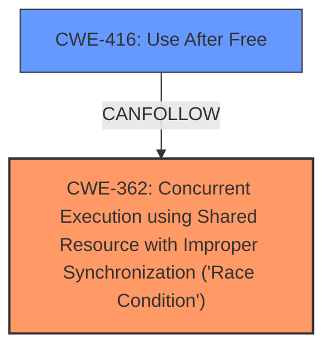

# Analysis Report for CVE-2024-56637

# Vulnerability Analysis Report: CVE-2024-56637

## Description

In the Linux kernel, the following vulnerability has been resolved netfilter ipset **Hold module reference while requesting a module** User space may unload ip_set.ko while it is itself requesting a set type backend module, leading to a kernel crash. The **race condition** may be provoked by inserting an mdelay() right after the nfnl_unlock() call.

## Vulnerability Description Key Phrases

- **Component:** netfilter ipset Hold module
- **Rootcause:** race condition
- **Vector:** mdelay() right after the nfnl_unlock() call
- **Weakness:** Hold module reference while requesting a module
- **Product:** Linux kernel
- **Impact:** kernel crash, unload ip_set.ko

## Analysis (with Relationship Data)

# Summary
| CWE ID | CWE Name | Confidence | CWE Abstraction Level | CWE Vulnerability Mapping Label | CWE-Vulnerability Mapping Notes |
|---|---|---|---|---|---|
| CWE-362 | Concurrent Execution using Shared Resource with Improper Synchronization ('Race Condition') | 0.9 | Class | Allowed-with-Review | Primary CWE. The vulnerability is caused by a race condition where the `ip_set.ko` module can be unloaded while it's requesting a backend module. |
| CWE-416 | Use After Free | 0.7 | Variant | Allowed | Secondary CWE. Results from the race condition when the kernel attempts to access memory that has already been freed. |

## Evidence and Confidence

*   **Confidence Score:** 0.8
*   **Evidence Strength:** HIGH

## Relationship Analysis
The primary weakness is a race condition (CWE-362), which can lead to a use-after-free vulnerability (CWE-416). CWE-362 is a Class-level CWE, and while there are more specific Base-level CWEs for race conditions (e.g., CWE-367, CWE-364), CWE-362 is the most appropriate given the provided information about concurrent execution and shared resource. CWE-416 arises as a consequence of this race condition.



## Vulnerability Chain
The vulnerability chain starts with a race condition (CWE-362) where the `ip_set.ko` module can be unloaded while it is requesting a backend module. This race condition leads to a use-after-free vulnerability (CWE-416) when the kernel attempts to access the freed memory, ultimately resulting in a kernel crash.
- Root Cause: CWE-362
- Impact: CWE-416

## Summary of Analysis
The vulnerability is a race condition that leads to a use-after-free. The primary CWE is CWE-362 because the root cause is a **race condition** where the `ip_set.ko` module can be unloaded while it is requesting a set type backend module. The race condition can be provoked by inserting an mdelay() right after the nfnl_unlock() call, so the module is referenced and then immediately unreferenced. If the user space acts during this time, the race condition occurs.

The text says: "User space may unload ip_set.ko while it is itself requesting a set type backend module, leading to a kernel crash. The **race condition** may be provoked by inserting an mdelay() right after the nfnl_unlock() call."

CWE-416 is a secondary consequence that can arise due to the race condition. The retriever results support CWE-362 as the top candidate. Other CWEs were considered but were not as directly relevant. For example, CWE-367 (Time-of-check Time-of-use (TOCTOU) Race Condition) was considered but deemed less appropriate since the vulnerability is not specifically a TOCTOU issue.

Relevant CWE Information:

# Enhanced Context (25 CWEs)
The following CWEs were identified as potentially relevant to this vulnerability:

## CWE-362: Concurrent Execution using Shared Resource with Improper Synchronization ('Race Condition')
**Abstraction Level**: Class
**Similarity Score**: 0.76
**Source**: dense

**Description**:
The product contains a concurrent code sequence that requires temporary, exclusive access to a shared resource, but a timing window exists in which the shared resource can be modified by another code sequence operating concurrently.

**Mapping Guidance**:
- Usage: Allowed-with-Review
- Rationale: This CWE entry is a Class and might have Base-level children that would be more appropriate

## CWE-416: Use After Free
**Abstraction Level**: Variant
**Similarity Score**: 2.69
**Source**: graph

**Description**:
CWE-416: Use After Free

**Mapping Guidance**:
- Usage: Allowed
- Rationale: This CWE entry is at the Variant level of abstraction, which is a preferred level of abstraction for mapping to the root causes of vulnerabilities.

**Relationships**:
- CANFOLLOW -> CWE-754
- CANFOLLOW -> CWE-364
- CANFOLLOW -> CWE-362
- CANFOLLOW -> CWE-1265
- CANPRECEDE -> CWE-123


## CWE Relationship Analysis

Current CWEs represent these abstraction levels: .


### Vulnerability Chain Analysis

**Chain starting from CWE-123:**
- 123 (Write-what-where Condition) - ROOT


**Chain starting from CWE-416:**
- 416 (Use After Free) - ROOT


### CWE Relationship Diagram

```mermaid
graph TD
    classDef primary fill:#f96,stroke:#333,stroke-width:2px
    classDef secondary fill:#69f,stroke:#333
    classDef tertiary fill:#9e9,stroke:#333
```


*Report generated on 2025-07-13 23:52:36*
